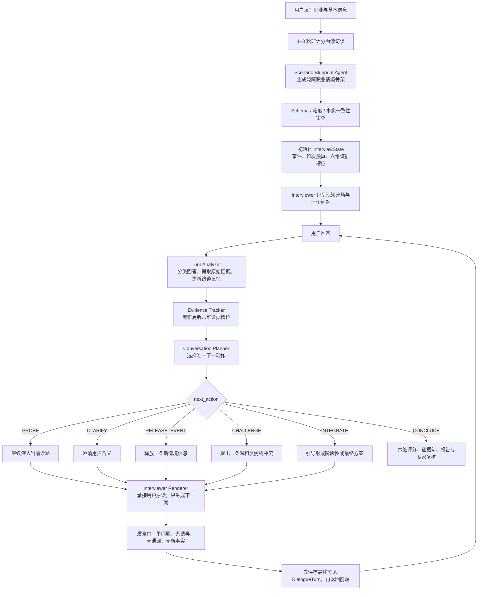

# ThinkAgent 职业自适应渐进式 AI 访谈改造执行方案

**版本**：v1.0

**日期**：2026-07-20

**负责人范围**：成员 B——产品系统与工程

**方案定位**：不重写六维 rubric、评分、报告和专家复核；将现有“职业自适应六阶段情境题”改造为“职业情境骨架约束下的渐进式半结构化访谈”。

---

## 1. 结论先行

本轮应采用的核心机制是：

> **职业情境只提前生成隐藏骨架和事件卡，不提前写完整场访谈；正式测评中，系统每轮分析用户刚刚说了什么、六维证据还缺什么，再决定“继续追问”还是“释放一条新事件”，并且只生成下一句用户可见问题。**

用一句话概括：

> **骨架提前生成，问题逐轮生成；情节按证据推进，而不是按题号推进。**

这不是将六个长问题拆屏显示，也不是放开给模型自由聊天。它是一个由职业情境主线、六维证据地图、轮次预算和问题合同共同约束的 next-turn planning 系统。

---

## 2. 当前实现与核心问题

### 2.1 已经完成，本轮不重写

当前代码已经具备：

- 职业信息填写与 1–3 轮非计分画像访谈；
- 职业基础情境生成、审查、缓存和个人画像表层适配；
- `ScenarioDesignAgent` 和 `ScenarioGenerationService` 的异步生成、幂等锁和降级；
- `AssessmentSession + DialogueTurn + AgentTrace` 会话与审计基础；
- `DialoguePolicy + FollowupAgent + HostAgent` 的追问、澄清、动态信息和阶段推进；
- 六维评分、原始证据句、报告、PDF、专家复核和匿名导出；
- 浏览器语音转写可编辑、AI 语音播放。

本轮改造的对象不是上述能力，而是它们之间的“下一轮问什么”机制。

### 2.2 当前代码为什么仍然像做题

当前 `GeneratedScenario` 合同强制一次生成：

```text
title
+ background
+ central_decision
+ 6 个 GeneratedStage.context
+ 全部 dynamic_infos
```

之后 `ScenarioMaterializationService` 将它物化为 6 个 `ScenarioStage`，每阶段再绑定一个预设 `main_question`。`SessionService` 按阶段释放 `context + main_question`。

因此，即使每个阶段内已经能动态追问，整体仍然是：

```text
提前生成完整六阶段材料
  → 进入一个阶段
  → 展示一大段 context
  → 提出阶段主问题
  → 追问后进入下一阶段
```

直接导致四个问题：

1. AI 一次告知太多情境信息，用户认知负担高；
2. 用户容易一次给出模板化综合答案，破坏真实访谈感；
3. “阶段 = 主维度”会忽略用户在早期回答中自然出现的其他维度证据；
4. 系统优先完成“当前阶段”，而不是判断“当下最值得问的一件事”。

### 2.3 本轮真正要改的四个点

| 当前 | 目标 |
| --- | --- |
| 一次生成完整题面和六个完整阶段文案 | 只生成职业情境骨架、稳定事实和隐藏事件卡 |
| 六维与六阶段强绑定 | 六维变成跨全程累积的证据槽位 |
| 按阶段和追问次数推进 | 根据证据充分度、上下文连续性和故事就绪度决定下一步 |
| `FollowupAgent` 同时分析、规划和写话术 | Planner 决定“问什么”，Interviewer 只决定“怎么说” |

---

## 3. 预期用户效果

### 3.1 用户可见体验

用户不再先阅读一大段综合材料，也看不到“第 3 阶段、证据评估、追问 1/2”。每轮 AI 只推进一个小目标。

示例（用户职业：嵌入式软件工程师）：

```text
AI：假设你负责的一批智能设备两天后要交付，但测试中刚发现，
    它在高温环境下偶尔会通信中断。听到这个情况，你首先会关注什么？

用户：我会先确认复现概率和影响范围。

AI：你提到了复现概率和影响范围。你会先让团队查哪一类信息？

用户：先看日志、温度区间和设备批次。

AI：现在硬件团队认为问题在固件，软件团队怀疑与传感器状态有关。
    面对这两种解释，你会先怎么判断？

用户：……

AI：刚收到一条新测试结果：中断主要集中在一个特定批次，
    但还不能完全排除其他批次。这会改变你刚才的安排吗？
```

用户体验上的预期变化：

- 从“阅读案例题并组织标准答案”变成“参与一件正在发展的工作事件”；
- 问题能承接用户上一轮的真实用词；
- 用户不需要猜“这道题要我回答几点”；
- 新信息在用户形成初步判断之后才出现，动态调整变成真实行为而不是口头表态；
- 整场访谈仍然有主线、有长度边界、有可评分证据。

### 3.2 后台预期效果

后台需要能随时回答：

```text
当前故事节点：exploration
当前话题：故障影响范围
用户初步立场：暂不决定延期，先确认风险
已释放事件：opening_event

问题界定：sufficient
证据评估：partial，缺少可靠性验证
推理论证：partial，缺少替代解释
多元视角：not_started
整合决策：not_started
动态调整：not_available（尚未释放反证）

下一动作：PROBE
原因：用户已提出信息需求，但未说明如何验证可靠性
本轮目标：只获取一项验证方法
```

---

## 4. 设计选择及理由

| 设计选择 | 采用理由 | 不采用的方案及风险 |
| --- | --- | --- |
| 一个职业自适应主情境 | 上下文连续，能观察用户在新信息下的真实调整 | 频繁更换多个完整情境会重新变成连续做题 |
| 只提前生成骨架和事件卡 | 控制事实、冲突和难度，又不把对话写死 | 提前生成全部问题会僵化；什么都不生成会跑题和临时编事实 |
| 六维作为全局证据槽位 | 用户一句话可能同时产生多维证据，可避免后续重复问 | “一阶段一维”会丢失自然证据，也容易暴露测评结构 |
| 保留隐藏软节点 | 故事必须能从异常、核实、冲突、决策、更新走到收束 | 完全取消推进会长时间停在同一话题并丧失动态调整机会 |
| Planner 与 Interviewer 分离 | 先确定唯一信息目标，再写成自然话术，可各自验证与降级 | 一次调用同时分析、规划、编事实和写问题，容易让测量目标和话术互相污染 |
| 问题只逐轮生成 | 用户每次回答都会改变最佳下一问 | 一次生成全部问题无法利用用户自发证据 |
| 用户可见文本先保存再返回 | 保证用户看到的内容与专家复核内容一致 | 前端再次截取、合成会破坏审计链 |

### 4.1 为什么不能“什么都不提前生成”

用户所说的“不需要直接完全生成整个”，应落地为“不提前生成全部用户可见文案和问题”，而不是“不生成主线”。

至少必须提前锁定：

- 用户在情境中的角色；
- 中心冲突与决策目标；
- 初始可见事实；
- 后续可释放的稳定事件卡；
- 事件间的前置条件和事实一致性；
- 动态调整所需的反向或补充新证据；
- 时间、追问、动态信息和结束预算。

这些内容用于测量公平、事实一致和防止模型临时编造。每轮的承接语、问题和过渡语则必须等用户回答后再生成。

---

## 5. 目标业务流程图



### 5.1 两条严格分离的链路

```text
内部测评链（不向用户展示）
情境骨架 → 事件状态 → 六维证据槽位 → 下一动作 → 追问理由

用户体验链（页面只显示）
AI 一句话 → 用户回答 → AI 自然承接 → 另一个小问题
```

---

## 6. 核心数据合同

### 6.1 职业情境从“完整题面”改为“隐藏骨架”

建议将 `occupation_scenario_v2` 升级为 `occupation_interview_blueprint_v3`。

```json
{
  "schema_version": "occupation_interview_blueprint_v3",
  "occupation_category": "工程/制造/建筑",
  "occupation": "嵌入式软件工程师",
  "user_role": "智能设备项目协调人",
  "title": "交付前的设备异常",
  "core_dilemma": "在时间有限且证据不完整时，如何平衡交付与可靠性风险",
  "decision_goal": "形成一项可执行、可调整的交付安排",
  "opening_event": {
    "event_code": "opening_anomaly",
    "facts": [
      "一批智能设备两天后交付",
      "高温环境下偶发通信中断"
    ],
    "question_goal": "了解用户首先关注的问题"
  },
  "story_nodes": [
    {
      "node_code": "evidence_uncertainty",
      "node_role": "exploration",
      "facts": ["故障尚未稳定复现"],
      "release_condition": {
        "after_nodes": ["opening_anomaly"],
        "requires_any_evidence": ["problem_definition"]
      },
      "elicitation_opportunities": [
        "evidence_evaluation",
        "reasoning"
      ]
    },
    {
      "node_code": "team_disagreement",
      "node_role": "conflict",
      "facts": [
        "硬件团队认为问题来自固件",
        "软件团队怀疑与传感器状态有关"
      ],
      "release_condition": {
        "after_nodes": ["evidence_uncertainty"],
        "max_release_turn": 6
      },
      "elicitation_opportunities": [
        "multiple_perspectives",
        "reasoning"
      ]
    },
    {
      "node_code": "counter_evidence",
      "node_role": "update",
      "facts": [
        "新测试结果显示问题主要集中在一个特定批次",
        "暂时不能完全排除其他批次"
      ],
      "release_condition": {
        "requires_prior_decision": true,
        "reserved_turns_before_end": 2
      },
      "elicitation_opportunities": ["dynamic_adjustment"]
    }
  ],
  "conversation_budget": {
    "max_total_user_turns": 12,
    "max_probes_per_topic": 2,
    "max_consecutive_same_dimension": 2,
    "reserved_update_turns": 2,
    "reserved_closure_turns": 1
  }
}
```

该合同不包含：

- 预先写好的全部问题；
- 一次给用户的大段 background；
- 用户必须按顺序回答的六道任务；
- 可直接暗示高分答案的专业处置方案。

`elicitation_opportunities` 只表示该事件有机会诱发哪些能力证据，不允许情境生成模型改写成员 A 冻结的 rubric 和证据规则。

### 6.2 六维变成全局证据槽位

```json
{
  "dimension_slots": {
    "problem_definition": {
      "status": "sufficient",
      "evidence_turn_ids": [8],
      "observed_behaviors": ["识别可靠性风险与交付约束"],
      "missing_behaviors": [],
      "confidence": 0.78
    },
    "evidence_evaluation": {
      "status": "partial",
      "evidence_turn_ids": [8, 10],
      "observed_behaviors": ["提出检查日志和批次"],
      "missing_behaviors": ["还未说明如何判断来源可靠性"],
      "confidence": 0.61
    },
    "dynamic_adjustment": {
      "status": "not_available",
      "evidence_turn_ids": [],
      "observed_behaviors": [],
      "missing_behaviors": ["等待反向新信息释放"],
      "confidence": null
    }
  }
}
```

槽位状态建议固定为：

```text
not_available  当前还没有合理诱发机会
not_started    已有诱发机会，尚无证据
partial        已有有效证据，但仍有关键缺口
sufficient     已达到本次访谈的充分度标准
blocked        达到追问上限仍不足，不再继续盘问
```

全局更新原则：

1. 每个有效用户回答都检查六个维度，不仅检查当前节点的主维度；
2. 同一句原始回答可以支持多个维度；
3. 证据必须指向用户的 `DialogueTurn`，不能引用 AI 的复述或 InterviewMemory；
4. 后续证据可提高充分度，但不能静默覆盖先前的相反表现；
5. “没有说到”只能记录为未获得证据，不能直接判定为低能力。

### 6.3 InterviewState

建议新增一对一会话状态，而不把所有状态散落在 Prompt 中：

```json
{
  "session_id": 101,
  "flow_version": "progressive_v3",
  "current_node_code": "exploration",
  "active_topic": "故障影响范围",
  "turn_count": 3,
  "released_event_codes": ["opening_anomaly"],
  "user_position": "先确认风险，尚未决定是否延期",
  "main_reasons": ["影响范围尚不明确"],
  "unresolved_threads": ["信息可靠性如何验证"],
  "probe_counters": {
    "故障影响范围": 1
  },
  "dimension_slots": {},
  "last_plan": {},
  "state_version": 5
}
```

实施选择：

- MVP 可先在 `assessment_session` 增加 `interview_state_json`、`flow_version` 与 `state_version`；
- 若后续需要进行状态历史查询，再拆出 `interview_state_snapshot`表；
- 每轮 Planner 的完整输入输出仍保存在 `AgentTrace`，不用状态表代替审计日志。

### 6.4 Planner 输出合同

```json
{
  "action": "PROBE",
  "active_topic": "故障影响范围",
  "target_dimension": "evidence_evaluation",
  "target_evidence": "信息来源及可靠性验证",
  "release_event_code": null,
  "question_intent": "了解用户会先查哪一类信息",
  "reflection_basis_turn_ids": [10],
  "reason": "用户已提出需要核实，但尚未说明首先获取的信息",
  "budget": {
    "used_turns": 3,
    "remaining_turns": 9,
    "reserved_update_turns": 2,
    "reserved_closure_turns": 1
  }
}
```

`action` 只允许：

| 动作 | 用途 |
| --- | --- |
| `CLARIFY` | 用户含义不清或请求解释 |
| `PROBE` | 顺着当前话题补一个关键证据缺口 |
| `RELEASE_EVENT` | 释放一条已审查的新事件卡并推进主线 |
| `CHALLENGE` | 在不提供答案的前提下引入一个已配置的反例或冲突 |
| `INTEGRATE` | 引导用户形成阶段性判断或最终行动 |
| `CONCLUDE` | 达到证据与轮次结束条件，进入评分 |

### 6.5 Interviewer 输出合同

```json
{
  "message": "你刚才提到要先确认影响范围。你会先让团队查哪一类信息？",
  "message_type": "followup",
  "question_count": 1,
  "introduced_fact_codes": [],
  "reflection_turn_ids": [10],
  "quality_flags": {
    "single_focus": true,
    "faithful_reflection": true,
    "non_judgmental": true,
    "non_leading": true,
    "no_internal_terms": true,
    "no_unreleased_facts": true
  }
}
```

话术规则：

- 一轮只有一个信息目标和一个核心问题；
- 通常 1–2 句，最多 1 个问号；
- 追问建议控制在 20–60 个汉字；新事件 + 问题建议 40–100 个汉字；
- 只可复述 `reflection_basis_turn_ids` 中真实出现的用户意思；
- 不必每轮都使用“你刚才提到”，避免模板感；
- 不评价“回答很好、很有洞察”，不根据字数显示满意；
- 不暴露阶段、维度、证据缺口、评分和追问次数；
- `RELEASE_EVENT` 只能使用 Planner 选中且未释放的事件事实；
- 不得为了自然而编造新数字、人物、压力或处理方案。

---

## 7. 每轮决策机制

### 7.1 固定处理顺序

每次用户回答后，严格执行：

```text
1. 保存用户原始回答
2. 判断是正式回答、澄清请求、低信息或跑题
3. 提取本轮六维证据 delta
4. 累积更新 Evidence Slots 和 InterviewMemory
5. 根据当前话题、证据缺口、可释放事件和预算选择一个 action
6. Interviewer 只将该 action 写成一句自然话术
7. 执行可见文本质量门
8. 保存最终 AI DialogueTurn 和 Planner/Interviewer AgentTrace
9. 返回前端原样展示
```

### 7.2 下一动作优先级

1. **先处理用户当前意图**：请求解释、澄清或跑题时，不直接计分或推进。
2. **优先承接当前话题**：用户刚提出一个有价值但未展开的判断时，先深入一次。
3. **补当前话题中预期信息增益最高的缺口**：不以“全局最低分”粗暴决定下一问。
4. **当前话题已充分或追问收益低时推进故事**：释放一条与已有判断相关的事件。
5. **优先保留动态调整和最终整合机会**：接近轮次上限时不再追着前面的次要缺口盘问。
6. **满足结束条件后收束**：已经形成初步决策、释放过动态新信息、获得最终整合回答，且达到证据或时间边界。

### 7.3 继续追问还是推进事件

| 当前状态 | 下一动作 |
| --- | --- |
| 用户表达含义不清 | `CLARIFY`，最多 1 次 |
| 已有观点但缺少一个核心理由 | `PROBE` |
| 用户提到“查数据”但未说明查什么 | `PROBE` |
| 用户已主动给出多维证据 | 记录全部证据，不重复询问，考虑 `RELEASE_EVENT` |
| 同一话题已追问 2 次 | 不再盘问，标记 `blocked`，然后 `RELEASE_EVENT` |
| 用户已形成初步方案 | 释放冲突或反向新信息 |
| 新信息已释放但用户未回应其影响 | `PROBE` 动态调整 |
| 距轮次上限只剩 3 轮 | 保留 2 轮给 update、1 轮给 closure |
| 六维证据基本足够或达到总上限 | `INTEGRATE` 后 `CONCLUDE` |

---

## 8. 兼容现有六阶段和六维评分

本轮不直接删除 `ScenarioStage`。建议先采用兼容层：

```text
现有 stage_code                新的隐藏故事角色
s1_problem_definition        → opening / initial interpretation
s2_evidence_verification     → exploration / evidence uncertainty
s3_stakeholder_perspectives  → conflict / perspectives
s4_reasoning_decision        → initial decision / trade-off
s5_dynamic_adjustment        → update / counter-evidence
s6_integrated_plan           → closure / final action
```

兼容原则：

- `ScenarioStage` 暂时作为后台故事节点容器，不再是用户可见的“六道题”；
- 节点与维度的绑定解释为“主要诱发机会”，不是该维度的唯一证据来源；
- Evidence Tracker 每轮检查六维，已在早期出现的证据不得在后面重复诱发；
- 现有 `ScoreEvidence` 继续只引用用户原始 turn；
- 现有 ScoringAgent、ReportAgent、PDF、专家复核和导出链保持不变。

这一兼容方案能避免一次性重写情境、会话、评分和管理端的所有数据模型。

---

## 9. 代码改造路径

### 9.1 批次 0：与成员 A 冻结测量合同

**预期效果**：明确“证据什么时候算 partial / sufficient”，避免工程侧用主观规则替代心理测量定义。

**需冻结的 JSON Schema**：

- 六维的可观察行为与充分度条件；
- 各类情境事件能提供哪些诱发机会；
- 哪些证据可跨节点累计；
- 追问前后置信度和证据 delta 计算方式；
- 最低覆盖、轮次上限与不足证据规则。

**理由**：成员 A 负责构念、rubric、证据和评分方法；成员 B 负责将该合同稳定落库、编排、复核和展示。

### 9.2 批次 1：情境骨架 v3 与兼容物化

**预期效果**：正式访谈不再依赖“一大段背景 + 6 个完整阶段题面”，但仍有可审查、可回放的职业主线。

**新增**：

- `GeneratedScenarioBlueprint`、`GeneratedStoryNode`、`GeneratedEventCard` Pydantic 合同；
- `occupation_interview_blueprint_v3` Prompt 与版本；
- v3 结构指纹、审查和 mock fixture；
- `flow_version=progressive_v3` 特性开关。

**修改**：

- `backend/app/agents/scenario_design_agent.py`
- `backend/app/services/scenario_generation_service.py`
- `backend/app/services/scenario_materialization_service.py`
- `backend/seeds/prompts.yaml`
- `backend/app/models/scenario.py` 或先复用 `generation_metadata_json`

**兼容做法**：

- 新会话使用 v3 blueprint；
- 旧会话继续使用 `occupation_scenario_v2`；
- v3 blueprint 先映射到现有六个 `ScenarioStage` 作为隐藏故事节点，避免立即删表；
- 旧报告和管理端仍可通过 `stage_id` 回放对话。

**难度**：中。

**预估**：2–3 人日。

### 9.3 批次 2：Evidence Tracker + Conversation Planner

**预期效果**：AI 不再机械完成当前阶段，而是先看用户已经自然给出了哪些六维证据，再选择当下信息增益最高的一问。

**新增**：

- `backend/app/agents/interview_planner_agent.py`
- `backend/app/services/evidence_tracker_service.py`
- `backend/app/services/interview_state_service.py`
- `InterviewPlanOutput`、`DimensionSlotState`、`InterviewState` Schema；
- Planner Prompt 和严格 JSON 校验；
- 同话题/同维度追问计数和预留轮次策略。

**重构**：

- `FollowupAgent` 不再直接决定可见问题；
- 其现有的回答分类、`resolved_evidence`、动态信息选择与 `DialoguePolicy` 作为 v3 Planner 的可复用输入与降级逻辑；
- `DialoguePolicy` 从“当前阶段完成决策器”升级为“动作边界和预算校验器”。

**建议模型编排**：

```text
第一次结构化调用：Turn Analyzer + Planner
输出回答分类、证据 delta、记忆更新和 next_action JSON

第二次短文本调用：Interviewer Renderer
只输出经过约束的一句可见问题
```

两次调用可以使用同一个 DeepSeek 模型和现有 `ModelGatewayService`，不需要部署两个物理模型。

**难度**：中高。

**预估**：3–5 人日。

### 9.4 批次 3：Interviewer Renderer 与统一用户可见出口

**预期效果**：AI 的开场、承接、追问、事件释放和结束语都像同一位访谈员，不再出现“第 X 部分、当前已知信息、下一阶段”。

**新增**：

- `backend/app/agents/interviewer_agent.py`
- `backend/app/agents/interview_question_validator.py`
- Interviewer Prompt 及 opening / followup / event / clarification / integration / closing 话术合同。

**复用与调整**：

- `HostAgent` 的自然主持能力迁入 `InterviewerAgent`；
- `question_contract.py` 的单问号、禁复合、跨阶段去重继续使用；
- `FollowupOutput.humanistic_steps`、`reflection_summary`、`evidence_gap` 迁移为 Planner 输入；
- 用户可见错误不再暴露 DeepSeek 或其他供应商名称。

**难度**：中。

**预估**：2–4 人日。

### 9.5 批次 4：Session 编排、审计链与前端改造

**预期效果**：逐轮规划真正进入线上流程，用户页面只显示连续对话，后台仍能复盘每次为什么问。

**后端修改**：

- `backend/app/services/session_service.py`：改为“保存回答 → 分析/规划 → 更新状态 → 渲染 → 质量门 → 保存 AI turn → 返回”；
- `backend/app/models/assessment.py`：增加 `flow_version`、`interview_state_json`、`state_version`；
- `backend/app/agents/schemas.py`：增加 Planner、Evidence Slot 和 Interviewer 合同；
- `backend/app/models/agent.py` / `AgentTrace`：分别记录 planner 与 interviewer 调用；
- `backend/app/schemas/session.py`：公开 Session 响应只返回模糊进度，不再将隐藏节点、未释放事件和证据缺口下发给受测端；
- `backend/app/services/admin_session_review_service.py`：增加蓝图、证据槽位、Planner 决策和追问效果复盘。

**前端修改**：

- `AssessmentSessionView.vue` 删除阶段标题、追问次数、“当前已知信息”、“阶段主问题”和“进入下一阶段”；
- 删除前端合成、截取或改写正式 AI 文本的逻辑；
- 仅保留 AI 访谈员、连续聊天气泡、模糊进度、预计剩余时间和文字/语音输入；
- 删除高分作答提示和按字数切换 `pleased` 表情的逻辑；
- `displayTurns` 原样展示后端已保存的用户可见 turn。

**审计字段**：

每个追问至少能追溯：

```text
trigger_turn_id
action
target_dimension
target_evidence
trigger_reason
confidence_before
confidence_after
evidence_delta
release_event_code
question_intent
prompt_template_id
model_name
fallback_type
duration_ms
```

**难度**：中高。

**预估**：3–5 人日。

---

## 10. 文件级修改清单

### 10.1 新增文件

| 文件 | 职责 |
| --- | --- |
| `backend/app/agents/interview_planner_agent.py` | 生成结构化下一轮计划 |
| `backend/app/agents/interviewer_agent.py` | 将计划渲染成短小、自然、非诱导的问题 |
| `backend/app/agents/interview_question_validator.py` | 单问题、去重、事实泄漏和诱导检查 |
| `backend/app/services/evidence_tracker_service.py` | 累积六维证据槽位，证据只引用用户 turn |
| `backend/app/services/interview_state_service.py` | 读写 InterviewState，维护轮次、话题和事件状态 |
| `backend/scripts/check_progressive_interview_flow.py` | 全链路渐进访谈回归 |

### 10.2 重点修改文件

| 文件 | 修改内容 |
| --- | --- |
| `backend/app/agents/scenario_design_agent.py` | v2 完整六阶段合同升级为 v3 情境骨架合同 |
| `backend/app/services/scenario_generation_service.py` | 生成、审查、适配和缓存 v3 blueprint |
| `backend/app/services/scenario_materialization_service.py` | 将软节点兼容物化到现有 `ScenarioStage` |
| `backend/app/agents/schemas.py` | 新增 Evidence Slot、Planner、Interviewer 结构合同 |
| `backend/app/agents/dialogue_policy.py` | 改为 action/budget 边界校验，不再只看当前阶段 |
| `backend/app/agents/followup_agent.py` | 迁移可见问题职责，保留分析和降级能力 |
| `backend/app/agents/host_agent.py` | 主持能力迁入统一 Interviewer，保留 legacy 兼容 |
| `backend/app/agents/dialogue_prompts.py` | 拆分 Planner Prompt 和 Interviewer Prompt |
| `backend/app/agents/question_contract.py` | 增加单信息目标、未释放事实、维度泄漏和诱导检查 |
| `backend/app/services/session_service.py` | 每轮按分析→证据→计划→渲染→持久化编排 |
| `backend/app/models/assessment.py` | 增加流程版本和持久化访谈状态 |
| `backend/app/schemas/session.py` | 调整受测端 Session 响应，隐藏内部节点数据 |
| `backend/app/services/admin_session_review_service.py` | 展示 Planner 选择、证据 delta 和事件释放原因 |
| `backend/seeds/prompts.yaml` | 新增版本化 v3 蓝图、Planner、Interviewer Prompt |
| `frontend/src/types/session.ts` | 新增受测端模糊进度合同，移除 UI 对阶段结构的依赖 |
| `frontend/src/api/session.ts` | 保持现有接口，适配新响应字段 |
| `frontend/src/views/AssessmentSessionView.vue` | 只显示连续访谈和模糊进度，不改写后端 turn |
| `frontend/src/components/assessment/InterviewerStage.vue` | 只保留中性 listening/thinking/speaking/idle 状态 |

---

## 11. 实施节奏与提交边界

| 批次 | 主要交付 | 预期效果 | 预估 | 依赖 |
| --- | --- | --- | ---: | --- |
| 0 | 六维证据槽位合同 | 心理规则与工程实现边界清晰 | 0.5–1 人日 | 成员 A 确认 |
| 1 | v3 情境骨架和兼容物化 | 不再生成完整六段题面 | 2–3 人日 | 批次 0 |
| 2 | Evidence Tracker + Planner | 每轮基于全局证据决定下一步 | 3–5 人日 | 批次 1 |
| 3 | Interviewer + 质量门 | 每轮只问一个自然小问题 | 2–4 人日 | 批次 2 |
| 4 | Session/UI/审计/测试 | 产品链路可用、可回放、可验收 | 3–5 人日 | 批次 2、3 |

**完整目标预估**：10.5–18 人日。

**可演示 MVP**：优先完成批次 0–3，约 7.5–13 人日；但未完成审计和回归前不应宣称正式交付。

每个批次建议使用 `system/*` 分支单独提交，不将情境 Schema、数据迁移、Agent 编排和前端 UI 混成一个大提交。

---

## 12. 验收指标

### 12.1 用户体验指标

- 开场仅提供进入情境所需的最少事实，不再一次展示完整冲突和任务列表；
- 98% 以上 AI 轮次只包含一个核心问题；
- 追问中不出现阶段名、六维名、证据缺口、评分和追问次数；
- 不发生跨轮重复主问题，不重复询问用户已自然提供的证据；
- 新事件只在初始判断或必要前置证据形成后释放；
- 访谈一般控制在 9–12 个用户正式回答轮次、12–18 分钟。

### 12.2 测量与审计指标

- 每个有效用户回答都会检查六维证据，一句话可绑定多维；
- 每条证据必须指向用户原始 `DialogueTurn.id`；
- 动态调整维度只在新事件实际释放后才进入 `not_started/partial/sufficient`；
- 每个 AI 问题都能追溯 Planner action、目标维度、证据缺口、问题意图、Prompt 版本和实际模型；
- 能对比追问前后 `confidence` 和 `evidence_delta`，判断追问是否获得了新证据；
- 用户看到的 AI 文本与数据库保存的 `DialogueTurn.content` 逐字一致。

### 12.3 边界与稳定性指标

- 同一话题最多追问 2 次，同一维度最多连续追问 2 次；
- 必须预留 2 轮用于动态更新，1 轮用于最终整合；
- 模型输出不合法时使用与当前 Planner action 一致的中性 fallback，不随机更换测量目标；
- 旧 `occupation_scenario_v2` 会话能继续恢复和完成；
- 新功能可通过 `flow_version` 回退到 legacy v2。

### 12.4 用户研究指标

在至少 10–20 位内部/真人试测中比较 legacy v2 与 progressive v3：

- 自评自然度；
- 单轮理解负担；
- 平均 AI 消息长度；
- 重复追问率；
- 平均有效证据 delta；
- 六维充分证据覆盖；
- 完成时长与中途退出率；
- 专家对“诱导性、连续性、证据价值”的标注。

---

## 13. 必须覆盖的测试场景

1. **第一轮已给多维证据**：系统记录全部证据，后续不再机械重问。
2. **只有观点、没有理由**：Planner 选 `PROBE`，Interviewer 只问一项依据。
3. **回答很短或含义不清**：只澄清 1 次，不无限鼓励重说。
4. **同一话题追问两次仍无新证据**：标记 blocked 并推进事件。
5. **用户主动跳到后续内容**：接受并记录证据，不要求按大纲重说一遍。
6. **还未形成初步决定**：不提前释放动态反证。
7. **动态新信息已释放**：能区分用户坚持、局部修改和全面推翻，不强迫改变。
8. **用户问 AI 该怎么做**：不提供答案，温和拉回用户的判断。
9. **Planner/Interviewer 超时或 JSON 错误**：使用与当前 action 和已释放事实一致的降级问题。
10. **刷新、重试和重复提交**：不重复保存回答、事件或 AI 问题。
11. **旧会话恢复**：legacy v2 按原逻辑完成。
12. **前端显示一致性**：数据库、API、页面和管理端看到的正式访谈文本一致。

---

## 14. 范围边界与风险

### 14.1 本轮明确不做

- 不优先开发全双工语音、声纹或 AI 主动打断用户；
- 不将产品宣传为心理医生、心理诊断或心理治疗；
- 不让职业情境生成模型改写六维定义和评分标准；
- 不将 AI 复述、InterviewMemory 或 Planner 推断当成原始评分证据；
- 不在新流程稳定前删除现有六阶段表和 legacy 链路；
- 不追求每个用户经历完全相同的问题；追求的是等价的证据机会、难度与边界。

### 14.2 主要风险及缓解

| 风险 | 影响 | 缓解方案 |
| --- | --- | --- |
| 职业个性化造成难度不等 | 用户间可比性下降 | 固定节点功能、事实数量、不确定性、冲突强度和反证功能，只改职业外壳 |
| Planner 一直追问最低槽位 | 盘问感和访谈过长 | 增加当前话题连续性、信息增益、同维度上限和保留轮次 |
| Interviewer 复述不准确 | 用户被误导或感到不被理解 | 只允许引用指定 turn，不确定时不复述而直接澄清 |
| 问题过度诱导 | 污染测量效度 | 单信息目标、禁选项提示、事实白名单、规则校验和专家标注 |
| 两次模型调用增加延迟 | 交互等待变长 | Planner 用低 reasoning/JSON 模式，Renderer 限制短输出；同时保留规则渲染 fallback，记录分段耗时 |
| 时间上下文过长 | 成本、延迟和遗忘上升 | 使用结构化 InterviewMemory + 最近对话 + 相关原始 turn，不把全部文本无限塞入 Prompt |
| 旧数据与新蓝图不兼容 | 会话无法恢复 | `flow_version` 分流，只让新会话使用 v3，保留 legacy 回归 |

---

## 15. 完成定义

只有同时满足以下条件，才能宣称“职业自适应渐进式访谈改造完成”：

1. 新会话只提前生成职业情境骨架和事件卡，不提前生成完整问题序列；
2. 用户回答后才产生下一个用户可见问题；
3. 六维证据跨全程累积，已自然获得的证据不被机械重问；
4. 故事能在预算内经历初始异常、核实、冲突、决策、更新和收束；
5. 每轮只问一个非诱导问题，不泄漏阶段和维度；
6. 用户所见文本与数据库、管理端复核文本一致；
7. 每个问题都可追溯为什么问、服务哪个证据缺口、是否获得了新证据；
8. 现有评分、报告、PDF、专家复核和匿名导出回归通过；
9. progressive v3 可通过特性开关回滚，legacy v2 会话可继续完成。

---

## 16. 建议的第一个开发里程碑

第一个里程碑不要同时改整个前端和评分。建议完成一条可自测的端到端纵切：

```text
一个 mock 职业蓝图
→ 一个完整 InterviewState
→ 用户第一次回答
→ Planner 在 PROBE / RELEASE_EVENT 中正确选一个
→ Interviewer 生成一个短问题
→ 证据槽位和 AgentTrace 落库
→ 页面原样展示
```

第一个里程碑的验收不是“六个节点都改完”，而是证明新的核心循环能在现有系统中完整跑通。
