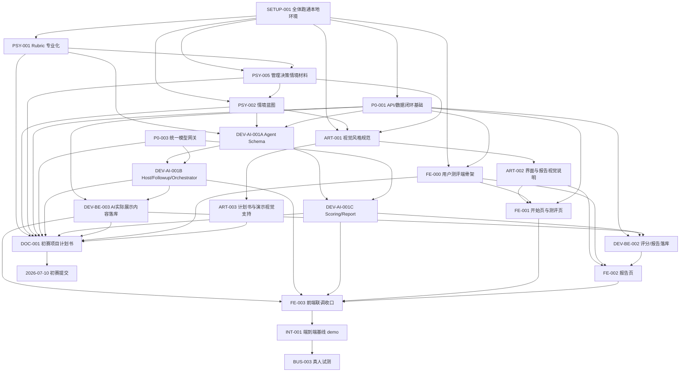

# 审辩式思维动态测评系统基线版开发任务分配

## 1. 项目定位

本项目当前进入“可运行基线版开发”阶段。前期需求规格说明、数据库设计和后端基础框架已经完成，接下来需要团队围绕同一套代码基线并行开发，尽快跑通一条完整测评闭环。

当前技术基线：

```text
FastAPI + MySQL 8.0 + SQLAlchemy + Alembic + YAML seed
```

第一版成功标准：

1. 成员可以按 README 在本地部署并运行项目；
2. 用户可以输入昵称并开始一次固定情境测评；
3. 系统可以加载情境、阶段、动态信息、追问规则和 rubric；
4. 用户与 AI 完成多轮对话；
5. 系统保存对话、AgentTrace、评分证据和报告；
6. 报告页展示六维评分、证据、优势、建议和发展计划；
7. 基线 demo 可以支持小规模真人试测。
8. 初赛项目计划书在 2026 年 7 月 10 日前完成内部审核并提交。
9. 形成统一视觉规范、报告展示风格和计划书/演示材料视觉支持。

## 2. 当前状态

| 区域 | 当前状态 | 差距 | 负责人确认 |
| --- | --- | --- | --- |
| 仓库基线 | 已有 FastAPI 后端、MySQL/Docker Compose、README、部署手册、数据库文档 | 需要所有成员按部署手册复跑本地环境 | 全体 |
| 数据库 | 已有 23 张业务表 ORM、Alembic migration、MySQL seed 入库验证 | 缺 Agent 运行期 repository/service，尤其是 AgentTrace、评分、报告落库服务 | 全栈 A |
| 后端 API | 已有 health、db health、默认情境读取、会话创建、用户回答保存、会话结束、报告读取占位、轻量后台管理 API | 缺 Agent 编排接入、AI 实际展示内容落库、评分落库、报告生成写入 | 全栈 A |
| 模型网关 | 已有 DeepSeek `deepseek-v4-pro` 统一模型网关骨架，默认 `mock` 可运行 | 缺 Agent 内部统一调用适配器、真实 API Key 联调和异常兜底验证 | 全栈 A 维护网关；全栈 B 只封装对话侧调用适配器 |
| Agent | 已有 prompt seed、AgentTrace 表、统一模型网关和 Agent 输入输出契约文档 | 缺 `backend/app/agents/**`、对话 Agent、评分 Agent、报告 Agent 和结构化输出解析 | 全栈 B 负责对话编排；全栈 C 负责评分报告 |
| 前端 | 已有轻量后台管理前端，可管理 rubric、情境、阶段、动态信息、追问规则 | 用户测评端入口页、测评对话页、报告页尚未开始 | 前端开发 |
| 心理测评内容 | 已有六维 seed 初稿 | 缺专业化 rubric、管理决策情境材料、情境蓝图、评分样例 | 心理组 |
| 商科与计划书材料 | 有商科组中文模板 | 缺计划书统稿、应用价值、演示脚本、试测方案 | 商科组 |
| 美术设计 | 已有视觉规范、界面视觉稿说明、图标与素材清单初稿 | 需要和用户测评前端、报告页、计划书版式继续对齐 | 美术设计 |
| 初赛项目计划书 | 未开始 | 初赛截止 2026-07-10，缺计划书统稿、供稿、审核和最终版 | 商科组牵头，全体供稿 |
| 真人测试 | 未开始 | 需要基线 demo 跑通后组织真人试测 | 商科组牵头，心理组协作 |

当前已验证接口：

```text
GET /api/v1/health
GET /api/v1/health/db
GET /api/v1/scenarios/default
GET /api/v1/model-gateway/status
POST /api/v1/model-gateway/chat
POST /api/v1/sessions
GET /api/v1/sessions/{session_uuid}
POST /api/v1/sessions/{session_uuid}/turns
POST /api/v1/sessions/{session_uuid}/finish
GET /api/v1/sessions/{session_uuid}/report
POST /api/v1/admin/login
GET /api/v1/admin/dashboard
```

## 3. 本阶段范围

### 3.1 本阶段必须完成

| 模块 | 目的 | 独立性 | Owner |
| --- | --- | --- | --- |
| 本地部署基线 | 保证所有成员能运行项目 | 独立 | 全体 |
| 测评会话 API | 创建 participant/session，推进测评流程 | 共享基础 | 全栈 A |
| 对话与记录 API | 保存用户回答、AI 发言、AgentTrace | 共享基础 | 全栈 A |
| AI 实际展示内容落库 | 保存每个用户真实看到的 AI 改写情境、追问和动态信息，并关联 AgentTrace | 共享基础 | 全栈 A 收口落库；全栈 B 只提供对话输出 |
| 统一模型网关 | 以 DeepSeek `deepseek-v4-pro` 为默认模型，提供 mock/real 双模式 | 共享基础 | 全栈 A |
| Agent 对话编排闭环 | 先不用真实模型也能完成主持、追问、动态信息释放和阶段推进 | 可并行 | 全栈 B |
| Agent 评分与报告闭环 | 先不用真实模型也能输出六维评分、证据和结构化报告 JSON | 可并行 | 全栈 C |
| 用户测评前端最小流程 | Vue 入口页、测评对话页、报告页、API 封装 | 依赖 API | 前端开发 |
| Rubric 专业化 | 让六维评分可解释、可校准 | 可并行 | 心理组 A |
| 情境蓝图专业化 | 让情境、动态信息、追问策略服务测评目标 | 可并行 | 心理组 B |
| 管理决策情境材料 | 把真实管理决策转化为可测评、可追问、可评分的情境任务 | 可并行 | 心理组 B |
| 初赛项目计划书 | 汇总项目背景、方案、技术路线、团队计划和预期成果 | 依赖各组供稿 | 商科组牵头 |
| 产品视觉与演示材料 | 统一测评产品的视觉语言、报告呈现和计划书/演示材料风格 | 可并行 | 美术设计 |
| Demo 试测方案 | 基线跑通后可找真人测试效果 | 依赖 demo | 商科组牵头 |

### 3.2 本阶段暂不做

1. 复杂后台配置发布流、配置审核流和细粒度权限；
2. 长期用户账号体系；
3. 多角色权限；
4. 多报告版本；
5. 正式信效度统计平台；
6. 大规模真实用户测试；
7. 自动根据 AI 质量调整配置权重；
8. 生产环境部署。

## 4. 团队分工总览

| 成员 | 角色 | 能力特点 | 主要负责 | 最终产出 |
| --- | --- | --- | --- | --- |
| 全栈 A | 项目基础设施与后端业务闭环 | FastAPI、数据库、API、整体集成 | 数据库、后端 API、部署、seed 导入、Agent 落库、最终集成 | 稳定后端基线 + 可集成 API |
| 前端开发 | 测评前端体验与页面闭环 | Vue、页面交互、接口联调、可视化展示 | 前端工程、入口页、测评页、报告页、前端构建 | 可演示前端 baseline |
| 全栈 B | Agent 对话编排 | Python、Agent、CoT、LLM 调用 | HostAgent、FollowupAgent、对话阶段推进、追问策略选择、动态信息释放、对话侧模型调用适配器 | 可运行的主持与追问 Agent |
| 全栈 C | Agent 评分与报告 | 全栈、Agent、结构化输出、RAG/上下文工程 | ScoringAgent、ReportAgent、专业上下文组装、评分证据抽取、报告 JSON 生成 | 可校验、可落库的评分与报告 Agent |
| 心理组 A | 构念与评分标准 | 心理测评理论、rubric、评分解释 | 六维能力模型、BARS 锚点、评分证据标准 | 专业 rubric v1 |
| 心理组 B | 情境测评设计 | 情境任务、追问策略、动态测评 | 管理决策情境材料、情境阶段、动态信息、追问策略、评分蓝图 | 情境材料 v1 + 情境蓝图 v1 |
| 商科组 | 计划书统稿、应用价值与试测组织 | 管理决策、业务场景、用户调研、材料整合 | 初赛项目计划书、应用价值、演示脚本、真人试测方案 | 计划书终稿 + 演示材料 + 试测反馈报告 |
| 美术设计 | 视觉规范、界面风格与材料设计 | 视觉表达、版式、图标、报告可视化 | 产品视觉规范、测评界面视觉说明、报告展示样式、计划书/演示材料视觉支持 | 视觉规范 v1 + 演示材料视觉稿 |

### 4.1 全栈 A/B/C 当前任务边界

| 成员 | 当前优先级 | 主要任务 | 不负责的边界 | 完成后交给谁 |
| --- | --- | --- | --- | --- |
| 全栈 A | 先稳住项目骨架和数据闭环 | 维护数据库模型、seed、会话 API、模型网关、后台管理、Agent schema 契约收口、AgentTrace/DialogueTurn/ScoreSnapshot/AssessmentReport 落库、端到端集成 | 不直接编写 Agent 的测评推理策略，不在 Agent 内部硬编码心理测评规则 | 给 B/C 提供稳定数据库配置、Session API、schema 契约、落库 service 和可运行环境 |
| 全栈 B | 先跑通“用户回答后 AI 继续问什么” | HostAgent、FollowupAgent、对话阶段推进、追问策略选择、动态信息释放、对话侧 LLM 调用适配 | 不做六维评分、不生成最终报告、不直接改 migration、不直接改 `session_service.py` 和最终集成编排 service | 给 A 提供可落库的主持/追问输出；给前端提供可展示的 AI 下一轮文本 |
| 全栈 C | 先跑通“回答如何被评分并生成报告” | ScoringAgent、ReportAgent、RAG/专业上下文、评分证据抽取、报告 JSON 结构 | 不主导 Host/Followup 的阶段推进，不直接改会话 API，不绕过 A 写数据库，不改 B 的追问策略选择逻辑 | 给 A 提供可保存的评分/报告输出；给商科组和前端提供报告结构样例 |

三人的共同规则：

1. `docs/05_Agent输入输出契约_v1.md` 是 Agent 字段标准，变更前先同步 A/B/C；
2. Agent 读取数据库配置，不硬编码情境、rubric、动态信息和追问规则；
3. A 负责合入共享服务和路由，B/C 负责各自 Agent 输出结构稳定；
4. mock 链路必须先跑通，真实模型接入不能阻塞 baseline；
5. 每个任务完成时必须说明测试命令、样例输入、样例输出和落库位置。

## 5. 依赖关系



## 6. 文件与目录 Ownership

| 区域 | Owner | 可编辑路径 | 只读参考路径 | 冲突规则 |
| --- | --- | --- | --- | --- |
| 项目基础配置 | 全栈 A | `README.md`、`backend/.env.example`、`docker-compose.yml`、`backend/requirements.txt` | 全仓库 | 其他成员需要改配置时先同步 |
| 数据库模型与迁移 | 全栈 A | `backend/app/models/**`、`backend/migrations/**` | `docs/04_数据库设计说明书.md` | 其他人不直接改 migration |
| 后端 API 与业务服务 | 全栈 A | `backend/app/api/**`、`backend/app/services/session_service.py`、`backend/app/repositories/**`、`backend/app/schemas/session.py` | `backend/app/models/**`、`backend/app/agents/**` | Agent 接口变更需和全栈 B/C 对齐，`session_service.py` 由全栈 A 收口 |
| AI 实际展示内容落库 | 全栈 A | `backend/app/services/agent_trace_service.py`、`backend/app/services/dialogue_service.py`、`backend/app/repositories/**`、`backend/app/schemas/**`、`backend/app/api/**` | `backend/app/models/assessment.py`、`backend/app/models/agent.py`、`backend/app/models/scenario.py`、`backend/app/services/agent_orchestrator.py` | 全栈 B 负责 Host/Followup 输出，全栈 A 负责 `AgentTrace` 与 `DialogueTurn` 落库 |
| 统一模型网关 | 全栈 A | `backend/app/api/v1/endpoints/model_gateway.py`、`backend/app/services/model_gateway_service.py`、`backend/app/schemas/model_gateway.py`、`backend/.env.example` | DeepSeek API 文档、`docs/api_contract_v1.md` | Agent 模块调用网关，不直接散落多个模型客户端 |
| 前端工程与页面 | 前端开发 | `frontend/**`、`docs/frontend/**` | `docs/api_contract_v1.md`、`docs/部署运行手册.md`、`backend/app/schemas/**` | 前端只通过 API 合同对接后端，不直接修改 `backend/**` |
| Agent 共享 schema | 全栈 A | `backend/app/agents/schemas.py`、`backend/app/agents/base.py` | `docs/05_Agent输入输出契约_v1.md`、`backend/app/models/**` | `schemas.py` 是 A/B/C 的共同契约，由全栈 A 先落最小稳定版；B/C 只提交字段变更建议，不直接抢改 |
| Agent 对话编排 | 全栈 B | `backend/app/agents/host_agent.py`、`backend/app/agents/followup_agent.py`、`backend/app/agents/dialogue_policy.py`、`backend/app/agents/dialogue_llm_client.py`、`backend/app/agents/dialogue_prompts.py`、`backend/app/agents/mock_dialogue.py` | `docs/05_Agent输入输出契约_v1.md`、`backend/seeds/prompts.yaml`、`backend/app/models/agent.py`、`backend/app/models/scenario.py`、`backend/app/agents/schemas.py` | B 只返回下一条 AI 文本、动态信息释放和阶段动作；不直接改 `session_service.py`、`scoring_agent.py`、`report_agent.py`、`agent_orchestrator.py` |
| Agent 运行编排与落库集成 | 全栈 A | `backend/app/services/agent_orchestrator.py`、`backend/app/services/agent_trace_service.py`、`backend/app/services/scoring_service.py`、`backend/app/services/report_service.py`、`backend/app/api/**`、`backend/app/repositories/**` | `backend/app/agents/**`、`backend/app/models/**` | A 负责把 B/C 输出串起来、落库并返回前端；B/C 不直接改最终集成 service |
| Agent 评分与报告 | 全栈 C | `backend/app/agents/scoring_agent.py`、`backend/app/agents/report_agent.py`、`backend/app/agents/rag_context.py`、`backend/app/agents/scoring_prompts.py`、`backend/app/agents/mock_scoring_report.py` | `docs/05_Agent输入输出契约_v1.md`、`backend/app/models/scoring.py`、`backend/app/models/report.py`、`backend/seeds/rubric.yaml`、`backend/app/agents/schemas.py` | C 只输出评分、证据、评分缺口和报告 JSON；不直接改 B 的对话推进逻辑和 A 的落库逻辑 |
| Prompt 配置 | 全栈 A | `backend/seeds/prompts.yaml` | B 的 `dialogue_prompts.py`、C 的 `scoring_prompts.py`、心理组 rubric、情境蓝图、`docs/05_Agent输入输出契约_v1.md` | seed 里的 prompt 由 A 统一收口；B/C 先在各自 prompt 文件中维护模块内模板，避免同时改同一个 YAML |
| Rubric 内容 | 心理组 A | `docs/psych/construct_and_rubric_v1.md` | `backend/seeds/rubric.yaml` | seed 由全栈 A 转写 |
| 管理决策情境材料 | 心理组 B | `docs/psych/管理决策情境材料_v1.md` | 赛题要求、`backend/seeds/scenario_product_48h.yaml` | 商科组可补充业务真实感，但测评阶段、动态信息、追问策略由心理组负责 |
| 情境蓝图 | 心理组 B | `docs/psych/scenario_blueprint_product_48h_v1.md` | `docs/psych/管理决策情境材料_v1.md`、`backend/seeds/scenario_product_48h.yaml` | seed 由全栈 A 转写 |
| 初赛项目计划书 | 商科组牵头 | `docs/商科组/初赛项目计划书_v1.md` | 赛题要求、需求规格说明书、数据库设计、API 合同、各组供稿 | 商科组统稿，全栈 A/全栈 B/心理组/前端开发按章节供稿，最终提交前全体审核 |
| 美术设计材料 | 美术设计 | `docs/美术设计/**` | `docs/01_需求规格说明书.md`、`docs/psych/管理决策情境材料_v1.md`、`docs/商科组/初赛项目计划书_v1.md`、`docs/api_contract_v1.md` | 美术设计先交规范和素材说明；如需进入 `frontend/**`，由前端开发确认后再合入 |
| 真人测试材料 | 商科组 | `docs/商科组/真人试测方案与招募计划_v1.md`、`docs/商科组/真人试测反馈报告_v1.md` | demo、报告页 | 涉及测评解释需心理组审核 |

## 7. 负责人前置任务

### P0-001 稳定本地部署与数据库基线

- Objective: 保证成员拿到仓库后能启动 MySQL、迁移表结构、导入 seed、启动后端。
- Owner: 全栈 A
- Status: Done（本机已验证，仍需成员各自复跑）
- Prerequisites: 当前 FastAPI 后端和 Docker Compose 已存在。
- Affected module: 部署、数据库、README。
- Allowed edit paths: `README.md`、`backend/README.md`、`docker-compose.yml`、`backend/scripts/**`、`backend/.env.example`。
- Read-only reference paths: `docs/04_数据库设计说明书.md`。
- Expected new files/directories: 如需要，可新增 `docs/dev_setup_troubleshooting.md`。
- API/data contract: `/api/v1/health`、`/api/v1/health/db`、`/api/v1/scenarios/default`、`/api/v1/model-gateway/status`。
- Acceptance criteria:
  1. 新成员可按 README 跑通服务；
  2. `python scripts/check_db.py` 通过；
  3. `/api/v1/scenarios/default` 返回默认情境。
- Required tests: 本地执行 migration、seed、接口检查。
- Integration check: 全体成员至少一人从空环境跑通。
- Lead acceptance: 全栈 A 确认。
- Deliverables: 可运行开发环境说明。
- Handoff note: 后续所有任务先以本地可跑通为前提。

### P0-002 定义核心 API 合同

- Objective: 先定清楚前端、Agent、数据库之间的接口边界。
- Owner: 全栈 A
- Status: Done
- Prerequisites: 数据模型已存在。
- Affected module: 后端 API、前端、Agent。
- Allowed edit paths: `backend/app/api/**`、`backend/app/schemas/**`、`docs/api_contract_v1.md`。
- Read-only reference paths: `docs/01_需求规格说明书.md`、`docs/04_数据库设计说明书.md`。
- Expected new files/directories: `docs/api_contract_v1.md`。
- API/data contract:
  1. `POST /api/v1/sessions`
  2. `GET /api/v1/sessions/{session_uuid}`
  3. `POST /api/v1/sessions/{session_uuid}/turns`
  4. `POST /api/v1/sessions/{session_uuid}/finish`
  5. `GET /api/v1/sessions/{session_uuid}/report`
- Acceptance criteria:
  1. 每个接口有请求/响应 JSON；
  2. 前端和 Agent 可基于合同并行开发；
  3. Swagger 可查看。
- Required tests: 至少用手工 curl/Swagger 跑通 mock。
- Integration check: 前端能按接口创建 session 并提交回答。
- Lead acceptance: 全栈 A 确认。
- Deliverables: API 合同文档 + 初始路由。
- Handoff note: 合同变更必须通知全栈 B 和前端开发。

### P0-003 接入统一模型网关基线

- Objective: 先提供一个统一的 LLM 调用入口，避免后续 Agent、评分、报告模块各自写一套模型调用逻辑。
- Owner: 全栈 A
- Status: Done
- Prerequisites: FastAPI 配置层已存在。
- Affected module: 模型配置、DeepSeek API 调用、Agent 基础依赖。
- Allowed edit paths: `backend/app/api/v1/endpoints/model_gateway.py`、`backend/app/services/model_gateway_service.py`、`backend/app/schemas/model_gateway.py`、`backend/.env.example`、`docs/api_contract_v1.md`。
- Read-only reference paths: DeepSeek 官方 API 文档。
- Expected new files/directories: 已新增模型网关 endpoint、schema、service。
- API/data contract:
  1. `GET /api/v1/model-gateway/status`
  2. `POST /api/v1/model-gateway/chat`
- Acceptance criteria:
  1. 默认 `MODEL_GATEWAY_MODE=mock` 时无 API Key 也能返回；
  2. 可通过 `.env` 切换 `MODEL_GATEWAY_MODE=real`；
  3. 默认模型配置为 `deepseek-v4-pro`；
  4. 超时、DeepSeek HTTP 错误和响应格式异常有明确错误返回；
  5. Agent 同学可基于该接口先完成连通性测试。
- Required tests: `GET /model-gateway/status` 和 `POST /model-gateway/chat` 已在本机通过。
- Integration check: 后续 DEV-AI-001B 和 DEV-AI-001C 调用该网关，不再另起散落式模型客户端。
- Lead acceptance: 全栈 A 确认。
- Deliverables: 统一模型网关代码 + API 合同说明。
- Handoff note: 真实 DeepSeek Key 不写入仓库，统一放在本地 `backend/.env`。

## 8. 并行成员任务

### 8.1 心理组 A：构念与评分标准

#### PSY-001 六维能力模型与 Rubric v1

- Objective: 把审辩式思维六维能力模型写成 AI 可用、人可解释的评分标准。
- Owner: 心理组 A
- Status: Done（fixture 与无前端验收脚本已完成；B/C 合入后复跑集成验收）
- Prerequisites: 阅读需求规格说明书和赛题要求。
- Affected module: 测评构念、评分标准、报告解释。
- Allowed edit paths: `docs/psych/construct_and_rubric_v1.md`。
- Read-only reference paths: `backend/seeds/rubric.yaml`、`docs/01_需求规格说明书.md`。
- Expected new files/directories: `docs/psych/construct_and_rubric_v1.md`。
- API/data contract: 后续映射到 `rubric_dimension`、`rubric_anchor`。
- Acceptance criteria:
  1. 六个维度都有定义；
  2. 每个维度至少 5 条可观察行为；
  3. 每个维度至少 1、3、5 分锚点；
  4. 每个维度至少 3 条典型证据句；
  5. 每个维度至少 2 条反例或无效证据；
  6. 评分语言能被非心理学成员读懂。
- Required tests: 用 3 条模拟回答试打分，检查评分标准是否能区分水平。
- Integration check: 全栈 A 能转写进 `rubric.yaml`。
- Lead acceptance: 心理组内部互审，全栈 A 检查可落库。
- Deliverables: Rubric 文档 v1。
- Handoff note: 不直接修改 seed，先交文档，确认后由全栈 A 转写。

#### PSY-003 人工评分校准样例

- Objective: 为 AI 评分提供人工校准样例。
- Owner: 心理组 A + 心理组 B
- Status: Not Started
- Prerequisites: PSY-001 初稿。
- Affected module: ScoringAgent、评分 prompt、报告解释。
- Allowed edit paths: `docs/psych/scoring_calibration_samples_v1.md`。
- Read-only reference paths: `docs/psych/construct_and_rubric_v1.md`。
- Expected new files/directories: `docs/psych/scoring_calibration_samples_v1.md`。
- API/data contract: 后续可进入 prompt few-shot 或测试集。
- Acceptance criteria:
  1. 10-20 条模拟用户回答；
  2. 覆盖低、中、高水平；
  3. 每条至少标注重点维度评分；
  4. 每个分数有证据句；
  5. 标注“看似合理但证据不足”的回答。
- Required tests: 随机抽 3 条给 Agent 同学试跑评分 prompt。
- Integration check: ScoringAgent 能用这些样例优化输出格式。
- Lead acceptance: 心理组共同确认。
- Deliverables: 人工评分样例集 v1。
- Handoff note: 这是后续 AI 评分质量提升的关键材料。

### 8.2 心理组 B：情境蓝图与追问策略

#### PSY-005 管理决策情境材料 v1

- Objective: 将赛题要求中的真实管理决策情境转化为可测评、可追问、可评分的情境材料，支撑后续情境蓝图、动态信息和追问策略设计。
- Owner: 心理组 B
- Status: Not Started
- Prerequisites: 阅读赛题要求、PSY-001 六维能力模型初稿、当前默认情境。
- Affected module: 情境背景、动态信息、角色冲突、追问策略、评分证据。
- Allowed edit paths: `docs/psych/管理决策情境材料_v1.md`。
- Read-only reference paths: `backend/seeds/scenario_product_48h.yaml`、赛题要求。
- Expected new files/directories: `docs/psych/管理决策情境材料_v1.md`。
- API/data contract: 后续映射到 `scenario_stage`、`stage_dynamic_info`、`stage_intervention_rule` 和评分证据提示。
- Acceptance criteria:
  1. 明确管理决策背景、核心冲突和用户需要完成的判断任务；
  2. 至少设计 4 个测评阶段，并说明每阶段主测维度；
  3. 至少提供 5 条可释放动态信息；
  4. 至少提供 5 类追问或挑战方向；
  5. 明确每类材料对应的审辩式思维观察点；
  6. 情境材料能直接支持单情境 30 分钟以内的测评流程。
- Required tests: 用一条模拟用户路径检查情境、动态信息和追问是否能自然推进。
- Integration check: PSY-002 能基于该材料形成完整情境蓝图。
- Lead acceptance: 心理组内部确认，全栈 A 检查可转写为 seed。
- Deliverables: 管理决策情境材料 v1。
- Handoff note: 商科组可以补充业务真实感和应用场景，但测评阶段、动态信息、追问方向和评分证据由心理组负责。

#### PSY-002 产品上线情境测评蓝图 v1

- Objective: 将默认情境扩展为完整测评蓝图，让每一阶段都能观察明确能力。
- Owner: 心理组 B
- Status: Not Started
- Prerequisites: PSY-005 管理决策情境材料初稿、PSY-001 维度定义。
- Affected module: 情境阶段、动态信息、追问策略。
- Allowed edit paths: `docs/psych/scenario_blueprint_product_48h_v1.md`。
- Read-only reference paths: `docs/psych/管理决策情境材料_v1.md`、`backend/seeds/scenario_product_48h.yaml`。
- Expected new files/directories: `docs/psych/scenario_blueprint_product_48h_v1.md`。
- API/data contract: 后续映射到 `scenario_stage`、`stage_dynamic_info`、`stage_intervention_rule`。
- Acceptance criteria:
  1. 至少 4 个阶段；
  2. 每阶段有阶段目标、背景、主问题、退出条件；
  3. 每阶段标注主测维度和辅助维度；
  4. 至少 3 条动态信息；
  5. 至少 8 条追问规则；
  6. 覆盖开放追问、澄清追问、挑战追问、陷阱性挑战、阶段推进。
- Required tests: 用一条模拟用户路径检查阶段是否能自然推进。
- Integration check: 全栈 A 能转写进 `scenario_product_48h.yaml`。
- Lead acceptance: 心理组和全栈 A 共同确认。
- Deliverables: 情境蓝图文档 v1。
- Handoff note: 追问规则要写“策略方向”，不要只写固定话术。

#### PSY-004 试测反馈问卷与心理测评效果指标

- Objective: 为真人试测设计反馈指标，帮助判断 demo 是否测得准、问得自然、报告是否有解释力。
- Owner: 心理组 B
- Status: Not Started
- Prerequisites: INT-001 基线 demo 可运行。
- Affected module: 真人试测、测评质量评估。
- Allowed edit paths: `docs/psych/pilot_measurement_feedback_form_v1.md`。
- Read-only reference paths: `docs/商科组/真人试测方案与招募计划_v1.md`。
- Expected new files/directories: `docs/psych/pilot_measurement_feedback_form_v1.md`。
- API/data contract: 后续可进入试测问卷或访谈提纲。
- Acceptance criteria:
  1. 包含情境真实性、追问自然度、报告可信度、评分解释性等指标；
  2. 区分用户主观体验和测评专业质量；
  3. 不使用临床诊断式表述；
  4. 能支持商科组整理试测反馈报告。
- Required tests: 让 1 名非项目成员试填问卷，检查是否能看懂。
- Integration check: 商科组能用该问卷组织真人测试。
- Lead acceptance: 心理组确认。
- Deliverables: 试测反馈问卷 v1。
- Handoff note: 这是 demo 试测的专业质量评估部分。

### 8.3 商科组：初赛计划书、应用价值与真人试测

#### DOC-001 初赛项目计划书统稿与提交

- Objective: 在 2026 年 7 月 10 日初赛提交截止前，完成一份结构完整、表达清晰、能体现心理测评专业性和 AI Agent 技术路线的项目计划书。
- Owner: 商科组牵头，全体供稿。
- Status: Not Started
- Prerequisites: 已有需求规格说明书、数据库设计说明书、API 合同、基线版任务分配和当前后端基线。
- Affected module: 初赛材料、项目表达、团队协作。
- Allowed edit paths: `docs/商科组/初赛项目计划书_v1.md`。
- Read-only reference paths:
  1. `docs/01_需求规格说明书.md`
  2. `docs/04_数据库设计说明书.md`
  3. `docs/api_contract_v1.md`
  4. `docs/03_基线版开发任务分配.md`
  5. `docs/psych/管理决策情境材料_v1.md`
- Expected new files/directories: `docs/商科组/初赛项目计划书_v1.md`。
- 分工要求:
  1. 商科组：负责计划书结构、应用价值、目标用户、商业/教育场景、实施计划、统稿和提交材料检查；
  2. 心理组 A/B：提供审辩式思维能力模型、六维构念、评分依据、情境测评设计和测评专业性说明；
  3. 全栈 A：提供系统总体架构、数据库设计、后端 API、部署方式、数据合规和工程可行性说明；
  4. 全栈 B：提供 HostAgent、FollowupAgent、动态追问、阶段推进、对话侧模型调用和失败兜底说明；
  5. 全栈 C：提供 ScoringAgent、ReportAgent、RAG/专业上下文、评分证据抽取和报告生成技术路线说明；
  6. 前端开发：提供前端页面规划、交互流程、报告展示方案和演示界面说明；
  7. 美术设计：提供计划书版式建议、核心流程图视觉风格、图标/配色规范和演示材料视觉支持。
- 建议时间节点:
  1. 2026-07-03 前：各组完成对应章节供稿；
  2. 2026-07-06 前：商科组完成计划书初稿；
  3. 2026-07-08 前：全体完成第一轮审阅和修改；
  4. 2026-07-09 前：形成最终提交版；
  5. 2026-07-10：按比赛要求提交。
- Acceptance criteria:
  1. 计划书完整覆盖项目背景、问题定义、解决方案、测评模型、AI 技术路线、系统架构、实施计划、团队分工、预期成果和风险合规；
  2. 能明确扣住赛题的多轮对话、情境动态、自适应追问、行为识别、自动评分、结构化报告和工具化要求；
  3. 心理测评部分有六维能力模型和可解释评分依据；
  4. AI 技术部分体现 Agent 协作、模型网关、结构化输出、失败兜底和日志追踪；
  5. 工程部分与当前 FastAPI/MySQL/前端/Agent 架构一致；
  6. 语言面向评审可读，避免只写技术术语或只写商业愿景；
  7. 提交前至少经过商科组、心理组、全栈 A、全栈 B、美术设计各 1 人审阅确认。
- Required tests: 用计划书目录反向检查赛题要求，逐条确认没有漏项。
- Integration check: 计划书中的技术方案、任务分工和当前仓库文档保持一致。
- Lead acceptance: 全体会前确认最终版，提交前由项目负责人做最后检查。
- Deliverables: 初赛项目计划书源文档；如比赛要求 Word/PDF，再由商科组导出最终提交版。
- Handoff note: 商科组负责“写成一份能提交的计划书”，其他组负责提供专业内容，不能把技术路线和测评依据全部留给商科组猜。

#### BUS-002 应用价值与演示脚本

- Objective: 让 demo 能被清楚讲出来，说明工具在真实组织或教学场景中的价值。
- Owner: 商科组
- Status: Not Started
- Prerequisites: 当前项目定位和第一版范围。
- Affected module: 汇报、演示、项目说明。
- Allowed edit paths: `docs/商科组/应用价值与演示脚本_v1.md`。
- Read-only reference paths: `docs/01_需求规格说明书.md`、最终 demo。
- Expected new files/directories: `docs/商科组/应用价值与演示脚本_v1.md`。
- API/data contract: 无。
- Acceptance criteria:
  1. 说明目标用户和使用场景；
  2. 说明相比传统测评的价值；
  3. 给出 3-5 分钟 demo 演示脚本；
  4. 包含隐私、可解释性、人工复核等风险说明；
  5. 能用于团队汇报。
- Required tests: 用脚本走一遍 demo，不超过 5 分钟。
- Integration check: 演示脚本和实际页面流程一致。
- Lead acceptance: 全体会议确认。
- Deliverables: 应用价值说明 + 演示脚本。
- Handoff note: 这部分可以直接支持后续答辩材料。

#### BUS-003 真人试测方案与招募计划

- Objective: 在基线 demo 跑通后，组织小规模真人测试，收集使用体验和测评效果反馈。
- Owner: 商科组
- Status: Not Started
- Prerequisites: INT-001 端到端基线 demo 可运行，PSY-004 反馈问卷完成。
- Affected module: 真人试测、用户反馈、产品改进。
- Allowed edit paths: `docs/商科组/真人试测方案与招募计划_v1.md`。
- Read-only reference paths: `docs/psych/pilot_measurement_feedback_form_v1.md`、demo。
- Expected new files/directories: `docs/商科组/真人试测方案与招募计划_v1.md`。
- API/data contract: 后续如需收集试测元数据，可由全栈 A 补接口。
- Acceptance criteria:
  1. 明确试测目标：可用性、情境真实性、追问质量、报告价值；
  2. 明确样本规模：先 5-8 人内部试测，再 15-30 人扩展试测；
  3. 明确招募对象：学生、准职场人、商科/管理相关背景可优先；
  4. 明确测试流程：知情说明、完成测评、填写反馈、简短访谈；
  5. 明确数据保护：不收集敏感身份信息，结果匿名整理；
  6. 明确风险边界：本系统是能力测评原型，不做心理诊断。
- Required tests: 先找 1 名内部成员按流程试跑。
- Integration check: 测试流程不阻塞 demo 使用。
- Lead acceptance: 全体确认后再找外部真人测试。
- Deliverables: 真人试测计划 v1。
- Handoff note: 不建议 demo 刚能打开就大规模测试，先小样本观察问题。

#### BUS-004 真人试测执行与反馈报告

- Objective: 基于真人试测结果，形成可用于迭代和汇报的反馈报告。
- Owner: 商科组
- Status: Blocked until INT-001
- Prerequisites: BUS-003、PSY-004、INT-001。
- Affected module: 产品迭代、汇报材料。
- Allowed edit paths: `docs/商科组/真人试测反馈报告_v1.md`。
- Read-only reference paths: 试测记录、反馈问卷。
- Expected new files/directories: `docs/商科组/真人试测反馈报告_v1.md`。
- API/data contract: 无。
- Acceptance criteria:
  1. 汇总完成率、平均耗时、用户主观评分；
  2. 汇总用户认为最自然和最不自然的追问；
  3. 汇总报告中最有帮助和最不可信的部分；
  4. 提出 5 条以内优先级最高的改进建议；
  5. 给出可放入项目汇报的结论图表或表格。
- Required tests: 反馈报告至少被 1 名开发和 1 名心理组成员阅读确认。
- Integration check: 改进建议能转化为后续任务。
- Lead acceptance: 全体确认。
- Deliverables: 试测反馈报告 v1。
- Handoff note: 重点是发现 demo 的真实问题，不追求数据好看。

### 8.4 美术设计：视觉规范、界面风格与演示材料

#### ART-001 产品视觉风格规范 v1

- Objective: 基于动态情境设计文档和当前产品定位，形成一套适合审辩式思维测评工具的视觉语言，帮助前端、计划书和演示材料保持统一专业感。
- Owner: 美术设计
- Status: Not Started
- Prerequisites: 阅读需求规格说明书、基线版任务分配、管理决策情境材料和动态情境设计文档。
- Affected module: 产品视觉风格、前端 UI 基调、计划书与演示材料。
- Allowed edit paths: `docs/美术设计/视觉风格规范_v1.md`。
- Read-only reference paths: `docs/01_需求规格说明书.md`、`docs/psych/管理决策情境材料_v1.md`、`docs/商科组/初赛项目计划书_v1.md`。
- Expected new files/directories: `docs/美术设计/视觉风格规范_v1.md`。
- API/data contract: 无。
- Acceptance criteria:
  1. 明确产品视觉关键词，例如专业、可信、理性、互动、可解释；
  2. 给出主色、辅助色、警示色、背景色和文本色建议；
  3. 给出字体层级、标题/正文/标签/数据数字的字号建议；
  4. 给出按钮、卡片、对话气泡、评分图表、证据引用块的风格建议；
  5. 说明哪些风格不适合本项目，例如过度娱乐化、医疗诊断感过强、普通聊天软件感过强；
  6. 前端开发可以据此开始做页面，不需要再临时猜配色和版式方向。
- Required tests: 美术设计、前端开发和全栈 A 共同快速走读一次，确认规范可执行。
- Integration check: FE-001、FE-002 开始前，前端开发能从该文档提取页面样式方向。
- Lead acceptance: 前端开发确认可实现，商科组确认适合计划书展示。
- Deliverables: 产品视觉风格规范 v1。
- Handoff note: 这份文档是风格边界，不要求第一版做完整设计系统，但要能指导页面和材料保持一致。

#### ART-002 测评界面与报告视觉稿说明 v1

- Objective: 把动态测评流程转化为可读、可演示的界面视觉说明，重点解决用户如何理解情境、如何看到动态信息更新、如何读懂六维评分和对话证据。
- Owner: 美术设计
- Status: Not Started
- Prerequisites: ART-001、PSY-002 初稿、FE-000 用户测评端骨架。
- Affected module: 开始页、测评对话页、报告页、图表与证据呈现。
- Allowed edit paths: `docs/美术设计/测评界面视觉稿说明_v1.md`、`docs/美术设计/图标与素材清单_v1.md`。
- Read-only reference paths: `docs/api_contract_v1.md`、`docs/psych/scenario_blueprint_product_48h_v1.md`、`docs/psych/管理决策情境材料_v1.md`、`frontend/**`。
- Expected new files/directories:
  1. `docs/美术设计/测评界面视觉稿说明_v1.md`
  2. `docs/美术设计/图标与素材清单_v1.md`
- API/data contract: 无；页面数据结构以前端和 API 合同为准。
- Acceptance criteria:
  1. 开始页说明昵称输入、测评引导和系统专业感如何呈现；
  2. 测评页说明情境背景、当前阶段、AI 提问、用户回答、动态信息释放和进度提示的视觉层级；
  3. 报告页说明六维评分、证据句、优势分析、改进建议和发展计划的展示方式；
  4. 至少给出 3 类图表/可视化建议，例如六维雷达图、阶段证据时间线、评分证据卡片；
  5. 说明移动端和桌面端都要避免文本拥挤、图表重叠和信息遮挡；
  6. 前端开发可以按说明拆分组件，不需要美术同学直接改代码。
- Required tests: 用一条模拟测评流程走读页面说明，检查用户是否能知道自己处在哪个阶段、为什么被追问、报告依据来自哪里。
- Integration check: FE-001 和 FE-002 采用该说明中的核心层级和图表建议。
- Lead acceptance: 前端开发确认可落地，心理组确认报告表达不误导测评含义。
- Deliverables: 测评界面与报告视觉稿说明 v1、图标与素材清单 v1。
- Handoff note: 第一版可以用文字说明、低保真图、参考图或简单截图标注表达，不强制要求高保真 Figma。

#### ART-003 初赛计划书与演示材料视觉支持 v1

- Objective: 支持商科组把项目计划书和演示材料做成评审容易理解的版本，突出“动态情境、多轮对话、Agent 协作、可解释评分、结构化报告”这些核心亮点。
- Owner: 美术设计
- Status: Not Started
- Prerequisites: DOC-001 目录确定、ART-001 初稿。
- Affected module: 初赛项目计划书、流程图、架构图、演示材料。
- Allowed edit paths: `docs/美术设计/计划书与演示材料视觉规范_v1.md`。
- Read-only reference paths: `docs/商科组/初赛项目计划书_v1.md`、`docs/03_基线版开发任务分配.md`、`docs/01_需求规格说明书.md`。
- Expected new files/directories: `docs/美术设计/计划书与演示材料视觉规范_v1.md`。
- API/data contract: 无。
- Acceptance criteria:
  1. 给出计划书封面、章节标题、表格、流程图和截图标注的统一版式建议；
  2. 给出至少 4 张核心图的视觉建议：系统总体架构图、动态测评流程图、Agent 协作流程图、报告结构示意图；
  3. 给出图标/配色/图表样式与 ART-001 保持一致的要求；
  4. 说明计划书与演示材料中哪些内容适合图示化，哪些内容保持文字更清楚；
  5. 商科组可以据此美化计划书，不需要重新设计视觉体系。
- Required tests: 商科组拿计划书初稿套用一次规范，确认不会影响内容可读性。
- Integration check: DOC-001 最终版引用或遵循该视觉规范。
- Lead acceptance: 商科组确认可用于提交材料，项目负责人做最终检查。
- Deliverables: 计划书与演示材料视觉规范 v1。
- Handoff note: 重点是提升专业表达和评审阅读效率，不追求装饰堆叠。

### 8.5 全栈 A：基础设施、业务 API、后端闭环

#### DEV-BE-000 轻量后台管理基线

- Objective: 提供一个可运行的后台管理入口，让团队可以查看和维护 rubric、情境、阶段、动态信息和追问规则，减少后续直接手改数据库的成本。
- Owner: 全栈 A
- Status: Done（已有后台 API 与 Vue 管理前端，仍需随 Agent 联调继续补字段）
- Prerequisites: 数据库模型、admin_user seed、基础路由已存在。
- Affected module: 后台管理 API、后台前端、配置管理。
- Allowed edit paths: `backend/app/api/v1/endpoints/admin.py`、`backend/app/schemas/admin.py`、`backend/app/core/security.py`、`frontend/**`。
- Read-only reference paths: `backend/app/models/rubric.py`、`backend/app/models/scenario.py`、`docs/04_数据库设计说明书.md`。
- Expected new files/directories: 已有 `frontend/`、后台视图、后台 API。
- API/data contract:
  1. `POST /api/v1/admin/login`
  2. `GET /api/v1/admin/dashboard`
  3. rubric、scenario、stage、dynamic info、intervention rule 管理接口；
  4. YAML 导出能力用于配置复盘。
- Acceptance criteria:
  1. 默认管理员可登录后台；
  2. 能查看和编辑能力维度、评分锚点、情境阶段、动态信息和追问规则；
  3. `npm run build` 通过；
  4. 后端 Python 编译检查通过。
- Required tests: `npm run build`、`python -m compileall app`。
- Integration check: DEV-AI-000 更新测试版 seed 后，后台能看到对应配置。
- Lead acceptance: 全栈 A 确认。
- Deliverables: 轻量后台管理系统 baseline。
- Handoff note: 后台第一版用于配置查看和轻量维护，不承担复杂审批流、多人权限和生产级审计。

#### DEV-BE-001 测评会话与对话 API

- Objective: 支撑用户从输入昵称到多轮对话的数据闭环。
- Owner: 全栈 A
- Status: Done（基础会话与回答落库已完成，阶段推进待 DEV-AI-001B 后接入）
- Prerequisites: P0-002。
- Affected module: 后端 API、数据库。
- Allowed edit paths: `backend/app/api/**`、`backend/app/schemas/**`、`backend/app/services/**`、`backend/app/repositories/**`。
- Read-only reference paths: `backend/app/models/**`、`docs/04_数据库设计说明书.md`。
- Expected new files/directories: `backend/app/services/session_service.py`、`backend/app/repositories/session_repository.py`。
- API/data contract:
  1. 创建 session；
  2. 提交用户回答；
  3. 读取对话历史；
  4. 读取当前阶段状态。
- Acceptance criteria:
  1. 输入昵称可创建 `participant` 和 `assessment_session`；
  2. 用户回答可写入 `dialogue_turn`；
  3. API 返回当前阶段和下一步动作；
  4. Swagger 可手工跑通。
- Required tests: 已用脚本验证创建 session、提交用户回答、读取会话、结束会话。
- Integration check: 前端可调用创建 session 和提交回答。
- Lead acceptance: 全栈 A 自测并记录接口示例。
- Deliverables: 会话与对话 API。
- Handoff note: 前端可先按 `docs/api_contract_v1.md` 接入会话链路，AI 追问返回等 Agent mock 完成后再补。

#### DEV-BE-003 AI 实际展示内容与 AgentTrace 落库链路

- Objective: 保存每个用户真实看到的 AI 改写情境、阶段问题、追问和动态信息，并把这些用户可见内容与生成它们的 AgentTrace 关联起来，保证后续评分、报告和复盘都基于用户实际拿到的内容。
- Owner: 全栈 A
- Status: Not Started
- Prerequisites: DEV-AI-001B 输出 Host/Followup Agent 结构化契约；DEV-BE-001 会话与对话 API 已完成。
- Affected module: 对话落库、AgentTrace、阶段推进、AI 生成内容审计。
- Allowed edit paths: `backend/app/services/**`、`backend/app/repositories/**`、`backend/app/schemas/**`、`backend/app/api/**`。
- Read-only reference paths: `backend/app/models/assessment.py`、`backend/app/models/agent.py`、`backend/app/models/scenario.py`、`backend/app/services/agent_orchestrator.py`、`docs/04_数据库设计说明书.md`。
- Expected new files/directories:
  1. 可选：`backend/app/services/agent_trace_service.py`
  2. 可选：`backend/app/services/dialogue_service.py`
  3. 可选：`backend/app/schemas/agent_runtime.py`
- API/data contract:
  1. Agent 每次生成用户可见内容前，后端保存 `AgentTrace.input_json`、`config_snapshot_json`、`generation_mode`、`ai_generation_weight`；
  2. Agent 成功后保存 `AgentTrace.output_json`、`raw_output`、`selected_dynamic_info_id`、`selected_rule_id`；
  3. 用户实际看到的文本保存为 `DialogueTurn.content`；
  4. `DialogueTurn.source_agent_trace_id` 指向生成该内容的 `AgentTrace`；
  5. 若内容来自动态信息，写入 `DialogueTurn.dynamic_info_id`；
  6. 若内容来自追问规则，写入 `DialogueTurn.intervention_rule_id`；
  7. `content_type` 至少区分 `stage_context`、`stage_question`、`followup_question`、`dynamic_info`、`system_notice`。
- Acceptance criteria:
  1. AI 改写后的阶段情境可以作为 `DialogueTurn` 保存并被会话详情读回；
  2. AI 生成的追问可以保存 `intervention_rule_id` 和 `source_agent_trace_id`；
  3. AI 释放的动态信息可以保存 `dynamic_info_id` 和 `source_agent_trace_id`；
  4. 任意一条 AI 用户可见内容，都能回溯到当时使用的配置快照、输入上下文、模型输出和生成模式；
  5. 后续配置发生变化时，历史会话仍能还原用户当时实际看到的内容；
  6. Agent 失败时保存 failed trace，并返回兜底问题或清晰错误状态。
- Required tests: 用 mock Agent 跑一次“生成阶段问题 -> 用户回答 -> 生成追问/动态信息”的链路，检查 `agent_trace` 和 `dialogue_turn` 关联完整。
- Integration check: 全栈 B 的 DEV-AI-001B mock Agent 输出可以被本任务直接落库；前端读取会话详情时能看到 AI 实际展示内容。
- Lead acceptance: 全栈 A + 全栈 B 联调确认，心理组可抽查一条会话复盘。
- Deliverables: AI 用户可见内容落库服务 + AgentTrace 关联逻辑。
- Handoff note: 任何面向用户展示的 AI 文本都不能只存在于模型返回值或前端状态里，必须保存到 `DialogueTurn`，并尽量关联对应 `AgentTrace`。

#### DEV-BE-004 后端模拟用户路径与测试数据基线

- Objective: 在用户测评前端尚未完成前，准备可复用的假用户数据、模拟对话路径和后端验收脚本，用于验证 Session API、Host/Followup Agent、Scoring/Report Agent、落库链路和报告链路是否可运行。
- Owner: 全栈 A
- Status: Not Started
- Prerequisites: DEV-AI-000、DEV-AI-001A、DEV-BE-001；完整闭环验收依赖 DEV-AI-001B、DEV-AI-001C、DEV-BE-003、DEV-BE-002。
- Affected module: 后端测试数据、模拟测评流程、Agent 集成验收。
- Allowed edit paths: `backend/tests/fixtures/**`、`backend/scripts/check_agent_fixture_cases.py`、`backend/scripts/check_mock_assessment_flow.py`、`backend/scripts/check_dialogue_agent_real_strict.py`、`docs/api_contract_v1.md`、`docs/03_基线版开发任务分配.md`。
- Read-only reference paths: `backend/app/agents/schemas.py`、`backend/seeds/scenario_product_48h.yaml`、`backend/seeds/rubric.yaml`、`docs/05_Agent输入输出契约_v1.md`。
- Expected new files/directories:
  1. `backend/tests/fixtures/assessment_users.json`
  2. `backend/tests/fixtures/dialogue_cases.json`
  3. `backend/tests/fixtures/scoring_cases.json`
  4. `backend/scripts/check_agent_fixture_cases.py`
  5. `backend/scripts/check_mock_assessment_flow.py`
  6. `backend/scripts/check_dialogue_agent_real_strict.py`
- API/data contract:
  1. 假用户数据只用于本地开发和验收，不进入正式 seed；
  2. 每个假用户包含 nickname、身份画像、典型回答路径和预期观察点；
  3. 模拟对话路径至少覆盖弱、中、强三类表现；
  4. 脚本通过后端 API 或 service 层创建 session、提交回答、调用 Agent、检查落库结果；
  5. 测试数据不得包含真实个人隐私信息。
- Suggested fake user paths:
  1. `student_weak`: 大学生用户，回答短、证据少，主要用于测试追问和低分评分；
  2. `student_medium`: 大学生用户，能说出基本取舍，但证据评估和动态调整不足；
  3. `workplace_strong`: 职场用户，能给出证据来源、推理链、多方视角和可执行方案；
  4. `edge_empty_or_short`: 极短回答或跑题回答，用于测试 fallback 和追问兜底；
  5. `dynamic_update_case`: 用户先给出明确方案，再被动态信息影响，用于测试动态调整。
- Acceptance criteria:
  1. 无前端环境下，脚本可以创建一次模拟测评 session；
  2. 能向 session 写入多轮假用户回答；
  3. B 的 Host/Followup 输出可用这些假用户路径验收；
  4. C 的 Scoring/Report 输出可用这些假用户路径验收；
  5. 落库后能查询到 `participant`、`assessment_session`、`dialogue_turn`；
  6. Agent 集成后能进一步查询到 `agent_trace`、`score_snapshot`、`score_result`、`score_evidence`、`assessment_report`；
  7. 测试脚本运行后可选择清理本次模拟数据，避免污染本地库。
- Required tests:
  1. `python scripts/check_agent_fixture_cases.py` 校验 fixture 格式；
  2. `python scripts/check_mock_assessment_flow.py` 在 mock 模式下跑通至少 1 条完整模拟路径；
  3. 后续 B/C 合入后，用同一批 fixture 分别跑 `check_dialogue_agent.py` 和 `check_scoring_report_agent.py`；
  4. B 做真实模型接入验收时，运行 `python scripts/check_dialogue_agent_real_strict.py`，且不允许 fallback 结果算通过。
- Integration check: 前端完成前，A/B/C 的后端联调先以这些假用户路径作为共同验收样例；前端完成后再把同样路径迁移到浏览器端到端验收。
- Lead acceptance: 全栈 A 确认脚本可重复运行；B/C 确认自己的 Agent 可以消费这些 fixture；心理组可抽查弱/中/强样例是否符合测评解释。
- Deliverables: 模拟用户 fixture + 后端模拟测评脚本 + 验收说明。
- Handoff note: 这项任务不是为了“造假数据展示”，而是为了在前端未完成前，保证后端和 Agent 模块有可重复、可自动化的验收基线。

#### DEV-BE-002 评分与报告落库 API

- Objective: 保存 Agent 评分和最终报告，支撑报告页展示。
- Owner: 全栈 A
- Status: Not Started
- Prerequisites: DEV-AI-001A 输出 schema 契约，DEV-AI-001C 输出评分/报告 JSON；DEV-BE-003 能保存 AI 实际展示内容和 AgentTrace。
- Affected module: 评分、报告、数据库。
- Allowed edit paths: `backend/app/services/scoring_service.py`、`backend/app/services/report_service.py`、`backend/app/repositories/**`、`backend/app/api/**`。
- Read-only reference paths: `backend/app/models/scoring.py`、`backend/app/models/report.py`。
- Expected new files/directories: scoring/report service 与 repository。
- API/data contract: 保存 `ScoreSnapshot`、`ScoreResult`、`ScoreEvidence`、`AssessmentReport`。
- Acceptance criteria:
  1. 每个维度分数可保存；
  2. 每个分数至少能关联证据句；
  3. 一个 session 只生成一份最终报告；
  4. 报告 API 可读取完整报告。
- Required tests: 用 mock JSON 写入并读回。
- Integration check: 报告页可以展示数据。
- Lead acceptance: 全栈 A 确认。
- Deliverables: 评分与报告数据服务。
- Handoff note: 评分解释字段不要只塞 JSON，证据需要结构化落库。

### 8.6 前端开发：Vue 前端最小闭环

#### FE-000 用户测评端路由与接口封装

- Objective: 在现有 Vue 前端工程基础上补齐用户测评端路由、API 封装和页面骨架，为入口页、测评页和报告页提供基础。
- Owner: 前端开发
- Status: Done（全栈 A 已先行补齐用户测评端最小路由、API 封装和页面骨架）
- Prerequisites: 全体先按部署手册跑通后端；`docs/api_contract_v1.md` 已存在。
- Affected module: 前端工程、路由、API client。
- Allowed edit paths: `frontend/**`、`docs/frontend/**`。
- Read-only reference paths: `docs/api_contract_v1.md`、`docs/部署运行手册.md`、`docs/美术设计/视觉风格规范_v1.md`、`backend/app/schemas/**`。
- Expected new files/directories:
  1. `frontend/src/api/session.ts`
  2. `frontend/src/types/session.ts`
  3. `frontend/src/views/AssessmentStartView.vue`
  4. `frontend/src/views/AssessmentSessionView.vue`
  5. `frontend/src/views/AssessmentReportView.vue`
  6. 必要时补充 `frontend/src/components/assessment/**` 和 `frontend/src/components/report/**`
- API/data contract:
  1. 使用 `VITE_API_BASE_URL` 配置后端地址；
  2. API client 至少封装 health、session、turn、report、model-gateway status；
  3. 不在页面组件里散落硬编码请求地址。
- Acceptance criteria:
  1. `npm install` 成功；
  2. `npm run dev` 能启动前端；
  3. `npm run build` 通过；
  4. 已创建用户测评端入口、`/assessment/session/:sessionUuid`、`/assessment/report/:sessionUuid` 三个路由，且不破坏现有后台管理路由；
  5. 页面能显示后端连接状态或在失败时给出清晰提示。
- Required tests: 本地启动前端并访问三个路由；执行一次 build。
- Integration check: 能请求 `/api/v1/health` 和 `/api/v1/model-gateway/status`。
- Lead acceptance: 全栈 A 检查工程结构和 API 封装方式。
- Deliverables: 用户测评端前端骨架。
- Handoff note: 前端开发不直接修改 `backend/**`；接口不够用时先在任务群和全栈 A 对齐。

#### FE-001 开始页与测评对话页

- Objective: 让用户可以输入昵称开始测评，并在测评页看到 AI 开场问题、提交回答、查看对话历史。
- Owner: 前端开发
- Status: Done（已可完成“输入昵称 -> 创建测评 -> 提交回答 -> 完成测评”）
- Prerequisites: FE-000、DEV-BE-001。
- Affected module: 开始页、测评页、会话状态。
- Allowed edit paths: `frontend/src/views/**`、`frontend/src/components/**`、`frontend/src/api/**`、`frontend/src/stores/**`、`frontend/src/styles/**`。
- Read-only reference paths: `docs/api_contract_v1.md`、`docs/04_数据库设计说明书.md`、`docs/美术设计/视觉风格规范_v1.md`、`docs/美术设计/测评界面视觉稿说明_v1.md`。
- Expected new files/directories:
  1. `frontend/src/views/AssessmentStartView.vue`
  2. `frontend/src/views/AssessmentSessionView.vue`
  3. `frontend/src/api/session.ts`
  4. `frontend/src/types/session.ts`
- API/data contract:
  1. `POST /api/v1/sessions`
  2. `GET /api/v1/sessions/{session_uuid}`
  3. `POST /api/v1/sessions/{session_uuid}/turns`
  4. `POST /api/v1/sessions/{session_uuid}/finish`
- Acceptance criteria:
  1. 用户输入昵称后能创建 session 并跳转到测评页；
  2. 测评页能展示情境标题、当前阶段、AI 开场问题；
  3. 用户提交回答后能写入后端并刷新对话历史；
  4. 在 Agent 追问未接入时，页面清晰显示“回答已保存，等待 AI 追问模块接入”一类状态；
  5. 用户可以点击完成测评，前端调用 finish 接口并进入报告页；
  6. 页面在接口失败、session 不存在、后端未启动时有可读错误提示。
- Required tests: 浏览器手工完成“输入昵称 -> 创建测评 -> 提交回答 -> 完成测评”流程。
- Integration check: 与本地后端 `http://127.0.0.1:8000` 联调成功。
- Lead acceptance: 全栈 A 现场跑一遍流程。
- Deliverables: 可用的开始页和测评对话页。
- Handoff note: 第一版重点是流程稳定和信息层次清楚，不需要把页面做成普通客服聊天框。

#### FE-002 报告页与报告空状态

- Objective: 提供报告展示页面，让后续评分和报告数据接入后可以直接呈现六维评分、证据和建议。
- Owner: 前端开发
- Status: Done（已完成报告读取入口和六维评分空状态，真实报告数据待 DEV-BE-002 接入）
- Prerequisites: FE-000；DEV-BE-002 完成前先做空状态和 mock 展示结构。
- Affected module: 报告页、图表、报告状态。
- Allowed edit paths: `frontend/src/views/ReportView.vue`、`frontend/src/components/report/**`、`frontend/src/api/**`、`frontend/src/styles/**`。
- Read-only reference paths: `docs/api_contract_v1.md`、`docs/美术设计/测评界面视觉稿说明_v1.md`、`backend/app/models/report.py`、`backend/app/models/scoring.py`。
- Expected new files/directories:
  1. `frontend/src/views/AssessmentReportView.vue`
  2. `frontend/src/api/session.ts`
  3. `frontend/src/types/session.ts`
- API/data contract:
  1. `GET /api/v1/sessions/{session_uuid}/report`
  2. 当前报告未生成时后端会返回 `404`；
  3. 报告数据结构以后端最终契约为准。
- Acceptance criteria:
  1. 报告未生成时有专业空状态，不显示崩溃页面；
  2. 能展示六维评分空状态，真实评分、证据句、优势分析、改进建议和发展计划由后续 ReportOutput 接入；
  3. 报告页结构为后续真实报告数据预留清晰组件边界；
  4. 图表或评分展示在桌面和移动宽度下不挤压、不重叠；
  5. 页面可用于团队演示“报告最终形态预览”。
- Required tests: 手工访问 `/assessment/report/:sessionUuid`，检查报告 404 状态下的六维空状态。
- Integration check: DEV-BE-002 完成后切换到真实报告 API。
- Lead acceptance: 全栈 A 和心理组共同确认报告信息层级。
- Deliverables: 报告页基础版本。
- Handoff note: 报告页是 demo 的展示重点，要突出“六维评分 + 对话证据 + 可解释建议”。

#### FE-003 前端联调与试测可用性收口

- Objective: 在后端 API、Agent mock 和报告落库逐步完成后，把前端流程收口到可演示、可试测的状态。
- Owner: 前端开发
- Status: Blocked until FE-001 and DEV-AI-001
- Prerequisites: FE-001、DEV-AI-001B、DEV-AI-001C、DEV-BE-003，报告页完整联调还依赖 DEV-BE-002。
- Affected module: 端到端体验、异常状态、试测可用性。
- Allowed edit paths: `frontend/**`。
- Read-only reference paths: `docs/api_contract_v1.md`、`docs/商科组/真人试测方案与招募计划_v1.md`。
- Expected new files/directories: 如需要，可新增 `frontend/src/utils/**`、`frontend/src/components/common/**`。
- API/data contract: 所有前端请求都通过 `frontend/src/api/**` 统一封装。
- Acceptance criteria:
  1. 从开始页到测评页再到报告页的主流程可以连续完成；
  2. 加载中、失败、空数据、后端未启动都有清晰状态；
  3. 页面可支撑商科组进行小样本真人试测；
  4. 前端构建通过；
  5. 不需要开发者手动改数据库或手动补请求才能演示。
- Required tests: 浏览器完整跑一遍端到端流程；记录发现的问题。
- Integration check: 全栈 A、全栈 B、前端开发共同联调。
- Lead acceptance: 全体会议演示通过。
- Deliverables: 可演示的前端 baseline。
- Handoff note: 这项任务在 Agent 和报告数据接入后收口，不要求前端一开始独立完成所有动态能力。

### 8.7 Agent 组：对话编排、评分与报告生成

#### 8.7.0 Agent 后端任务的交付口径

Agent 任务按后端模块验收。它不一定暴露 HTTP 接口，但必须像后端接口一样有清晰的内部调用契约：

```text
AgentRuntimeContext 输入 -> Agent 模块处理 -> Pydantic 输出模型 -> 全栈 A 负责落库和 API 返回
```

因此，B/C 交付的不是 prompt 文案，也不是一个只能手工运行的聊天 demo，而是可被后端集成的 Python 模块。每个 Agent 模块至少要交付：

1. 内部模块入口：A 可以 import 并调用；
2. 输入字段说明：使用 `AgentRuntimeContext` 中的哪些字段；
3. 输出模型：必须返回 `HostOutput`、`FollowupOutput`、`ScoringOutput` 或 `ReportOutput`；
4. mock 实现：无 API Key 时也能稳定跑通；
5. 真实模型适配：后续通过统一模型网关切换；
6. fallback：模型失败、JSON 解析失败、字段缺失时不阻塞流程；
7. 测试脚本或测试用例：A 能独立跑命令验收；
8. README 或模块说明：说明样例输入、样例输出和已覆盖场景。

验收时不只看 AI 文本是否“像人话”，而是看输出能否被系统稳定吃进去、能否落库、能否解释、失败时能否兜底。

#### DEV-AI-000 Agent 测试版配置导入

- Objective: 将心理组现有材料先转写为一版 Agent 可读取的测试版 seed，保证 Agent 开发有稳定输入。
- Owner: 全栈 A
- Status: Done（已完成 `agent_test_v1` seed，包含 6 维度、6 阶段、6 条动态信息、12 条追问策略）
- Prerequisites: 心理组已提交六维能力模型、情境流程、测评规则初稿。
- Affected module: rubric、scenario、dynamic info、intervention rule、prompt。
- Allowed edit paths: `backend/seeds/rubric.yaml`、`backend/seeds/scenario_product_48h.yaml`、`backend/seeds/prompts.yaml`、`backend/seeds/report_template.yaml`。
- Read-only reference paths: `docs/psych/**`、`docs/05_Agent输入输出契约_v1.md`。
- Expected new files/directories: 如需要，可新增 `docs/psych/agent_test_seed_mapping_v1.md` 说明心理组材料到 seed 的映射。
- API/data contract: seed 导入后，Agent 通过数据库读取 `rubric_dimension`、`rubric_anchor`、`scenario_stage`、`stage_dynamic_info`、`stage_intervention_rule`。
- Acceptance criteria:
  1. 六维能力模型均有定义、可观察行为和无效证据；
  2. 每个维度至少有 1/3/5 分锚点；
  3. 产品上线前 48 小时情境至少包含 6 个阶段；
  4. 每个阶段绑定主测/辅测维度；
  5. 至少有 4 条动态信息；
  6. 至少有 8 条追问策略；
  7. 每条追问策略有 `fallback_question`；
  8. `python scripts/seed_db.py` 和 `python scripts/check_db.py` 通过。
- Required tests: 重新导入 seed 后，后台能看到能力模型、阶段、动态信息和追问策略。
- Integration check: DEV-AI-001A、DEV-AI-001B、DEV-AI-001C、DEV-AI-002B、DEV-AI-002C 必须基于该测试版配置开发，不再硬编码情境和 rubric。
- Lead acceptance: 全栈 A 确认，心理组抽查内容方向。
- Deliverables: Agent 测试版 seed + `docs/psych/agent_test_seed_mapping_v1.md`。
- Handoff note: 不需要等心理组最终版材料，先用测试版稳定结构，后续通过后台和 seed 继续迭代内容。

#### DEV-AI-001A Agent Schema 最小稳定契约

- Objective: 把 `docs/05_Agent输入输出契约_v1.md` 落成 Pydantic schema 最小稳定版，让 B/C 可以在不互相等待的情况下分别实现自己的 Agent 输出。
- Owner: 全栈 A
- Status: Done（已新增 `backend/app/agents/**` 与 `scripts/check_agent_contract.py`）
- Prerequisites: P0-002、DEV-AI-000、`docs/05_Agent输入输出契约_v1.md`。
- Affected module: Agent 共享契约、结构化输出校验。
- Allowed edit paths: `backend/app/agents/__init__.py`、`backend/app/agents/base.py`、`backend/app/agents/schemas.py`。
- Read-only reference paths: `docs/05_Agent输入输出契约_v1.md`、`backend/app/models/agent.py`、`backend/app/models/scenario.py`、`backend/app/models/scoring.py`、`backend/app/models/report.py`。
- Expected new files/directories:
  1. `backend/app/agents/`
  2. `backend/app/agents/base.py`
  3. `backend/app/agents/schemas.py`
- API/data contract:
  1. 定义 `AgentRuntimeContext`；
  2. 定义 `HostOutput`、`FollowupOutput`、`ScoringOutput`、`ReportOutput`；
  3. 定义统一失败输出和 fallback 字段；
  4. 所有输出模型都能 `model_dump()` 为可落库 JSON。
- Acceptance criteria:
  1. schema 字段覆盖契约文档中的 Host/Followup/Scoring/Report 输出；
  2. 评分分数限制在 1-5，置信度限制在 0-1；
  3. `dimension_key`、`selected_rule_code`、`selected_dynamic_info_code` 使用稳定字符串编码；
  4. B/C 读取 schema 后能清楚知道自己该返回什么字段；
  5. schema 文件不包含具体业务推理逻辑，不写死情境文本或评分规则。
- Required tests: 新增或提供脚本校验 Host/Followup/Scoring/Report 的最小样例均可解析。
- Integration check: DEV-AI-001B 和 DEV-AI-001C 必须 import 本任务定义的 schema，不另起一套 DTO。
- Lead acceptance: 全栈 A 自测通过，并让 B/C 各自确认字段够用。
- Deliverables: `backend/app/agents/schemas.py` + `backend/app/agents/base.py` + `backend/scripts/check_agent_contract.py`。
- Handoff note: 这是 B/C 并行开发的前置任务。字段变更统一由 A 收口，B/C 不直接抢改共享 schema。

#### DEV-AI-001B HostAgent / FollowupAgent / 对话策略模块

- Objective: 跑通“用户回答后，系统判断下一步问什么或是否推进阶段”的对话编排链路。
- Owner: 全栈 B
- Status: Ready to Start（DEV-AI-000、DEV-AI-001A 已完成）
- Prerequisites: DEV-AI-001A、DEV-AI-000、统一模型网关可用、本地已跑通 `check_agent_contract.py`。
- Affected module: 主持 Agent、追问 Agent、阶段推进、动态信息释放。
- Allowed edit paths: `backend/app/agents/host_agent.py`、`backend/app/agents/followup_agent.py`、`backend/app/agents/dialogue_policy.py`、`backend/app/agents/dialogue_llm_client.py`、`backend/app/agents/dialogue_prompts.py`、`backend/app/agents/mock_dialogue.py`、`backend/scripts/check_dialogue_agent.py`。
- Read-only reference paths: `backend/app/agents/schemas.py`、`backend/app/models/scenario.py`、`backend/app/models/agent.py`、`backend/seeds/scenario_product_48h.yaml`、`backend/seeds/prompts.yaml`、`docs/05_Agent输入输出契约_v1.md`。
- Expected new files/directories:
  1. `backend/app/agents/host_agent.py`
  2. `backend/app/agents/followup_agent.py`
  3. `backend/app/agents/dialogue_policy.py`
  4. `backend/app/agents/dialogue_llm_client.py`
  5. `backend/app/agents/dialogue_prompts.py`
  6. `backend/app/agents/mock_dialogue.py`
  7. `backend/scripts/check_dialogue_agent.py`
- API/data contract:
  1. HostAgent 输出 `HostOutput`；
  2. FollowupAgent 输出 `FollowupOutput`；
  3. 对话策略模块输入为 session、participant、current_stage、dialogue_history、candidate_dynamic_infos、candidate_intervention_rules、latest_score_snapshot；
  4. B 的模块不直接 commit 数据库，不直接调用 `session_service.py`，落库和接口返回由全栈 A 的 service 收口；
  5. 生成内容必须携带 `content_type`、`generation_mode`、`ai_generation_weight`、`selected_rule_code` 或 `selected_dynamic_info_code`。
- Recommended internal interface:
  1. `HostAgent.generate(context: AgentRuntimeContext) -> HostOutput`
  2. `FollowupAgent.generate(context: AgentRuntimeContext) -> FollowupOutput`
  3. `DialoguePolicy.decide(context: AgentRuntimeContext) -> FollowupOutput`
  4. `MockDialogueAgent` 提供不依赖 API Key 的固定样例输出；
  5. 真实模型调用统一放在 `dialogue_llm_client.py`，不要在多个文件里散落 HTTP 请求。
- Detailed tasks:
  1. HostAgent：根据 `context.participant.nickname`、`context.scenario`、`context.stage` 生成开场问题或下一阶段问题；
  2. FollowupAgent：根据 `latest_user_turn`、候选追问规则、候选动态信息和评分缺口生成追问；
  3. dialogue_policy：判断下一步是 `ask_followup`、`advance_stage`、`finish_ready` 还是 `generate_report`；
  4. dynamic info release：当用户回答需要新证据刺激时，选择一条 `candidate_dynamic_infos` 并写入 `selected_dynamic_info_code`；
  5. rule selection：从 `candidate_intervention_rules` 中选择最合适的规则，并写入 `selected_rule_code`；
  6. fallback：如果模型输出为空、非 JSON、字段缺失或质量不合格，使用规则中的 `fallback_question`；
  7. trace-friendly output：每次输出必须保留 `reason`、`warnings`、`fallback_used`，方便 A 写入 `AgentTrace`；
  8. module doc：在文件注释或 README 片段中说明输入、输出、测试命令和失败兜底策略。
- Acceptance criteria:
  1. mock 模式下，给定一段用户回答和阶段配置，能得到一条可展示的 AI 追问；
  2. 能根据阶段配置读取 `context_ai_weight` 和 `question_ai_weight`；
  3. 能选择追问规则或动态信息，并说明选择原因；
  4. 追问失败时返回 `fallback_question`；
  5. 阶段追问次数达到上限时能给出推进下一阶段的 `next_action`；
  6. 不在 Agent 内硬编码具体情境文本、rubric 维度和数据库 ID；
  7. 不输出六维评分、不生成最终报告、不写 `ScoreResult` / `AssessmentReport` 相关逻辑。
- Required tests:
  1. `python scripts/check_dialogue_agent.py` 能在无 API Key 环境运行；
  2. 普通追问：用户回答笼统时，返回 `content_type=followup_question`；
  3. 动态信息释放：需要新证据时，返回 `content_type=dynamic_info_question`，并带 `selected_dynamic_info_code`；
  4. fallback：模拟模型非 JSON 输出时，返回 `fallback_used=true`；
  5. 阶段推进：追问次数达到上限时，返回 `next_action=advance_stage` 或 `finish_ready`；
  6. 输出必须能通过 `HostOutput.model_validate(...)` 或 `FollowupOutput.model_validate(...)`；
  7. DEV-BE-004 完成后，必须能消费 `backend/tests/fixtures/dialogue_cases.json` 中的弱/中/强假用户路径。
- Integration check: DEV-BE-003 能保存 B 输出的 AI 文本和 AgentTrace；前端能从会话详情读回 AI 追问。
- Lead acceptance: 全栈 A 确认输出可落库，心理组可抽查一条追问是否服务当前测评目标。
- Deliverables: HostAgent、FollowupAgent、对话策略模块、对话侧 LLM client、对话 mock、`check_dialogue_agent.py`、样例输入输出说明。
- Handoff note: B 的重点是“对话往哪里走”。如果需要评分缺口，只读取 `latest_score_snapshot` 或 C 输出的 `detected_score_gaps`，不要重写评分逻辑。

#### DEV-AI-001C ScoringAgent / ReportAgent / RAG 上下文

- Objective: 跑通“用户回答如何形成六维评分、证据句和结构化报告”的评分报告链路。
- Owner: 全栈 C
- Status: Ready to Start（DEV-AI-000、DEV-AI-001A 已完成）
- Prerequisites: DEV-AI-001A、DEV-AI-000、心理组 rubric/情境材料初稿、本地已跑通 `check_agent_contract.py`。
- Affected module: 评分 Agent、报告 Agent、专业上下文、结构化输出校验。
- Allowed edit paths: `backend/app/agents/scoring_agent.py`、`backend/app/agents/report_agent.py`、`backend/app/agents/rag_context.py`、`backend/app/agents/scoring_prompts.py`、`backend/app/agents/mock_scoring_report.py`、`backend/scripts/check_scoring_report_agent.py`。
- Read-only reference paths: `backend/app/agents/schemas.py`、`backend/app/models/scoring.py`、`backend/app/models/report.py`、`backend/seeds/rubric.yaml`、`backend/seeds/report_template.yaml`、`docs/psych/**`、`docs/05_Agent输入输出契约_v1.md`。
- Expected new files/directories:
  1. `backend/app/agents/scoring_agent.py`
  2. `backend/app/agents/report_agent.py`
  3. `backend/app/agents/rag_context.py`
  4. `backend/app/agents/scoring_prompts.py`
  5. `backend/app/agents/mock_scoring_report.py`
  6. `backend/scripts/check_scoring_report_agent.py`
- API/data contract:
  1. ScoringAgent 输出 `ScoringOutput`；
  2. ReportAgent 输出 `ReportOutput`；
  3. 评分证据必须来自对话原文或已释放动态信息，不允许编造用户原话；
  4. 报告 JSON 至少包含 `summary`、`overall_level`、`dimension_reports`、`advantages`、`improvement_suggestions`、`development_plan`、`disclaimer`；
  5. RAG 第一版可先返回固定专业上下文，但接口形式要可替换为后续检索。
- Recommended internal interface:
  1. `RagContextBuilder.build(context: AgentRuntimeContext) -> list[str]`
  2. `ScoringAgent.score(context: AgentRuntimeContext) -> ScoringOutput`
  3. `ReportAgent.generate(context: AgentRuntimeContext, scoring: ScoringOutput) -> ReportOutput`
  4. `MockScoringReportAgent` 提供不依赖 API Key 的固定评分和报告样例；
  5. 真实模型调用复用统一模型网关，不另写散落式模型客户端。
- Detailed tasks:
  1. rag_context：从 `rubric_dimensions`、`rubric_anchors`、`professional_context` 组装评分上下文，第一版可先固定返回心理组资料摘要；
  2. ScoringAgent：基于对话历史、阶段目标和 rubric 输出六维评分；
  3. evidence extraction：从用户原话或已释放动态信息中抽取证据，写入 `EvidenceItem.text`；
  4. score gap detection：输出 `detected_score_gaps` 和 `detected_argument_issues`，说明缺少哪些能力证据；
  5. ReportAgent：基于最终评分和关键证据生成结构化报告；
  6. report boundary：报告必须包含免责声明，避免临床诊断、人格定性和高风险选拔结论；
  7. fallback：模型失败时返回保守评分或待人工复核说明，不能让报告链路崩掉；
  8. module doc：说明样例输入、样例输出、证据来源规则和测试命令。
- Acceptance criteria:
  1. mock 模式下，每个维度可生成 1-5 分、评分理由、置信度和至少一条证据；
  2. 能输出 `detected_score_gaps`，供 B 的追问编排参考；
  3. 最终报告能引用关键证据句并给出改进建议；
  4. 报告语言避免诊断化和人格定性；
  5. 输出可被 A 直接转为 `ScoreSnapshot`、`ScoreResult`、`ScoreEvidence`、`AssessmentReport`；
  6. 不生成下一轮追问、不推进阶段、不释放动态信息、不改 B 的对话策略。
- Required tests:
  1. `python scripts/check_scoring_report_agent.py` 能在无 API Key 环境运行；
  2. 弱回答样例：能给出低分，并说明证据不足；
  3. 中等回答样例：能给出 3 分左右，并输出明确改进点；
  4. 强回答样例：能给出高分，并引用用户原话作为证据；
  5. 非 JSON / 字段缺失样例：能 fallback，不中断；
  6. 输出必须能通过 `ScoringOutput.model_validate(...)` 和 `ReportOutput.model_validate(...)`；
  7. DEV-BE-004 完成后，必须能消费 `backend/tests/fixtures/scoring_cases.json` 中的弱/中/强假用户路径。
- Integration check: DEV-BE-002 能保存 C 输出的评分和报告；前端报告页能展示报告 JSON。
- Lead acceptance: 全栈 A 确认落库字段完整，心理组抽查评分解释是否符合构念。
- Deliverables: ScoringAgent、ReportAgent、RAG 上下文接口、评分/报告 mock、`check_scoring_report_agent.py`、样例输入输出说明。
- Handoff note: C 的重点是“证据如何支持评分和报告”，不要把报告写成泛泛鼓励文案。

#### DEV-AI-002B 对话侧真实 LLM 接入

- Objective: 在统一模型网关基础上，让 HostAgent / FollowupAgent 可以从 mock 切换到真实模型生成阶段问题和追问。
- Owner: 全栈 B
- Status: Blocked until DEV-AI-001B
- Prerequisites: Host/Followup mock 跑通，模型网关可切换 mock/real。
- Affected module: 对话侧 LLM 调用、追问生成、异常兜底。
- Allowed edit paths: `backend/app/agents/dialogue_llm_client.py`、`backend/app/agents/host_agent.py`、`backend/app/agents/followup_agent.py`、`backend/app/agents/dialogue_prompts.py`。
- Read-only reference paths: `backend/app/services/model_gateway_service.py`、`backend/app/agents/schemas.py`、`backend/seeds/prompts.yaml`。
- Expected new files/directories: 无新增要求，优先完善 DEV-AI-001B 已建文件。
- API/data contract: 通过统一模型网关发送 messages，返回 raw text + parsed `HostOutput` / `FollowupOutput`。
- Acceptance criteria:
  1. `MODEL_GATEWAY_MODE=mock` 时对话链路仍可运行；
  2. `MODEL_GATEWAY_MODE=real` 且配置 API Key 后，Host/Followup 输出仍能通过 schema 校验；
  3. 模型输出空文本、非 JSON、字段缺失时使用 fallback；
  4. 对话侧 prompt 不包含评分和报告生成职责；
  5. 输出中能保留 `reason`、`selected_rule_code`、`selected_dynamic_info_code` 等可追溯字段。
- Required tests:
  1. mock 切换测试：`MODEL_GATEWAY_MODE=mock` 时不依赖 API Key，Host/Followup 输出可通过 schema；
  2. real 接入测试：`MODEL_GATEWAY_MODE=real` 且配置 API Key 后，运行 `python scripts/check_dialogue_agent_real_strict.py`，必须真实调用模型，`fallback_used=false` 才能判定通过；
  3. real 接入失败测试：未配置 API Key、网络失败或模型返回异常时，脚本必须明确提示失败原因，不能把 fallback 结果当作真实接入成功；
  4. 非 JSON 输出兜底测试；
  5. 动态信息释放测试。
- Integration check: A 的 `agent_orchestrator.py` 可以调用 B 的对话侧 Agent，并保存用户可见 AI 文本与 AgentTrace。
- Lead acceptance: 全栈 A 确认可接入，心理组抽查追问方向。
- Deliverables: 对话侧真实模型接入说明 + 可运行样例。
- Handoff note: B 不负责 RAG 专业上下文和评分报告 prompt。

#### DEV-AI-002C 评分报告侧 RAG / 真实 LLM 接入

- Objective: 在统一模型网关基础上，让 ScoringAgent / ReportAgent 可以读取专业上下文并从 mock 切换到真实模型输出评分和报告。
- Owner: 全栈 C
- Status: Blocked until DEV-AI-001C
- Prerequisites: Scoring/Report mock 跑通，模型网关可切换 mock/real。
- Affected module: 专业上下文、评分提示词、报告提示词、结构化输出解析。
- Allowed edit paths: `backend/app/agents/rag_context.py`、`backend/app/agents/scoring_agent.py`、`backend/app/agents/report_agent.py`、`backend/app/agents/scoring_prompts.py`、`backend/app/agents/mock_scoring_report.py`。
- Read-only reference paths: `backend/app/services/model_gateway_service.py`、`backend/app/agents/schemas.py`、`backend/seeds/rubric.yaml`、`backend/seeds/report_template.yaml`、`docs/psych/**`。
- Expected new files/directories: 无新增要求，优先完善 DEV-AI-001C 已建文件。
- API/data contract: 通过统一模型网关发送 messages，返回 raw text + parsed `ScoringOutput` / `ReportOutput`。
- Acceptance criteria:
  1. `MODEL_GATEWAY_MODE=mock` 时评分和报告链路仍可运行；
  2. `MODEL_GATEWAY_MODE=real` 且配置 API Key 后，Scoring/Report 输出仍能通过 schema 校验；
  3. RAG 第一版可以先返回固定专业上下文，但必须独立成 `rag_context.py`，便于后续替换为检索；
  4. 模型输出空文本、非 JSON、字段缺失时使用 fallback；
  5. 评分证据必须来自用户对话或已释放动态信息；
  6. 报告包含免责声明，不写成临床诊断或人格定性。
- Required tests:
  1. mock 切换测试：`MODEL_GATEWAY_MODE=mock` 时不依赖 API Key，Scoring/Report 输出可通过 schema；
  2. real 接入测试：`MODEL_GATEWAY_MODE=real` 且配置 API Key 后，必须真实调用模型，`fallback_used=false` 或等价的真实调用标记才可判定通过；
  3. real 接入失败测试：未配置 API Key、网络失败或模型返回异常时，脚本必须明确提示失败原因，不能把 fallback 结果当作真实接入成功；
  4. RAG 固定上下文注入测试；
  5. 评分证据来源检查；
  6. 非 JSON 输出兜底测试。
- Integration check: A 的 `scoring_service.py` 和 `report_service.py` 可以保存 C 的评分/报告输出。
- Lead acceptance: 全栈 A 确认可落库，心理组抽查评分依据。
- Deliverables: 评分报告侧真实模型接入说明 + RAG 上下文接口 + 可运行样例。
- Handoff note: C 不负责阶段推进、追问策略选择和动态信息释放。

### 8.8 全栈 B / 全栈 C 解耦后的验收口径

本阶段不再给 B/C 分配共同 owner 的任务。共享契约、最终运行编排和数据库落库由全栈 A 收口；全栈 B 与全栈 C 分别在自己的 Agent 模块内完成独立逻辑，最后由全栈 A 做集成。

Agent 后端任务按五层验收：

1. 契约层：输出能通过 `backend/app/agents/schemas.py` 的 Pydantic 校验；
2. 模块层：A 可以直接 import B/C 的模块并调用，不需要手工复制 prompt；
3. 稳定层：mock 模式下固定输入能稳定返回固定结构；
4. 兜底层：模型超时、非 JSON、字段缺失时能返回 fallback；
5. 集成层：A 可以把输出保存到对应数据库表，前端可以从 API 读到结果。

因此，B/C 代码做得好不好，不按“模型回答看起来聪不聪明”判断，而按“结构是否稳定、边界是否清楚、能否被系统落库、失败时是否可控、心理测评依据是否说得通”判断。

| 成员 | 一句话目标 | 主要输入 | 主要输出 | 做完后的效果 | 全栈 A 验收方式 |
| --- | --- | --- | --- | --- | --- |
| 全栈 B | 决定“下一轮 AI 应该怎么问” | 当前阶段、用户最新回答、历史对话、候选动态信息、候选追问规则、最新评分缺口摘要 | `HostOutput`、`FollowupOutput`、下一步动作、追问文本、动态信息释放结果、选择原因 | 用户提交回答后，系统能继续追问、释放新信息或推进阶段 | 用固定上下文调用 B 的模块，检查是否返回合法 JSON、是否能覆盖普通追问/动态信息/fallback/阶段推进四类场景 |
| 全栈 C | 决定“这段回答如何评分并生成报告” | 完整对话、rubric、评分锚点、阶段目标、专业上下文、报告模板 | `ScoringOutput`、`ReportOutput`、六维评分、证据句、评分缺口、报告 JSON | 系统能根据用户原话生成六维评分、证据解释和最终报告 | 用 2-3 条模拟回答调用 C 的模块，检查分数、证据、理由、置信度、报告结构和免责声明是否完整 |

#### 全栈 B 具体做什么

B 负责“测评对话推进逻辑”，重点不是评分，而是让测评像一个受控的 AI 主持人。

核心逻辑：

1. HostAgent：根据情境阶段、用户昵称和阶段主问题生成开场问题或下一阶段问题；
2. FollowupAgent：根据用户最新回答、当前阶段目标和候选追问规则生成追问；
3. dialogue_policy：判断当前应该继续追问、释放动态信息、推进阶段还是提示可结束；
4. dynamic info 选择：从 `stage_dynamic_info` 候选中选择是否释放新信息；
5. fallback：模型失败或输出不合格时，使用规则中的 `fallback_question`；
6. dialogue_llm_client：只封装对话侧模型调用，不处理评分和报告。

B 做完后的可见效果：

1. 用户回答后，系统能自动给出下一条 AI 追问；
2. 追问能围绕当前阶段主测维度和追问策略，而不是普通闲聊；
3. 在合适阶段可以释放动态信息；
4. 追问次数达到上限后可以推进到下一阶段；
5. 每次输出都带原因、规则编码、动态信息编码和 fallback 标记，便于 A 落库。

B 的验收清单：

1. 给定一段模拟用户回答，B 的模块返回合法 `FollowupOutput`；
2. 普通追问、动态信息释放、fallback、阶段推进四个测试样例都能跑通；
3. 输出里包含 `content_type`、`next_action`、`selected_rule_code`、`selected_dynamic_info_code`、`reason`；
4. 不出现评分字段、报告字段和数据库 commit；
5. 不改 `session_service.py`、`agent_orchestrator.py`、`scoring_agent.py`、`report_agent.py`；
6. mock 模式可跑，真实模型失败时可兜底。

#### 全栈 C 具体做什么

C 负责“评分与报告逻辑”，重点不是下一轮问什么，而是把用户回答转化为可解释的测评结果。

核心逻辑：

1. rag_context：组装心理测评专业上下文，第一版可以先固定返回 rubric、行为证据规则和报告边界；
2. ScoringAgent：读取对话、rubric 和阶段目标，输出六维评分、证据句、理由和置信度；
3. score gap 识别：输出 `detected_score_gaps`，供 B 后续追问参考；
4. ReportAgent：基于最终评分和证据生成结构化报告 JSON；
5. evidence 校验：评分证据必须来自用户原话或已释放动态信息，不编造证据；
6. scoring/report prompt：只维护评分与报告提示词，不维护对话追问提示词。

C 做完后的可见效果：

1. 每段回答或每个阶段可以得到六维评分快照；
2. 每个维度分数都有证据句和评分理由；
3. 系统能识别哪些维度证据不足；
4. 测评结束后能生成结构化报告；
5. 报告可以给前端展示，也可以给商科组作为计划书样例。

C 的验收清单：

1. 用 2-3 条模拟回答能输出合法 `ScoringOutput`；
2. 每个维度分数为 1-5，置信度为 0-1；
3. 至少能为关键维度抽取用户原话证据；
4. 输出 `detected_score_gaps` 和 `detected_argument_issues`；
5. `ReportOutput` 包含 summary、dimension_reports、advantages、improvement_suggestions、development_plan、disclaimer；
6. 不生成下一轮追问、不释放动态信息、不推进阶段；
7. 不改 `host_agent.py`、`followup_agent.py`、`dialogue_policy.py`、`agent_orchestrator.py`；
8. 心理组抽查评分依据后没有明显违背六维构念。

#### 全栈 A 最终验收方式

全栈 A 不按“代码写完没写完”验收 B/C，而按“输出能不能被系统吃进去”验收。

1. 先跑 `python scripts/check_agent_contract.py`，确认共享契约仍通过；
2. 跑 B 的 `python scripts/check_dialogue_agent.py`，确认 Host/Followup 输出合法；
3. 跑 C 的 `python scripts/check_scoring_report_agent.py`，确认 Scoring/Report 输出合法；
4. 跑 A 的 `python scripts/check_agent_fixture_cases.py`，确认假用户 fixture 结构合法；
5. 跑 A 的 `python scripts/check_mock_assessment_flow.py`，在无前端环境下模拟一次用户测评流程；
6. B 输出能否被 `agent_orchestrator.py` 接入并保存为 `DialogueTurn` 和 `AgentTrace`；
7. C 输出能否被 `scoring_service.py` 和 `report_service.py` 保存为 `ScoreSnapshot`、`ScoreResult`、`ScoreEvidence`、`AssessmentReport`；
8. 前端读取会话时能看到 B 生成的 AI 追问；
9. 前端读取报告时能看到 C 生成的六维评分和报告；
10. 任一 Agent 输出失败时，系统不会中断，会返回 fallback 或明确状态；
11. B/C 的代码没有互相修改对方 owner 路径。

## 9. 真人测试建议

商科同学提出“基线版跑通后拿 demo 找真人测试效果”，方向是对的，但建议按真人试测方式做，不要直接大规模发给同学随便试。

### 9.1 建议分三步

| 阶段 | 样本 | 目的 | 输出 |
| --- | --- | --- | --- |
| 内部 Alpha | 2-3 名项目外熟人 | 找明显 bug、流程卡点、看不懂的页面 | 问题清单 |
| 小样本试测 | 5-8 人 | 看测评流程、追问自然度、报告可解释性 | 第一版反馈报告 |
| 扩展试测 | 15-30 人 | 初步观察不同背景用户体验和完成情况 | 可用于汇报的数据摘要 |

### 9.2 试测前必须满足

1. demo 能完整跑完，不需要开发者在旁边手动修；
2. 数据库能保存一次完整会话；
3. 报告页能展示六维评分和证据；
4. 有知情说明，说明这是原型试测，不是心理诊断；
5. 不收集身份证号、手机号等不必要敏感信息；
6. 有统一反馈问卷；
7. 有测试观察记录表。

### 9.3 建议采集指标

| 指标 | 负责 | 用途 |
| --- | --- | --- |
| 完成率 | 商科组 | 判断流程是否顺畅 |
| 完成耗时 | 商科组 | 判断 30 分钟目标是否可达 |
| 情境真实性评分 | 商科组 | 判断案例是否像真实管理决策 |
| 追问自然度评分 | 心理组 + 商科组 | 判断 AI 交互是否可接受 |
| 评分解释可信度 | 心理组 | 判断报告是否专业可信 |
| 报告有用性 | 商科组 | 判断用户是否觉得反馈有价值 |
| 用户困惑点 | 商科组 | 指导产品迭代 |
| 典型回答样例 | 心理组 | 用于后续评分校准 |

### 9.4 风险边界

1. 不宣称系统能诊断心理问题；
2. 不把试测分数作为真实能力评价结论；
3. 不公开展示个人原始回答；
4. 试测结果只用于改进原型；
5. 需要保留人工复核和解释空间。

## 10. 测试与验收计划

| 层级 | Owner | 检查项 | 命令/方法 | 通过标准 |
| --- | --- | --- | --- | --- |
| 环境检查 | 全体 | 本地能跑后端 | README 命令 | `/docs` 可访问 |
| 数据库检查 | 全栈 A | migration + seed | `alembic upgrade head`、`python scripts/seed_db.py`、`python scripts/check_db.py` | 无错误 |
| API 检查 | 全栈 A | 核心接口 | Swagger/curl | 返回约定 JSON |
| 前端工程检查 | 前端开发 | 前端启动和构建 | `npm install`、`npm run dev`、`npm run build` | 三个命令成功，页面可访问 |
| 前端流程检查 | 前端开发 | 开始页、测评页、报告页 | 浏览器手工测试 | 可以创建 session、提交回答、进入报告页 |
| Agent Schema 检查 | 全栈 A | Host/Followup/Scoring/Report 输出结构 | `python scripts/check_agent_contract.py` | mock JSON 均可被 schema 解析 |
| Agent 对话编排检查 | 全栈 B | 主持、追问、动态信息释放、阶段推进 | `python scripts/check_dialogue_agent.py` | 能返回合法 `HostOutput` / `FollowupOutput`，覆盖普通追问、动态信息、fallback、阶段推进 |
| 对话侧真实模型检查 | 全栈 B | Host/Followup 真实模型接入 | `MODEL_GATEWAY_MODE=real` + 真实 API Key 运行 `python scripts/check_dialogue_agent_real_strict.py` | 真实模型返回结构化输出，`fallback_used=false`；未配置 API Key 时不能判定通过 |
| Agent 评分报告检查 | 全栈 C | 六维评分、证据句、报告 JSON | `python scripts/check_scoring_report_agent.py` | 能返回合法 `ScoringOutput` / `ReportOutput`，分数、证据、建议、免责声明结构完整 |
| 评分报告真实模型检查 | 全栈 C | Scoring/Report 真实模型接入 | `MODEL_GATEWAY_MODE=real` + 真实 API Key 运行 real 检查脚本 | 真实模型返回结构化评分/报告，不能把 fallback 当作真实接入成功 |
| 模拟用户 fixture 检查 | 全栈 A | 假用户画像、弱/中/强回答路径、边界回答 | `python scripts/check_agent_fixture_cases.py` | fixture 结构合法，不含真实隐私数据，B/C 可复用 |
| 无前端后端流程检查 | 全栈 A | 创建 session、写入假用户回答、调用 Agent、检查落库 | `python scripts/check_mock_assessment_flow.py` | 无前端环境下能跑通至少 1 条模拟测评路径 |
| AI 展示内容落库检查 | 全栈 A + 全栈 B | AI 改写情境、追问、动态信息与 AgentTrace 关联 | mock Agent 链路测试 + 数据库查询 | 用户实际看到的 AI 文本可从 `dialogue_turn` 读回，并能追溯 `agent_trace` |
| 评分报告落库检查 | 全栈 A + 全栈 C | ScoreSnapshot、ScoreResult、ScoreEvidence、AssessmentReport | mock 评分/报告落库测试 + 数据库查询 | 报告页能读取真实落库报告 |
| 内容检查 | 心理组 | rubric 和情境蓝图 | 人工审阅 | 可落到 seed |
| 业务检查 | 商科组 | 情境真实性和演示脚本 | 走读 demo | 逻辑自洽 |
| 视觉检查 | 美术设计 | 视觉规范、页面层级、报告图表、计划书视觉一致性 | 文档走读 + 页面/材料检查 | 专业、清晰、可读，不影响测评解释 |
| 初赛计划书检查 | 商科组牵头，全体参与 | 项目计划书完整性 | 对照赛题要求逐条检查 | 2026-07-10 前形成可提交终稿 |
| 端到端检查 | 全体 | 完成一次测评 | 浏览器手工测试 | 报告生成成功 |
| 试测检查 | 商科组 | 真人试测流程 | 试测记录 + 问卷 | 形成反馈报告 |

## 11. 进度管理

状态词统一使用：

```text
Not Started
In Progress
Blocked
In Review
Done
```

每日或每次会议更新格式：

```text
任务 ID：
当前状态：
已完成：
下一步：
阻塞点：
需要谁确认：
测试结果/产出链接：
```

Done 的标准：

1. 产出物已提交到指定路径；
2. 验收标准逐条满足；
3. 需要测试的任务已跑过测试；
4. 需要审核的任务已被对应负责人确认；
5. 其他成员无需口头解释也能接着使用。

## 12. PR 与合并规则

1. 分支名包含任务 ID，例如 `feature/DEV-BE-001-session-api`；
2. PR 标题包含任务 ID；
3. PR 描述写清改了哪些路径、怎么测试；
4. 不直接修改别人 ownership 路径；
5. 修改 `backend/app/models/**`、`backend/migrations/**` 必须由全栈 A 确认；
6. 修改 Agent schema 或输出字段必须通知全栈 A、全栈 B、全栈 C 和心理组；
7. 修改 prompt 时，host/followup 由全栈 B 主导，scoring/report 由全栈 C 主导，涉及评分解释时通知心理组；
8. 修改 rubric 或情境内容必须说明专业依据；
9. 修改 `frontend/**` 由前端开发主导，涉及 API 字段变更时先通知全栈 A；
10. 所有面向用户展示的 AI 生成文本必须保存到 `DialogueTurn`，并尽量关联对应 `AgentTrace`；
11. 修改 `docs/美术设计/**` 由美术设计主导，进入 `frontend/**` 的素材或样式需和前端开发对齐；
12. 初赛项目计划书由商科组牵头统稿，各组供稿不得直接覆盖他人章节；
13. 合并顺序优先：部署基线 -> API 合同 -> Agent schema -> Host/Followup mock -> Scoring/Report mock -> AI 实际展示内容落库 -> 评分/报告落库 -> 前端流程联调 -> 端到端联调 -> 真人试测。

## 13. 立即行动

1. 全体成员先按 README 跑通本地环境；
2. 全栈 A 保持 API 合同、会话 API、模型网关稳定，下一步先补后端模拟用户 fixture 和无前端验收脚本，再接评分/报告落库；
3. 前端开发先做 FE-000 用户测评端路由与接口封装，再做 FE-001 开始页和测评页；
4. 商科组立即启动 DOC-001 初赛项目计划书统稿，按 2026-07-10 截止日期倒排；
5. 心理组 A 交六维 rubric v1，并同步供稿计划书的测评构念章节；
6. 心理组 B 交情境蓝图 v1，并同步供稿计划书的情境测评流程章节；
7. 心理组 B 交管理决策情境材料 v1，商科组开始设计真人试测方案；
8. 全栈 A 先完成 DEV-AI-000，把心理组材料整理为 Agent 测试版 seed，并用后台确认配置可见；
9. 全栈 A 同步完成 DEV-AI-001A，落地 `backend/app/agents/schemas.py` 和最小样例校验脚本；
10. 全栈 B 在 schema 稳定后做 DEV-AI-001B，完成 HostAgent、FollowupAgent 和对话策略模块；
11. 全栈 C 在 schema 稳定后做 DEV-AI-001C，完成 ScoringAgent、ReportAgent 和 RAG 上下文接口；
12. 全栈 B 再做 DEV-AI-002B，对话侧接入真实模型并保留 fallback；
13. 全栈 C 再做 DEV-AI-002C，评分报告侧接入 RAG/真实模型并保留 fallback；
14. 全栈 A 接 DEV-BE-004，先准备后端模拟用户 fixture 和无前端验收脚本；
15. 全栈 A 接 DEV-BE-003 和 DEV-BE-002，负责把 B/C 输出保存为 `DialogueTurn`、`AgentTrace`、评分和报告；
16. 美术设计先交 ART-001 视觉风格规范 v1，再补 ART-002 页面/报告视觉说明；
17. 下一次会议同时检查初赛计划书进度、视觉规范、Agent schema、Host/Followup mock、Scoring/Report mock、模拟用户 fixture 和落库链路。
