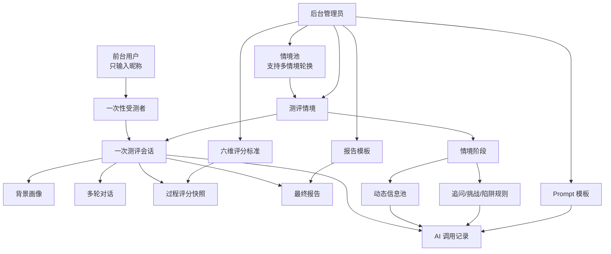
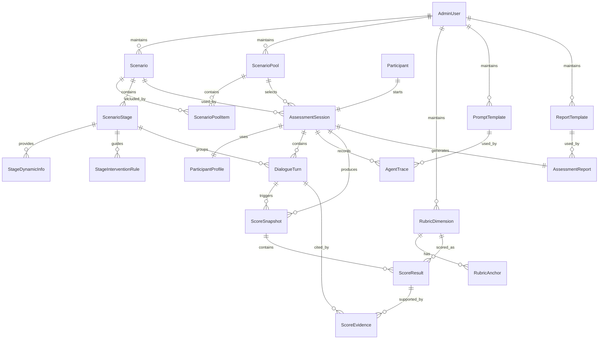

# 审辩式思维动态测评系统数据库设计说明书

## 1. 文档目标

本文档用于指导审辩式思维动态测评系统第一版数据库设计。当前阶段优先保证数据模型稳定、边界清晰、后续开发成员可以围绕统一模型开展工作。

数据库设计分为四个阶段推进：

1. 概念结构设计：识别系统中的核心实体、属性和关系，形成 E-R 图；
2. 逻辑结构设计：将概念模型转为 MySQL 关系模型，明确表、字段、主外键和约束；
3. 物理结构设计：确定存储引擎、字段类型、索引、JSON 字段和备份策略；
4. 数据库实施：通过 SQLAlchemy ORM、Alembic migration 和 seed 数据落地。

本文当前已覆盖概念结构设计、逻辑结构设计、物理结构设计和数据库实施阶段约定。

## 2. 概念结构设计

### 2.1 设计边界

第一版数据库需要支撑一条完整测评闭环：

1. 用户进入测评入口，输入昵称后创建一次性测评身份；
2. 系统进行背景采集并形成测评上下文；
3. 系统加载固定测评情境；
4. 用户与 AI 完成多轮情境对话；
5. Agent 记录每次调用输入、输出和异常；
6. 系统生成六维评分和证据句；
7. 系统生成结构化测评报告；
8. 后续可以追溯、复查和迭代测评配置。

第一版前台不做用户注册、登录和账号体系。后台管理员账号只用于后续管理测评配置、查看测评记录和维护系统数据，不与前台受测者身份混用。

### 2.2 概念模型分域

| 领域 | 核心实体 | 建模目标 |
| --- | --- | --- |
| 用户与受测者域 | `AdminUser`、`Participant`、`ParticipantProfile` | 管理后台账号、一次性受测者身份和背景画像 |
| 测评配置域 | `Scenario`、`ScenarioStage`、`StageDynamicInfo`、`StageInterventionRule`、`ScenarioPool`、`ScenarioPoolItem`、`RubricDimension`、`RubricAnchor`、`PromptTemplate`、`ReportTemplate` | 管理情境、阶段策略、情境池、评分标准、prompt 和报告模板 |
| 测评运行域 | `AssessmentSession`、`DialogueTurn` | 记录一次测评会话和多轮对话过程 |
| AI 过程域 | `AgentTrace` | 记录 Agent 调用、模型输出、失败原因和耗时 |
| 评分报告域 | `ScoreSnapshot`、`ScoreResult`、`ScoreEvidence`、`AssessmentReport` | 保存每段对话评分快照、六维评分、证据句和最终报告 |

### 2.3 核心实体说明

#### 2.3.1 `AdminUser` 后台管理员

`AdminUser` 表示后台管理系统中的登录账号。它只服务于系统管理、测评配置维护、测评记录查看等后台场景，不代表前台受测者。

第一版后台实现简单登录即可，目标是保护管理入口和配置入口，不追求复杂权限体系。

核心属性：

| 属性 | 说明 |
| --- | --- |
| 管理员标识 | 系统内部唯一 ID |
| 账号信息 | 用户名、密码摘要、显示名称 |
| 角色 | `ADMIN` |
| 状态 | 正常、禁用 |
| 最近登录时间 | 用于简单审计 |
| 创建时间 | 账号创建时间 |

关系：

- 一个 `AdminUser` 可以创建或维护测评配置；
- `AdminUser` 不直接关联前台 `Participant`，避免把一次性测评用户误建成账号体系。

#### 2.3.2 `Participant` 受测者

`Participant` 表示一次测评中的前台受测者身份。第一版用户不注册、不登录，只在进入测评时输入昵称，系统用该昵称作为本次测评中的称呼。

示例流程：

1. 用户打开测评系统；
2. 系统提示：“你好，我是本次测评的 AI 心理测评师，我该怎么称呼您呢？”；
3. 用户在输入框中填写昵称；
4. 系统创建 `Participant` 和对应的 `AssessmentSession`。

核心属性：

| 属性 | 说明 |
| --- | --- |
| 受测者标识 | 系统内部唯一 ID |
| 昵称 | 用户进入测评时填写的称呼 |
| 年龄段 | 可为空，支持表单或 AI 互动式采集 |
| 身份类型 | 可为空，如学生、在职人员、其他 |
| 教育阶段 | 可为空，如本科、硕士、博士、其他 |
| 专业方向 | 可为空，适用于学生场景 |
| 职业方向 | 可为空，适用于在职场景 |
| 行业 | 可为空，适用于在职场景 |
| 工作年限 | 可为空，适用于在职场景 |
| 组织角色 | 可为空，如成员、负责人、管理者 |
| 自我描述 | 可为空，保存用户对自己背景的自然语言描述 |
| 信息采集方式 | form、ai_dialogue、mixed |
| 原始基础信息 | 可为空，保存表单或 AI 采集的原始 JSON |
| 来源 | 自助测评 |
| 状态 | active、completed、aborted |
| 创建时间 | 受测者创建时间 |

关系：

- 一个 `Participant` 只绑定一个 `AssessmentSession`；
- 一个 `Participant` 只拥有一个本次测评画像 `ParticipantProfile`。

#### 2.3.3 `ParticipantProfile` 受测者画像

`ParticipantProfile` 表示背景采集后的结构化画像。它不是简单的用户资料，而是 AI 根据用户原始回答提取出的测评上下文。

核心属性：

| 属性 | 说明 |
| --- | --- |
| 画像标识 | 系统内部唯一 ID |
| 会话标识 | 关联本次测评会话 |
| 原始背景回答 | 用户在背景采集阶段的原始回答集合 |
| AI 初步分析 | AI 对背景信息的结构化分析 |
| 人群类型 | 学生、在职人员、其他 |
| 情境适配标签 | 用于后续调整情境语境 |
| 画像版本 | 便于后续迭代 |

关系：

- 一个 `AssessmentSession` 通常使用一个 `ParticipantProfile`；
- 一个 `ParticipantProfile` 只服务于本次测评，不作为长期用户画像复用。

#### 2.3.4 `Scenario` 测评情境

`Scenario` 表示一套完整测评任务，例如“产品上线前 48 小时”。它是情境配置的根实体。

核心属性：

| 属性 | 说明 |
| --- | --- |
| 情境标识 | 系统内部唯一 ID |
| 情境编码 | 如 `product_launch_48h` |
| 情境标题 | 用户和后台可读名称 |
| 情境背景 | 管理决策任务背景 |
| 适用对象 | 学生、职场人员、通用 |
| 情境类型 | 管理决策、校园决策、职场协作等 |
| 难度等级 | easy、medium、hard |
| 预计时长 | 单情境预估完成分钟数 |
| 轮换权重 | 多情境轮换时的抽取权重 |
| 是否默认 | 是否作为第一版默认情境 |
| 版本 | 情境版本 |
| 状态 | 草稿、启用、停用 |

关系：

- 一个 `Scenario` 包含多个 `ScenarioStage`；
- 一个 `Scenario` 可以被多个 `AssessmentSession` 使用。

#### 2.3.5 `ScenarioStage` 情境阶段

`ScenarioStage` 表示情境中的一个观察阶段。每个阶段承担不同测量目标，例如问题界定、证据评估、动态调整等。

核心属性：

| 属性 | 说明 |
| --- | --- |
| 阶段标识 | 系统内部唯一 ID |
| 情境标识 | 所属情境 |
| 阶段编码 | 如 `s1`、`s2` |
| 阶段顺序 | 用于控制对话流程 |
| 阶段目标 | 本阶段希望观察的能力 |
| 阶段背景 | 给用户呈现的上下文 |
| 主问题 | 本阶段核心提问 |
| 情境生成模式 | fixed_context、config_guided、ai_expanded，用于人工控制阶段情境呈现时配置与 AI 的比重 |
| 情境 AI 生成权重 | 0-100，值越高越允许 AI 根据用户画像和阶段目标改写或扩写情境表达 |
| 情境生成约束 | AI 生成阶段情境时必须遵守的事实边界、禁止新增内容和表达要求 |
| 目标维度 | 本阶段主测或辅测维度 |
| 追问上限 | 控制单阶段最多追问次数 |
| 预计时长 | 控制该阶段预期耗时 |
| 阶段退出条件 | 用于判断是否进入下一阶段 |

关系：

- 一个 `ScenarioStage` 属于一个 `Scenario`；
- 一个 `ScenarioStage` 可以配置多个 `StageDynamicInfo`；
- 一个 `ScenarioStage` 可以配置多个 `StageInterventionRule`；
- 一个 `ScenarioStage` 可以对应多个 `DialogueTurn`；
- 一个 `ScenarioStage` 可以观察多个 `RubricDimension`。

#### 2.3.6 `StageDynamicInfo` 阶段动态信息

`StageDynamicInfo` 表示某个情境阶段中可由 AI 选择释放的新信息。它不是固定在某一轮必须出现，而是作为 AI 可用的信息池，用于观察用户是否能根据新证据调整判断。

核心属性：

| 属性 | 说明 |
| --- | --- |
| 动态信息标识 | 系统内部唯一 ID |
| 阶段标识 | 所属情境阶段 |
| 信息编码 | 如 `new_user_complaints` |
| 信息标题 | 后台可读标题 |
| 信息内容 | 可释放给用户的新信息 |
| 信息类型 | 数据更新、利益相关方反馈、风险信号、反向证据等 |
| 触发条件 | AI 判断何时适合释放该信息 |
| 目标维度 | 该信息主要用于观察哪些能力维度 |
| 释放优先级 | 多条信息候选时的排序依据 |
| 状态 | 启用、停用 |

关系：

- 一个 `ScenarioStage` 可以包含多个 `StageDynamicInfo`；
- `FollowupAgent` 可以根据用户回答选择释放某条动态信息；
- 被释放的信息最终以 `DialogueTurn` 的形式呈现给用户，并可在 `AgentTrace` 中记录选择原因。

#### 2.3.7 `StageInterventionRule` 阶段干预规则

`StageInterventionRule` 表示某个情境阶段中 AI 可以采用的追问、挑战、陷阱或推进策略。它定义的是策略方向，不是固定话术。

核心属性：

| 属性 | 说明 |
| --- | --- |
| 规则标识 | 系统内部唯一 ID |
| 阶段标识 | 所属情境阶段 |
| 规则编码 | 如 `clarify_evidence_source` |
| 规则类型 | clarify、open_followup、challenge、trap、dynamic_update、advance |
| 触发条件 | AI 判断何时使用该规则 |
| 追问方向 | 用自然语言说明本规则希望引导用户补充什么 |
| 目标维度 | 该规则主要观察哪些能力维度 |
| 示例问题 | 给 AI 的参考问法，不要求原样使用 |
| 追问生成模式 | fixed_question、template_guided、strategy_guided、ai_open，用于人工控制追问生成时配置与 AI 的比重 |
| 追问 AI 生成权重 | 0-100，值越高越允许 AI 自主组织追问表达 |
| 追问生成约束 | AI 生成追问时必须遵守的边界，例如不能诱导、不能泄露评分标准、必须围绕目标维度；也可保存人本主义访谈式追问约束，如先接住用户表达、再中性复述、提示无唯一标准答案、最后围绕一个证据缺口追问 |
| 兜底问题 | AI 输出失败或质量不达标时使用的固定追问 |
| 退出提示 | 可为空，用于阶段推进时提示用户 |
| 优先级 | 多条规则候选时的排序依据 |
| 状态 | 启用、停用 |

关系：

- 一个 `ScenarioStage` 可以包含多个 `StageInterventionRule`；
- `FollowupAgent` 根据用户回答、评分缺口和阶段状态选择合适规则；
- 每次规则选择过程记录在 `AgentTrace` 中，生成的自然语言问题保存为 `DialogueTurn`。

补充说明：

- `StageInterventionRule` 仍然只定义追问策略方向，不直接保存每一轮最终话术；
- 人本主义访谈式追问机制不新增独立表，而是通过 `question_generation_constraints_json` 保存生成边界，通过 `AgentTrace.output_json` 保存本轮追问的结构化执行结果；
- 第一版建议将“不能心理咨询、不能诊断、不能暗示标准答案、每轮只问一个核心问题、优先引导用户多说理由和证据”等要求配置在追问生成约束中。

#### 2.3.8 `RubricDimension` 能力维度

`RubricDimension` 表示审辩式思维的评分维度。第一版固定六个维度：

| 维度 key | 中文名称 |
| --- | --- |
| `problem_definition` | 问题界定 |
| `evidence_evaluation` | 证据评估 |
| `reasoning_argumentation` | 推理论证 |
| `multiple_perspectives` | 多元视角 |
| `integrative_decision` | 整合决策 |
| `dynamic_adjustment` | 动态调整 |

核心属性：

| 属性 | 说明 |
| --- | --- |
| 维度标识 | 系统内部唯一 ID |
| 维度编码 | 固定英文 key |
| 维度名称 | 中文名称 |
| 维度定义 | 该维度测量什么能力 |
| 可观察行为 | 用户语言中可识别的行为表现 |
| 无效证据说明 | 哪些表达不能作为高分证据 |
| 适用阶段 | 主要在哪些情境阶段观察 |
| 版本 | 维度定义版本 |

关系：

- 一个 `RubricDimension` 包含多个 `RubricAnchor`；
- 一个 `RubricDimension` 可以产生多个 `ScoreResult`；
- 一个 `RubricDimension` 可以被多个 `ScenarioStage` 观察。

#### 2.3.9 `RubricAnchor` 评分锚点

`RubricAnchor` 表示某个维度下不同分数水平的表现标准。第一版建议至少维护 1、3、5 分锚点。

核心属性：

| 属性 | 说明 |
| --- | --- |
| 锚点标识 | 系统内部唯一 ID |
| 维度标识 | 所属能力维度 |
| 分数 | 1 到 5 |
| 水平名称 | 低、中、高或更细等级 |
| 行为描述 | 该分数对应的表现 |
| 典型证据句 | 可作为评分参考的表达 |
| 反例 | 不能作为该水平证据的表达 |

关系：

- 一个 `RubricDimension` 包含多个 `RubricAnchor`；
- `ScoringAgent` 使用 `RubricAnchor` 生成评分依据。

#### 2.3.10 `PromptTemplate` Prompt 模板

`PromptTemplate` 表示 Agent 调用大模型时使用的提示词模板。它需要版本化，便于追踪评分变化和模型行为变化。

核心属性：

| 属性 | 说明 |
| --- | --- |
| 模板标识 | 系统内部唯一 ID |
| Agent 名称 | host、followup、scoring、report 等 |
| 模板名称 | 可读名称 |
| 模板内容 | prompt 主体 |
| 输入变量 | 模板需要哪些上下文变量 |
| 版本 | prompt 版本 |
| 状态 | 草稿、启用、停用 |

关系：

- 一个 `PromptTemplate` 可以被多个 `AgentTrace` 引用；
- 不同 Agent 使用不同类型的 `PromptTemplate`。

#### 2.3.11 `ReportTemplate` 报告模板

`ReportTemplate` 表示最终测评报告的结构和段落模板。

核心属性：

| 属性 | 说明 |
| --- | --- |
| 模板标识 | 系统内部唯一 ID |
| 模板编码 | 用于程序引用 |
| 模板名称 | 可读名称 |
| 模板结构 | 报告模块定义 |
| 适用情境 | 关联情境或通用 |
| 版本 | 模板版本 |
| 状态 | 草稿、启用、停用 |

关系：

- 一个 `ReportTemplate` 可以生成多个 `AssessmentReport`；
- 一个 `Scenario` 可以指定默认 `ReportTemplate`。

#### 2.3.12 `AssessmentSession` 测评会话

`AssessmentSession` 是测评运行过程的中心实体，表示一次完整或未完成的测评。

核心属性：

| 属性 | 说明 |
| --- | --- |
| 会话标识 | 系统内部唯一 ID |
| 受测者标识 | 本次测评对应的受测者 |
| 情境标识 | 本次使用的情境 |
| 情境池标识 | 可为空，记录本次情境来自哪个情境池 |
| 情境选择方式 | manual、random、round_robin、adaptive |
| 情境选择原因 | 可为空，记录系统为什么选择该情境 |
| 当前阶段 | 当前进行到哪个情境阶段 |
| 会话状态 | created、in_progress、scoring、completed、aborted、failed |
| 测评模式 | mock、llm、review |
| 开始时间 | 测评开始时间 |
| 完成时间 | 测评完成时间 |
| 总耗时 | 用于测评时长控制 |

关系：

- 一个 `AssessmentSession` 属于一个 `Participant`；
- 一个 `AssessmentSession` 使用一个 `Scenario`；
- 一个 `AssessmentSession` 包含多个 `DialogueTurn`；
- 一个 `AssessmentSession` 记录多个 `AgentTrace`；
- 一个 `AssessmentSession` 产生多个 `ScoreSnapshot`；
- 一个 `AssessmentSession` 生成一个 `AssessmentReport`。

#### 2.3.13 `DialogueTurn` 对话轮次

`DialogueTurn` 记录测评中的每一轮对话，包括用户回答、AI 提问、系统提示。

核心属性：

| 属性 | 说明 |
| --- | --- |
| 对话标识 | 系统内部唯一 ID |
| 会话标识 | 所属测评会话 |
| 阶段标识 | 所属情境阶段 |
| 轮次序号 | 对话顺序 |
| 说话方 | user、ai、system |
| 内容 | 对话文本 |
| 内容类型 | 背景采集、情境回答、追问、动态信息、总结 |
| 来源 Agent Trace | 若该轮为 AI 生成内容，记录生成它的 Agent 调用 |
| 动态信息来源 | 若该轮释放了阶段动态信息，记录对应动态信息 |
| 干预规则来源 | 若该轮使用了某条追问或推进规则，记录对应干预规则 |
| 创建时间 | 对话生成或提交时间 |

关系：

- 一个 `AssessmentSession` 包含多个 `DialogueTurn`；
- 一个 `DialogueTurn` 可以被多个 `ScoreEvidence` 引用；
- `DialogueTurn.content` 只保存用户实际看到或说出的文本，不保存追问背后的完整决策依据；
- AI 追问背后的目标维度、触发原因、证据缺口和人本主义访谈结构，保存于对应的 `AgentTrace.output_json`，并通过 `source_agent_trace_id` 关联。

#### 2.3.14 `AgentTrace` Agent 调用记录

`AgentTrace` 记录每次 Agent 调用的全过程，是后续排查、复现、解释评分的重要依据。

核心属性：

| 属性 | 说明 |
| --- | --- |
| Trace 标识 | 系统内部唯一 ID |
| 会话标识 | 所属测评会话 |
| Agent 名称 | background、host、followup、scoring、report |
| Prompt 模板标识 | 使用的 prompt 版本 |
| 生成模式 | 本次情境或追问生成实际采用的模式 |
| AI 生成权重 | 本次情境或追问生成实际采用的 AI 权重 |
| 配置快照 | 本次调用使用的关键配置快照，避免后续配置变更后无法复现历史结果 |
| 输入 JSON | 本次 Agent 输入 |
| 输出 JSON | 本次 Agent 结构化输出。对追问 Agent 而言，除最终问题外，还可保存目标维度、触发原因、证据缺口、用户回答复述和人本主义访谈四步结构 |
| 原始输出 | 模型原始文本 |
| 状态 | success、failed |
| 错误码 | 超时、JSON 解析失败、配置缺失等 |
| 模型名称 | 使用的模型 |
| 耗时 | 调用耗时 |
| 创建时间 | 调用时间 |

关系：

- 一个 `AssessmentSession` 包含多个 `AgentTrace`；
- 一个 `AgentTrace` 可引用一个 `PromptTemplate`；
- `ScoreResult` 和 `AssessmentReport` 可以记录来源 `AgentTrace`。

追问 Agent 的 `output_json` 建议包含：

| 字段 | 说明 |
| --- | --- |
| `question` | 最终呈现给用户的追问文本 |
| `target_dimensions` | 本轮追问服务的能力维度 key |
| `trigger_reason` | 触发本轮追问的原因 |
| `reflection_summary` | 对用户上一轮回答的中性复述 |
| `evidence_gap` | 当前缺少的可评分证据 |
| `humanistic_steps.listening_acknowledgement` | 倾听接住：承接用户已经表达的内容 |
| `humanistic_steps.reflective_clarification` | 复述澄清：中性概括用户观点或表达缺口 |
| `humanistic_steps.safety_prompt` | 安全化提示：说明无唯一标准答案、重点是理解思考过程 |
| `humanistic_steps.evidence_probe` | 证据化追问：围绕一个核心证据缺口继续追问 |

这些字段属于 Agent 过程数据，不进入 `DialogueTurn` 表，避免把用户可见文本和内部决策过程混在同一张对话表里。

#### 2.3.15 `ScoreSnapshot` 评分快照

`ScoreSnapshot` 表示一次评分事件。第一版需要保留每段对话后的评分快照，用于最终报告页展示用户在测评过程中的思维变化，也便于分析每一次交互对六维能力判断的影响。

核心属性：

| 属性 | 说明 |
| --- | --- |
| 快照标识 | 系统内部唯一 ID |
| 会话标识 | 所属测评会话 |
| 阶段标识 | 可为空，表示该快照对应的情境阶段 |
| 对话标识 | 可为空，表示该快照由哪一轮对话触发 |
| 快照类型 | turn、stage、final |
| 快照摘要 | 对本次评分变化的简要说明 |
| 趋势分析 | 可为空，用于报告页展示过程变化 |
| Trace 标识 | 来源 Agent 调用 |
| 创建时间 | 快照生成时间 |

关系：

- 一个 `AssessmentSession` 可以产生多个 `ScoreSnapshot`；
- 一个 `DialogueTurn` 可以触发一个或多个 `ScoreSnapshot`；
- 一个 `ScoreSnapshot` 包含多个 `ScoreResult`。

#### 2.3.16 `ScoreResult` 评分结果

`ScoreResult` 表示某个评分快照中，一个能力维度上的评分结果。最终六维评分和每段对话的阶段性评分都使用同一实体表达，通过所属 `ScoreSnapshot` 区分。

核心属性：

| 属性 | 说明 |
| --- | --- |
| 评分标识 | 系统内部唯一 ID |
| 快照标识 | 所属评分快照 |
| 维度标识 | 对应能力维度 |
| 分数 | 1 到 5 |
| 评分理由 | AI 或人工给出的理由 |
| 置信度 | AI 对评分的置信程度 |
| 评分来源 | mock、llm、manual、review |
| Trace 标识 | 来源 Agent 调用 |
| 创建时间 | 评分生成时间 |

关系：

- 一个 `ScoreSnapshot` 对每个相关 `RubricDimension` 产生一个 `ScoreResult`；
- 一个 `ScoreResult` 包含多个 `ScoreEvidence`；
- 一个 `ScoreResult` 通过所属 `ScoreSnapshot` 追溯来源 Agent 调用。

#### 2.3.17 `ScoreEvidence` 评分证据

`ScoreEvidence` 表示支撑某个评分的具体对话依据。单独建模是为了保证评分可解释、可复查。

核心属性：

| 属性 | 说明 |
| --- | --- |
| 证据标识 | 系统内部唯一 ID |
| 评分标识 | 所属评分结果 |
| 对话标识 | 来源对话轮次 |
| 证据文本 | 可引用的原始句子或片段 |
| 证据类型 | 支持证据、反向证据、无效证据 |
| 解释 | 为什么该句能支持评分 |

关系：

- 一个 `ScoreResult` 可以包含多个 `ScoreEvidence`；
- 一个 `DialogueTurn` 可以被多个 `ScoreEvidence` 引用。

#### 2.3.18 `AssessmentReport` 测评报告

`AssessmentReport` 表示一次测评最终生成的结构化报告。

核心属性：

| 属性 | 说明 |
| --- | --- |
| 报告标识 | 系统内部唯一 ID |
| 会话标识 | 所属测评会话 |
| 报告模板标识 | 使用的报告模板 |
| 报告 JSON | 完整结构化报告 |
| 总结 | 报告摘要 |
| 生成状态 | draft、generated、failed |
| Trace 标识 | 来源 Agent 调用 |
| 创建时间 | 报告生成时间 |

关系：

- 一个 `AssessmentSession` 只生成一个最终 `AssessmentReport`；
- 一个 `AssessmentReport` 使用一个 `ReportTemplate`；
- 一个 `AssessmentReport` 可以引用一个 `AgentTrace`。

#### 2.3.19 `ScenarioPool` 情境池

`ScenarioPool` 表示一组可用于轮换的测评情境。第一版可以只创建一个默认情境池，并放入一个完整情境；后续增加情境时，不需要改变会话和评分主流程。

核心属性：

| 属性 | 说明 |
| --- | --- |
| 情境池标识 | 系统内部唯一 ID |
| 情境池编码 | 如 `default_management_pool` |
| 情境池名称 | 可读名称 |
| 轮换策略 | manual、random、round_robin、adaptive |
| 适用对象 | 学生、在职人员、通用 |
| 说明 | 情境池用途说明 |
| 状态 | 草稿、启用、停用 |
| 创建时间 | 创建时间 |

关系：

- 一个 `ScenarioPool` 包含多个 `ScenarioPoolItem`；
- 一个 `ScenarioPool` 可以被多个 `AssessmentSession` 使用。

#### 2.3.20 `ScenarioPoolItem` 情境池明细

`ScenarioPoolItem` 表示某个情境池中包含的一个具体情境，并保存轮换所需的权重、顺序和启用状态。

核心属性：

| 属性 | 说明 |
| --- | --- |
| 明细标识 | 系统内部唯一 ID |
| 情境池标识 | 所属情境池 |
| 情境标识 | 所属情境 |
| 轮换权重 | 随机轮换时的权重 |
| 展示顺序 | 手动或顺序轮换时使用 |
| 状态 | 启用、停用 |

关系：

- 一个 `ScenarioPoolItem` 属于一个 `ScenarioPool`；
- 一个 `ScenarioPoolItem` 关联一个 `Scenario`。

### 2.4 实体关系说明

核心关系如下：

| 关系 | 类型 | 说明 |
| --- | --- | --- |
| `AdminUser` - `Scenario` | 一对多 | 一个后台管理员可以创建或维护多个情境配置 |
| `AdminUser` - `ScenarioPool` | 一对多 | 一个后台管理员可以创建或维护多个情境池 |
| `AdminUser` - `RubricDimension` | 一对多 | 一个后台管理员可以创建或维护多个评分维度配置 |
| `AdminUser` - `PromptTemplate` | 一对多 | 一个后台管理员可以创建或维护多个 prompt 模板 |
| `AdminUser` - `ReportTemplate` | 一对多 | 一个后台管理员可以创建或维护多个报告模板 |
| `Participant` - `AssessmentSession` | 一对一 | 一个一次性受测者只对应一次测评 |
| `AssessmentSession` - `ParticipantProfile` | 一对一 | 一次测评使用一个会话画像 |
| `ScenarioPool` - `ScenarioPoolItem` | 一对多 | 一个情境池包含多个情境明细 |
| `Scenario` - `ScenarioPoolItem` | 一对多 | 一个情境可以加入多个情境池 |
| `ScenarioPool` - `AssessmentSession` | 一对多 | 一个情境池可以产生多次测评会话 |
| `Scenario` - `ScenarioStage` | 一对多 | 一个情境包含多个阶段 |
| `Scenario` - `AssessmentSession` | 一对多 | 一个情境可被多次测评使用 |
| `ScenarioStage` - `StageDynamicInfo` | 一对多 | 一个阶段可以配置多条可释放动态信息 |
| `ScenarioStage` - `StageInterventionRule` | 一对多 | 一个阶段可以配置多条追问、挑战、陷阱和推进规则 |
| `ScenarioStage` - `DialogueTurn` | 一对多 | 一个阶段下有多轮对话 |
| `RubricDimension` - `RubricAnchor` | 一对多 | 一个维度包含多个评分锚点 |
| `RubricDimension` - `ScoreResult` | 一对多 | 一个维度对应多次测评评分 |
| `AssessmentSession` - `DialogueTurn` | 一对多 | 一次测评包含多轮对话 |
| `AssessmentSession` - `AgentTrace` | 一对多 | 一次测评包含多次 Agent 调用 |
| `AssessmentSession` - `ScoreSnapshot` | 一对多 | 一次测评可以产生多个过程评分快照 |
| `DialogueTurn` - `ScoreSnapshot` | 一对多 | 一轮用户回答可以触发一次评分快照 |
| `ScoreSnapshot` - `ScoreResult` | 一对多 | 一个快照包含多个维度评分 |
| `AssessmentSession` - `AssessmentReport` | 一对一 | 一次测评生成一份最终报告 |
| `ScoreResult` - `ScoreEvidence` | 一对多 | 一个维度评分可以有多条证据 |
| `DialogueTurn` - `ScoreEvidence` | 一对多 | 一轮对话可以被多个评分证据引用 |
| `PromptTemplate` - `AgentTrace` | 一对多 | 一个 prompt 版本可用于多次 Agent 调用 |
| `ReportTemplate` - `AssessmentReport` | 一对多 | 一个报告模板可生成多份报告 |

### 2.5 概念图

#### 2.5.1 业务对象关系图

这张图用于让非技术成员快速理解系统中有哪些核心对象，以及它们大致怎么关联。



#### 2.5.2 测评过程数据流图

这张图用于理解一场测评中数据是如何产生的。


#### 2.5.3 简化 E-R 图

这张图主要用于后续数据库表结构设计，不要求所有成员完全读懂。非技术成员优先阅读前两张图即可。



### 2.6 概念设计关键决策

#### 2.6.1 前台不建立用户账号体系

第一版前台流程是一次性测评，不做用户注册、登录和历史账号管理。用户进入系统后只填写昵称，系统创建一次性 `Participant` 和本次 `AssessmentSession`。这样可以降低初版复杂度，也更符合交互式测评的自然入口。

#### 2.6.2 将后台账号建成 `AdminUser`

后台管理员账号只用于管理测评配置、查看测评记录和维护系统数据。第一版实现简单登录即可，不引入复杂权限模型。`AdminUser` 不直接管理 `Participant`，避免把一次性受测者误建成长期用户体系。

#### 2.6.3 `Participant` 保留可空基础信息

第一版允许通过表单或 AI 互动式对话收集基础信息，因此 `Participant` 中保留年龄段、身份类型、教育阶段、专业方向、职业方向、行业、工作年限等可空字段。这样既支持“只输入昵称就开始测评”，也支持后续逐步补充背景信息。

#### 2.6.4 将背景画像建成 `ParticipantProfile`

背景采集不是普通问卷字段，而是 AI 从交互式回答中提取出的上下文。它需要保存原始回答和 AI 分析结果，并绑定到具体测评会话，便于后续解释为什么系统选择了某类追问或情境表达方式。

#### 2.6.5 将测评配置与测评运行分离

`Scenario`、`RubricDimension`、`PromptTemplate`、`ReportTemplate` 属于配置域；`AssessmentSession`、`DialogueTurn`、`AgentTrace` 属于运行域。这样后续修改配置不会破坏历史测评数据。

#### 2.6.6 用阶段策略支撑“配置引导，AI 主导”

情境不应写死每一轮对话，而应由配置提供测评目标、动态信息和干预策略，再由 AI 根据用户回答实时选择下一步。`StageDynamicInfo` 负责提供可释放的新信息，`StageInterventionRule` 负责提供澄清、开放追问、挑战、陷阱和阶段推进等策略。AI 的选择过程通过 `AgentTrace` 记录，最终生成的自然语言问题通过 `DialogueTurn` 保存。

情境和追问需要支持人工调整“配置约束”和“AI 生成”的比重。第一版不做自动调参，而是在配置层提供清晰开关：

| 调整对象 | 配置落点 | 人工可调内容 |
| --- | --- | --- |
| 情境呈现 | `ScenarioStage` | 情境生成模式、AI 生成权重、生成约束 |
| 追问生成 | `StageInterventionRule` | 追问生成模式、AI 生成权重、生成约束、兜底问题 |

其中 AI 生成权重只保存 AI 侧权重，例如 30 表示配置约束占主要地位、AI 负责润色和轻度适配；70 表示配置提供边界、AI 可以更主动地组织情境表达或追问方式。配置权重由系统按 `100 - AI 生成权重` 推导，不在数据库中重复保存。

建议第一版默认使用 `config_guided` 和 `strategy_guided`：配置提供事实边界、测评目标、追问方向和样例问题，AI 根据用户画像、上一轮回答和阶段状态生成自然语言表达。若发现某个情境或追问质量不稳定，可以人工降低 AI 生成权重，或切换到更接近固定配置的模式。

为了保证后续可复盘，`AgentTrace` 需要记录每次调用实际采用的生成模式、AI 生成权重和关键配置快照。这样即使后台或 YAML 后续修改了情境和追问配置，历史测评仍然可以解释当时 AI 为什么这样呈现情境、为什么这样追问。

#### 2.6.7 保留每段对话的评分快照

第一版需要在报告页展示用户在每次交互中的表现变化，因此评分不只保存最终结果，还要通过 `ScoreSnapshot` 保存每轮或每阶段的评分状态。最终报告可以基于这些快照展示趋势、变化和关键转折点。

#### 2.6.8 将评分证据单独建模

本系统强调评分可解释性。`ScoreEvidence` 独立成实体后，可以清楚记录某个分数来自哪一轮对话、哪一句话、为什么能作为证据。

#### 2.6.9 一次测评只保留一份最终报告

第一版暂定每个 `AssessmentSession` 只生成一份最终 `AssessmentReport`。不提供重复生成和报告版本管理能力，避免初版数据状态过于复杂。

#### 2.6.10 允许 AI 过程使用 JSON 保存

Agent 的输入、输出和报告结构存在不确定性，适合保留 JSON 字段。但核心查询字段，如会话状态、维度分数、维度 key、阶段顺序、Agent 名称、错误码等，仍应结构化建模，避免后续无法查询和统计。

#### 2.6.11 多情境轮换先做基础设施预留

赛题鼓励多情境轮换和信效度验证。第一版优先保证一个高质量完整情境，但数据库模型和接口需要支持多情境扩展：

1. 使用 `ScenarioPool` 和 `ScenarioPoolItem` 表达情境池；
2. `AssessmentSession` 记录本次会话选择的 `scenario_id`、`scenario_pool_id` 和选择方式；
3. 第一版 seed 一个默认情境池，先放入“产品上线前 48 小时”这一完整情境；
4. 后续新增情境时，只需新增 `Scenario`、`ScenarioStage` 和情境池明细；
5. 情境选择策略第一版可先支持 manual 和 random，adaptive 留作后续扩展。

这样第一版不会为了多情境内容分散精力，但系统结构已经能回应赛题对多情境轮换的鼓励。

### 2.7 测评配置落库方案选择

心理测评配置包括情境、情境阶段、评分维度、评分锚点、prompt 模板和报告模板。第一版有两种常见做法：

| 方案 | 做法 | 优点 | 缺点 | 适用情况 |
| --- | --- | --- | --- | --- |
| 直接在数据库维护 | 开发完成后台管理页面后，管理员直接在页面中创建和编辑配置 | 所见即所得；后续运营维护方便；配置变更可以立即生效 | 第一版开发量大；需要先做表单、校验、权限和版本管理；容易拖慢基线版进度 | 后台管理已经是核心交付物时使用 |
| YAML seed 导入数据库 | 心理组和 Agent 组先写 YAML 文件，系统启动或执行 seed 脚本时导入 MySQL | 开发快；配置可版本管理；适合多人协作；便于代码审查和回滚；不依赖后台页面 | 非技术成员直接编辑有门槛；需要写导入脚本和格式校验；线上修改不如后台灵活 | 第一版基线系统、比赛原型、配置结构还在迭代时使用 |

推荐第一版采用 **YAML seed 导入数据库**：

1. 心理测评组先维护 `rubric.yaml`、`scenario_product_48h.yaml`、`report_template.yaml`；
2. Agent 组维护 `prompts.yaml`；
3. 你负责写 seed 脚本，将 YAML 导入 MySQL；
4. 系统运行时统一从 MySQL 读取配置；
5. 后续如果要做后台管理，再基于同一套数据库表做编辑页面。

这个方案的好处是：心理组和 Agent 组可以先用文件协作，不会被后台开发阻塞；系统运行时又不是直接读散落文件，而是统一落到 MySQL，方便后续版本管理、查询和扩展。

### 2.8 已确认决策

进入逻辑结构设计前，当前已确认以下决策：

1. 后台管理系统第一版实现简单登录，使用 `AdminUser` 管理后台入口；
2. 前台用户不注册、不登录，只创建一次性 `Participant`；
3. `Participant` 除昵称外，保留年龄段、身份类型、教育阶段、专业方向、职业方向、行业、工作年限等可空字段；
4. 基础信息既可由表单采集，也可由 AI 互动式采集；
5. 情境配置采用“配置引导，AI 主导”的方式，使用 `StageDynamicInfo` 和 `StageInterventionRule` 支撑动态信息更新、自适应追问和陷阱性挑战，并通过阶段/规则上的生成模式与 AI 生成权重支持人工调整情境和追问的生成自由度；
6. 评分保留每段对话或每个阶段的 `ScoreSnapshot`；
7. 一次测评只保留一份最终 `AssessmentReport`，第一版不做报告重复生成和版本管理；
8. 心理测评配置推荐先用 YAML seed 导入 MySQL，后续再扩展后台编辑；
9. 多情境轮换第一版做基础设施预留，默认情境池中先放一个完整情境；如时间允许，可追加第二个轻量情境用于验证轮换机制。

### 2.9 概念模型复盘

#### 2.9.1 对赛题核心需求的覆盖

| 赛题能力要求 | 当前模型支撑方式 | 结论 |
| --- | --- | --- |
| 情境呈现与对话主持 | `Scenario`、`ScenarioStage`、`DialogueTurn`，并由 `ScenarioStage` 控制情境生成模式和 AI 生成权重 | 已覆盖 |
| 开放性追问、陷阱性挑战追问 | `StageInterventionRule` 定义追问、挑战、陷阱和推进策略，并控制追问生成模式和 AI 生成权重 | 已覆盖 |
| 动态信息更新 | `StageDynamicInfo` 提供可释放的信息池，AI 动态选择 | 已覆盖 |
| 自适应追问 | `StageInterventionRule` + `ScoreSnapshot` + `AgentTrace` 支撑基于表现选择策略 | 已覆盖 |
| 行为实时识别 | `AgentTrace` 保存识别过程，`ScoreSnapshot` 保存阶段性判断 | 已覆盖 |
| 六维自动评分 | `RubricDimension`、`RubricAnchor`、`ScoreSnapshot`、`ScoreResult` | 已覆盖 |
| 评分依据可解释 | `ScoreEvidence` 关联具体 `DialogueTurn` | 已覆盖 |
| 结构化报告生成 | `AssessmentReport`、`ReportTemplate` | 已覆盖 |
| 单情境 30 分钟控制 | `Scenario.预计时长`、`ScenarioStage.预计时长`、`ScenarioStage.追问上限` | 已覆盖 |
| 多情境轮换 | `ScenarioPool`、`ScenarioPoolItem`、`AssessmentSession.情境选择方式` | 已预留 |

#### 2.9.2 规范化与冗余检查

当前概念模型基本符合 3NF 的方向：

1. `Participant` 只保存一次性受测者身份和可空背景字段，不承担测评过程记录；
2. `AssessmentSession` 作为运行中心，统一关联对话、Agent 调用、评分和报告；
3. `Scenario`、`RubricDimension`、`PromptTemplate`、`ReportTemplate` 等配置与运行数据分离；
4. `StageDynamicInfo` 和 `StageInterventionRule` 从 `ScenarioStage` 中拆出，避免把多条动态信息和多条追问策略塞进同一字段；
5. `ScoreSnapshot` 和 `ScoreResult` 分离，既能保存过程评分，又能避免每个评分结果重复描述同一次评分事件；
6. `ScoreEvidence` 单独建模，避免把评分证据只塞进 JSON，保证后续可解释性和可查询性；
7. 情境和追问的 AI/配置比重只保存 AI 生成权重，配置权重由系统推导，避免重复字段带来的不一致；
8. AI 输入输出、报告正文、原始采集信息这类结构变化大的内容允许使用 JSON，但关键检索字段保持结构化。

#### 2.9.3 第一版落地建议

第一版实现时建议按以下优先级落库：

1. 必须落库：`Participant`、`AssessmentSession`、`DialogueTurn`、`AgentTrace`、`ScoreSnapshot`、`ScoreResult`、`ScoreEvidence`、`AssessmentReport`；
2. 必须 seed：`Scenario`、`ScenarioStage`、`StageDynamicInfo`、`StageInterventionRule`、`RubricDimension`、`RubricAnchor`、`PromptTemplate`、`ReportTemplate`；
3. 预留但可轻量实现：`ScenarioPool`、`ScenarioPoolItem`；
4. 简单实现：`AdminUser` 登录后台；
5. 暂不实现复杂能力：后台配置编辑、报告版本管理、正式信效度统计、多角色权限。

#### 2.9.4 阶段结论

当前概念模型已经可以支撑第一版项目开发，并且对后续多情境轮换、后台配置管理、过程性评分展示和信效度分析保留了扩展空间。下文进入逻辑结构设计：将上述实体转换为 MySQL 表结构，并进行字段设计、主外键设计、唯一约束设计和 3NF 检查。

## 3. 逻辑结构设计

### 3.1 逻辑设计原则

逻辑结构设计阶段将概念实体转换为 MySQL 关系模型。本阶段遵循以下原则：

1. 核心业务对象独立成表，避免把重要数据全部塞进 JSON；
2. 一对多关系通过外键表达，多对多关系通过中间表表达；
3. 配置数据与运行数据分离，保证配置变更不破坏历史测评记录；
4. AI 输入输出、报告正文、原始采集信息等结构变化较大的内容允许使用 JSON；
5. 会话状态、阶段顺序、维度分数、Agent 名称、错误码等高频查询字段必须结构化；
6. 第一版按 3NF 设计，不做过早反规范化；
7. 表名使用小写蛇形命名，字段名使用小写蛇形命名。

### 3.2 通用字段与类型约定

除特殊说明外，业务表默认包含以下通用字段：

| 字段 | 类型 | 约束 | 说明 |
| --- | --- | --- | --- |
| `id` | BIGINT UNSIGNED | PK, AUTO_INCREMENT | 主键 |
| `created_at` | DATETIME(3) | NOT NULL | 创建时间 |
| `updated_at` | DATETIME(3) | NOT NULL | 更新时间 |

常用类型约定：

| 数据类型 | 使用场景 |
| --- | --- |
| `VARCHAR(32)` | 状态、类型、枚举编码 |
| `VARCHAR(64)` | 业务编码、用户名、维度 key |
| `VARCHAR(128)` | 标题、名称、昵称 |
| `TEXT` | 情境背景、规则说明、评分理由 |
| `MEDIUMTEXT` | prompt 内容、模型原始输出 |
| `JSON` | AI 输入输出、报告结构、原始采集信息、数组型配置 |
| `TINYINT UNSIGNED` | 1-5 分评分、布尔标记 |
| `DECIMAL(4,3)` | 置信度、权重 |
| `DATETIME(3)` | 毫秒级时间记录 |

### 3.3 逻辑表清单

| 领域 | 表名 | 说明 |
| --- | --- | --- |
| 后台管理 | `admin_user` | 后台管理员账号 |
| 前台受测者 | `participant` | 一次性受测者身份 |
| 前台受测者 | `participant_profile` | 本次测评背景画像 |
| 测评配置 | `scenario` | 测评情境 |
| 测评配置 | `scenario_stage` | 情境阶段 |
| 测评配置 | `stage_dynamic_info` | 阶段动态信息 |
| 测评配置 | `stage_intervention_rule` | 阶段干预规则 |
| 测评配置 | `scenario_stage_dimension` | 阶段与能力维度关系 |
| 测评配置 | `stage_dynamic_info_dimension` | 动态信息与能力维度关系 |
| 测评配置 | `stage_intervention_rule_dimension` | 干预规则与能力维度关系 |
| 测评配置 | `rubric_dimension` | 能力维度 |
| 测评配置 | `rubric_anchor` | 评分锚点 |
| 测评配置 | `prompt_template` | Prompt 模板 |
| 测评配置 | `report_template` | 报告模板 |
| 多情境轮换 | `scenario_pool` | 情境池 |
| 多情境轮换 | `scenario_pool_item` | 情境池明细 |
| 测评运行 | `assessment_session` | 测评会话 |
| 测评运行 | `dialogue_turn` | 对话轮次 |
| AI 过程 | `agent_trace` | Agent 调用记录 |
| 评分报告 | `score_snapshot` | 过程评分快照 |
| 评分报告 | `score_result` | 维度评分结果 |
| 评分报告 | `score_evidence` | 评分证据 |
| 评分报告 | `assessment_report` | 最终测评报告 |

### 3.4 表结构设计

#### 3.4.1 `admin_user`

后台管理员账号表。第一版用于简单登录和后台入口保护。

| 字段 | 类型 | 约束 | 说明 |
| --- | --- | --- | --- |
| `id` | BIGINT UNSIGNED | PK | 管理员 ID |
| `username` | VARCHAR(64) | NOT NULL, UNIQUE | 登录用户名 |
| `password_hash` | VARCHAR(255) | NOT NULL | 密码摘要 |
| `display_name` | VARCHAR(128) | NOT NULL | 显示名称 |
| `role` | VARCHAR(32) | NOT NULL | 第一版固定 `ADMIN` |
| `status` | VARCHAR(32) | NOT NULL | `active` / `disabled` |
| `last_login_at` | DATETIME(3) | NULL | 最近登录时间 |
| `created_at` | DATETIME(3) | NOT NULL | 创建时间 |
| `updated_at` | DATETIME(3) | NOT NULL | 更新时间 |

唯一约束：

- `uk_admin_user_username(username)`

#### 3.4.2 `participant`

一次性受测者身份表。前台用户不注册、不登录，只在测评入口输入昵称，并可通过表单或 AI 对话补充背景信息。

| 字段 | 类型 | 约束 | 说明 |
| --- | --- | --- | --- |
| `id` | BIGINT UNSIGNED | PK | 受测者 ID |
| `nickname` | VARCHAR(64) | NOT NULL | 用户昵称 |
| `age_range` | VARCHAR(32) | NULL | 年龄段 |
| `identity_type` | VARCHAR(32) | NULL | 学生、在职人员、其他 |
| `education_stage` | VARCHAR(64) | NULL | 教育阶段 |
| `major_direction` | VARCHAR(128) | NULL | 专业方向 |
| `career_direction` | VARCHAR(128) | NULL | 职业方向 |
| `industry` | VARCHAR(128) | NULL | 所属行业 |
| `work_years_range` | VARCHAR(32) | NULL | 工作年限范围 |
| `organization_role` | VARCHAR(64) | NULL | 组织角色 |
| `self_description` | TEXT | NULL | 用户自我描述 |
| `info_collect_method` | VARCHAR(32) | NOT NULL | `form` / `ai_dialogue` / `mixed` |
| `raw_basic_info` | JSON | NULL | 表单或 AI 采集的原始基础信息 |
| `source` | VARCHAR(32) | NOT NULL | 第一版固定 `self_assessment` |
| `status` | VARCHAR(32) | NOT NULL | `active` / `completed` / `aborted` |
| `created_at` | DATETIME(3) | NOT NULL | 创建时间 |
| `updated_at` | DATETIME(3) | NOT NULL | 更新时间 |

说明：

- `participant` 与 `assessment_session` 通过 `assessment_session.participant_id` 建立一对一关系；
- 背景字段允许为空，以同时支持只输入昵称、表单收集和 AI 互动式收集。

#### 3.4.3 `participant_profile`

背景画像表。保存 AI 对本次测评背景信息的结构化理解。

| 字段 | 类型 | 约束 | 说明 |
| --- | --- | --- | --- |
| `id` | BIGINT UNSIGNED | PK | 画像 ID |
| `session_id` | BIGINT UNSIGNED | NOT NULL, UNIQUE, FK | 所属测评会话 |
| `raw_background_answers` | JSON | NULL | 背景采集原始回答 |
| `ai_profile_json` | JSON | NULL | AI 结构化画像 |
| `population_type` | VARCHAR(32) | NULL | 学生、在职人员、其他 |
| `adaptation_tags` | JSON | NULL | 情境适配标签 |
| `profile_version` | VARCHAR(32) | NOT NULL | 画像结构版本 |
| `created_at` | DATETIME(3) | NOT NULL | 创建时间 |
| `updated_at` | DATETIME(3) | NOT NULL | 更新时间 |

外键：

- `fk_participant_profile_session(session_id) -> assessment_session(id)`

#### 3.4.4 `scenario`

测评情境表。保存一个完整情境的基础信息。

| 字段 | 类型 | 约束 | 说明 |
| --- | --- | --- | --- |
| `id` | BIGINT UNSIGNED | PK | 情境 ID |
| `scenario_code` | VARCHAR(64) | NOT NULL, UNIQUE | 情境编码 |
| `title` | VARCHAR(128) | NOT NULL | 情境标题 |
| `background` | TEXT | NOT NULL | 情境背景 |
| `target_audience` | VARCHAR(64) | NOT NULL | 适用对象 |
| `scenario_type` | VARCHAR(64) | NOT NULL | 管理决策、校园决策等 |
| `difficulty_level` | VARCHAR(32) | NOT NULL | `easy` / `medium` / `hard` |
| `estimated_minutes` | INT UNSIGNED | NOT NULL | 预计完成分钟数 |
| `rotation_weight` | INT UNSIGNED | NOT NULL | 默认轮换权重 |
| `is_default` | TINYINT(1) | NOT NULL | 是否默认情境 |
| `version` | VARCHAR(32) | NOT NULL | 情境版本 |
| `status` | VARCHAR(32) | NOT NULL | `draft` / `active` / `disabled` |
| `created_by` | BIGINT UNSIGNED | NULL, FK | 创建管理员 |
| `created_at` | DATETIME(3) | NOT NULL | 创建时间 |
| `updated_at` | DATETIME(3) | NOT NULL | 更新时间 |

外键：

- `fk_scenario_created_by(created_by) -> admin_user(id)`

#### 3.4.5 `scenario_stage`

情境阶段表。保存情境中的阶段目标、主问题、节奏控制信息和情境呈现生成策略。

| 字段 | 类型 | 约束 | 说明 |
| --- | --- | --- | --- |
| `id` | BIGINT UNSIGNED | PK | 阶段 ID |
| `scenario_id` | BIGINT UNSIGNED | NOT NULL, FK | 所属情境 |
| `stage_code` | VARCHAR(64) | NOT NULL | 阶段编码 |
| `stage_order` | INT UNSIGNED | NOT NULL | 阶段顺序 |
| `title` | VARCHAR(128) | NOT NULL | 阶段标题 |
| `stage_goal` | TEXT | NOT NULL | 阶段目标 |
| `context` | TEXT | NOT NULL | 阶段背景 |
| `main_question` | TEXT | NOT NULL | 主问题 |
| `context_generation_mode` | VARCHAR(32) | NOT NULL | `fixed_context` / `config_guided` / `ai_expanded` |
| `context_ai_weight` | TINYINT UNSIGNED | NOT NULL | 情境呈现中 AI 生成权重，0-100 |
| `context_generation_constraints_json` | JSON | NULL | 情境生成约束，如事实边界、禁用内容、表达风格 |
| `max_followups` | INT UNSIGNED | NOT NULL | 单阶段追问上限 |
| `estimated_minutes` | INT UNSIGNED | NOT NULL | 阶段预计分钟数 |
| `exit_criteria_json` | JSON | NULL | 阶段退出条件 |
| `status` | VARCHAR(32) | NOT NULL | `active` / `disabled` |
| `created_at` | DATETIME(3) | NOT NULL | 创建时间 |
| `updated_at` | DATETIME(3) | NOT NULL | 更新时间 |

唯一约束：

- `uk_stage_code(scenario_id, stage_code)`
- `uk_stage_order(scenario_id, stage_order)`

外键：

- `fk_stage_scenario(scenario_id) -> scenario(id)`

#### 3.4.6 `stage_dynamic_info`

阶段动态信息表。保存某个阶段可由 AI 选择释放的新信息。

| 字段 | 类型 | 约束 | 说明 |
| --- | --- | --- | --- |
| `id` | BIGINT UNSIGNED | PK | 动态信息 ID |
| `stage_id` | BIGINT UNSIGNED | NOT NULL, FK | 所属阶段 |
| `info_code` | VARCHAR(64) | NOT NULL | 动态信息编码 |
| `title` | VARCHAR(128) | NOT NULL | 信息标题 |
| `content` | TEXT | NOT NULL | 信息内容 |
| `info_type` | VARCHAR(32) | NOT NULL | 数据更新、反馈、风险信号等 |
| `trigger_condition` | TEXT | NULL | 触发条件说明 |
| `priority` | INT UNSIGNED | NOT NULL | 释放优先级 |
| `status` | VARCHAR(32) | NOT NULL | `active` / `disabled` |
| `created_at` | DATETIME(3) | NOT NULL | 创建时间 |
| `updated_at` | DATETIME(3) | NOT NULL | 更新时间 |

唯一约束：

- `uk_dynamic_info_code(stage_id, info_code)`

外键：

- `fk_dynamic_info_stage(stage_id) -> scenario_stage(id)`

#### 3.4.7 `stage_intervention_rule`

阶段干预规则表。保存 AI 可选择的追问、挑战、陷阱或推进策略，并保存追问生成策略。

| 字段 | 类型 | 约束 | 说明 |
| --- | --- | --- | --- |
| `id` | BIGINT UNSIGNED | PK | 规则 ID |
| `stage_id` | BIGINT UNSIGNED | NOT NULL, FK | 所属阶段 |
| `rule_code` | VARCHAR(64) | NOT NULL | 规则编码 |
| `rule_type` | VARCHAR(32) | NOT NULL | `clarify` / `open_followup` / `challenge` / `trap` / `dynamic_update` / `advance` |
| `trigger_condition` | TEXT | NULL | 触发条件说明 |
| `strategy_direction` | TEXT | NOT NULL | 追问或干预方向 |
| `sample_question` | TEXT | NULL | 示例问题 |
| `question_generation_mode` | VARCHAR(32) | NOT NULL | `fixed_question` / `template_guided` / `strategy_guided` / `ai_open` |
| `question_ai_weight` | TINYINT UNSIGNED | NOT NULL | 追问生成中 AI 生成权重，0-100 |
| `question_generation_constraints_json` | JSON | NULL | 追问生成约束，如禁止诱导、必须围绕目标维度、人本主义访谈式追问边界 |
| `fallback_question` | TEXT | NULL | AI 输出失败或质量不达标时使用的兜底追问 |
| `exit_prompt` | TEXT | NULL | 阶段推进提示 |
| `priority` | INT UNSIGNED | NOT NULL | 规则优先级 |
| `max_use_count` | INT UNSIGNED | NULL | 单会话最多使用次数 |
| `status` | VARCHAR(32) | NOT NULL | `active` / `disabled` |
| `created_at` | DATETIME(3) | NOT NULL | 创建时间 |
| `updated_at` | DATETIME(3) | NOT NULL | 更新时间 |

唯一约束：

- `uk_intervention_rule_code(stage_id, rule_code)`

外键：

- `fk_intervention_rule_stage(stage_id) -> scenario_stage(id)`

#### 3.4.8 维度关联表

阶段、动态信息、干预规则都可能关联多个能力维度。为满足 3NF，不把维度列表直接写成逗号字符串。

`scenario_stage_dimension`

| 字段 | 类型 | 约束 | 说明 |
| --- | --- | --- | --- |
| `id` | BIGINT UNSIGNED | PK | 主键 |
| `stage_id` | BIGINT UNSIGNED | NOT NULL, FK | 阶段 ID |
| `dimension_id` | BIGINT UNSIGNED | NOT NULL, FK | 维度 ID |
| `observe_role` | VARCHAR(32) | NOT NULL | `primary` / `secondary` |
| `weight` | DECIMAL(4,3) | NULL | 观察权重 |

`stage_dynamic_info_dimension`

| 字段 | 类型 | 约束 | 说明 |
| --- | --- | --- | --- |
| `id` | BIGINT UNSIGNED | PK | 主键 |
| `dynamic_info_id` | BIGINT UNSIGNED | NOT NULL, FK | 动态信息 ID |
| `dimension_id` | BIGINT UNSIGNED | NOT NULL, FK | 维度 ID |
| `weight` | DECIMAL(4,3) | NULL | 关联权重 |

`stage_intervention_rule_dimension`

| 字段 | 类型 | 约束 | 说明 |
| --- | --- | --- | --- |
| `id` | BIGINT UNSIGNED | PK | 主键 |
| `rule_id` | BIGINT UNSIGNED | NOT NULL, FK | 干预规则 ID |
| `dimension_id` | BIGINT UNSIGNED | NOT NULL, FK | 维度 ID |
| `weight` | DECIMAL(4,3) | NULL | 关联权重 |

唯一约束：

- `uk_stage_dimension(stage_id, dimension_id)`
- `uk_dynamic_info_dimension(dynamic_info_id, dimension_id)`
- `uk_rule_dimension(rule_id, dimension_id)`

#### 3.4.9 `rubric_dimension`

能力维度表。第一版固定六个维度。

| 字段 | 类型 | 约束 | 说明 |
| --- | --- | --- | --- |
| `id` | BIGINT UNSIGNED | PK | 维度 ID |
| `dimension_key` | VARCHAR(64) | NOT NULL, UNIQUE | 维度 key |
| `name` | VARCHAR(64) | NOT NULL | 中文名称 |
| `definition` | TEXT | NOT NULL | 维度定义 |
| `observable_behaviors` | JSON | NOT NULL | 可观察行为列表 |
| `invalid_evidence_desc` | TEXT | NULL | 无效证据说明 |
| `version` | VARCHAR(32) | NOT NULL | 版本 |
| `status` | VARCHAR(32) | NOT NULL | `active` / `disabled` |
| `created_by` | BIGINT UNSIGNED | NULL, FK | 创建管理员 |
| `created_at` | DATETIME(3) | NOT NULL | 创建时间 |
| `updated_at` | DATETIME(3) | NOT NULL | 更新时间 |

#### 3.4.10 `rubric_anchor`

评分锚点表。第一版至少维护 1、3、5 分。

| 字段 | 类型 | 约束 | 说明 |
| --- | --- | --- | --- |
| `id` | BIGINT UNSIGNED | PK | 锚点 ID |
| `dimension_id` | BIGINT UNSIGNED | NOT NULL, FK | 所属维度 |
| `score_level` | TINYINT UNSIGNED | NOT NULL | 分数等级，1-5 |
| `level_name` | VARCHAR(64) | NOT NULL | 水平名称 |
| `behavior_desc` | TEXT | NOT NULL | 行为描述 |
| `evidence_examples` | JSON | NULL | 典型证据句 |
| `counter_examples` | JSON | NULL | 反例 |
| `status` | VARCHAR(32) | NOT NULL | `active` / `disabled` |
| `created_at` | DATETIME(3) | NOT NULL | 创建时间 |
| `updated_at` | DATETIME(3) | NOT NULL | 更新时间 |

唯一约束：

- `uk_anchor_dimension_score(dimension_id, score_level)`

#### 3.4.11 `prompt_template`

Prompt 模板表。按 Agent 类型和版本管理。

| 字段 | 类型 | 约束 | 说明 |
| --- | --- | --- | --- |
| `id` | BIGINT UNSIGNED | PK | 模板 ID |
| `agent_name` | VARCHAR(64) | NOT NULL | Agent 名称 |
| `template_code` | VARCHAR(64) | NOT NULL | 模板编码 |
| `name` | VARCHAR(128) | NOT NULL | 模板名称 |
| `content` | MEDIUMTEXT | NOT NULL | Prompt 内容 |
| `input_schema_json` | JSON | NULL | 输入结构说明 |
| `output_schema_json` | JSON | NULL | 输出结构说明 |
| `version` | VARCHAR(32) | NOT NULL | 版本 |
| `status` | VARCHAR(32) | NOT NULL | `draft` / `active` / `disabled` |
| `created_by` | BIGINT UNSIGNED | NULL, FK | 创建管理员 |
| `created_at` | DATETIME(3) | NOT NULL | 创建时间 |
| `updated_at` | DATETIME(3) | NOT NULL | 更新时间 |

唯一约束：

- `uk_prompt_template_version(agent_name, template_code, version)`

#### 3.4.12 `report_template`

报告模板表。

| 字段 | 类型 | 约束 | 说明 |
| --- | --- | --- | --- |
| `id` | BIGINT UNSIGNED | PK | 模板 ID |
| `template_code` | VARCHAR(64) | NOT NULL | 模板编码 |
| `name` | VARCHAR(128) | NOT NULL | 模板名称 |
| `scenario_id` | BIGINT UNSIGNED | NULL, FK | 适用情境，空表示通用 |
| `structure_json` | JSON | NOT NULL | 报告结构定义 |
| `version` | VARCHAR(32) | NOT NULL | 版本 |
| `status` | VARCHAR(32) | NOT NULL | `draft` / `active` / `disabled` |
| `created_by` | BIGINT UNSIGNED | NULL, FK | 创建管理员 |
| `created_at` | DATETIME(3) | NOT NULL | 创建时间 |
| `updated_at` | DATETIME(3) | NOT NULL | 更新时间 |

唯一约束：

- `uk_report_template_version(template_code, version)`

#### 3.4.13 `scenario_pool` 与 `scenario_pool_item`

情境池用于支持多情境轮换。

`scenario_pool`

| 字段 | 类型 | 约束 | 说明 |
| --- | --- | --- | --- |
| `id` | BIGINT UNSIGNED | PK | 情境池 ID |
| `pool_code` | VARCHAR(64) | NOT NULL, UNIQUE | 情境池编码 |
| `name` | VARCHAR(128) | NOT NULL | 情境池名称 |
| `rotation_strategy` | VARCHAR(32) | NOT NULL | `manual` / `random` / `round_robin` / `adaptive` |
| `target_audience` | VARCHAR(64) | NOT NULL | 适用对象 |
| `description` | TEXT | NULL | 说明 |
| `status` | VARCHAR(32) | NOT NULL | `draft` / `active` / `disabled` |
| `created_by` | BIGINT UNSIGNED | NULL, FK | 创建管理员 |
| `created_at` | DATETIME(3) | NOT NULL | 创建时间 |
| `updated_at` | DATETIME(3) | NOT NULL | 更新时间 |

`scenario_pool_item`

| 字段 | 类型 | 约束 | 说明 |
| --- | --- | --- | --- |
| `id` | BIGINT UNSIGNED | PK | 明细 ID |
| `pool_id` | BIGINT UNSIGNED | NOT NULL, FK | 情境池 ID |
| `scenario_id` | BIGINT UNSIGNED | NOT NULL, FK | 情境 ID |
| `rotation_weight` | INT UNSIGNED | NOT NULL | 轮换权重 |
| `display_order` | INT UNSIGNED | NOT NULL | 展示顺序 |
| `status` | VARCHAR(32) | NOT NULL | `active` / `disabled` |

唯一约束：

- `uk_pool_scenario(pool_id, scenario_id)`

#### 3.4.14 `assessment_session`

测评会话表。一次性受测者与一次测评会话一对一。

| 字段 | 类型 | 约束 | 说明 |
| --- | --- | --- | --- |
| `id` | BIGINT UNSIGNED | PK | 会话 ID |
| `session_uuid` | CHAR(36) | NOT NULL, UNIQUE | 对外展示或追踪用 UUID |
| `participant_id` | BIGINT UNSIGNED | NOT NULL, UNIQUE, FK | 受测者 ID |
| `scenario_id` | BIGINT UNSIGNED | NOT NULL, FK | 本次情境 |
| `scenario_pool_id` | BIGINT UNSIGNED | NULL, FK | 情境池 |
| `current_stage_id` | BIGINT UNSIGNED | NULL, FK | 当前阶段 |
| `selection_mode` | VARCHAR(32) | NOT NULL | `manual` / `random` / `round_robin` / `adaptive` |
| `selection_reason` | TEXT | NULL | 情境选择原因 |
| `status` | VARCHAR(32) | NOT NULL | `created` / `in_progress` / `scoring` / `completed` / `aborted` / `failed` |
| `assessment_mode` | VARCHAR(32) | NOT NULL | `mock` / `llm` / `review` |
| `started_at` | DATETIME(3) | NULL | 开始时间 |
| `completed_at` | DATETIME(3) | NULL | 完成时间 |
| `total_duration_seconds` | INT UNSIGNED | NULL | 总耗时 |
| `created_at` | DATETIME(3) | NOT NULL | 创建时间 |
| `updated_at` | DATETIME(3) | NOT NULL | 更新时间 |

#### 3.4.15 `dialogue_turn`

对话轮次表。保存用户、AI、系统提示的每一轮内容。

| 字段 | 类型 | 约束 | 说明 |
| --- | --- | --- | --- |
| `id` | BIGINT UNSIGNED | PK | 对话 ID |
| `session_id` | BIGINT UNSIGNED | NOT NULL, FK | 会话 ID |
| `stage_id` | BIGINT UNSIGNED | NULL, FK | 所属阶段 |
| `turn_index` | INT UNSIGNED | NOT NULL | 会话内顺序 |
| `speaker` | VARCHAR(32) | NOT NULL | `user` / `ai` / `system` |
| `content` | TEXT | NOT NULL | 对话内容 |
| `content_type` | VARCHAR(32) | NOT NULL | 背景采集、情境回答、追问、动态信息等 |
| `source_agent_trace_id` | BIGINT UNSIGNED | NULL, FK | 生成该轮 AI 内容的 Agent 调用 |
| `dynamic_info_id` | BIGINT UNSIGNED | NULL, FK | 若释放动态信息，记录来源 |
| `intervention_rule_id` | BIGINT UNSIGNED | NULL, FK | 若应用干预规则，记录来源 |
| `created_at` | DATETIME(3) | NOT NULL | 创建时间 |

唯一约束：

- `uk_turn_index(session_id, turn_index)`

设计说明：

- `dialogue_turn.content` 保存用户可见或用户提交的自然语言文本；
- 若该轮 AI 文本来自追问 Agent，`source_agent_trace_id` 指向对应 `agent_trace`；
- 追问背后的目标维度、触发原因、证据缺口、人本主义访谈四步结构等内部信息不冗余到 `dialogue_turn`，统一保存在 `agent_trace.output_json`。

#### 3.4.16 `agent_trace`

Agent 调用记录表。

| 字段 | 类型 | 约束 | 说明 |
| --- | --- | --- | --- |
| `id` | BIGINT UNSIGNED | PK | Trace ID |
| `session_id` | BIGINT UNSIGNED | NOT NULL, FK | 会话 ID |
| `stage_id` | BIGINT UNSIGNED | NULL, FK | 阶段 ID |
| `trigger_turn_id` | BIGINT UNSIGNED | NULL, FK | 触发本次调用的对话 |
| `prompt_template_id` | BIGINT UNSIGNED | NULL, FK | 使用的 prompt |
| `agent_name` | VARCHAR(64) | NOT NULL | Agent 名称 |
| `generation_mode` | VARCHAR(32) | NULL | 本次情境或追问生成实际采用的模式 |
| `ai_generation_weight` | TINYINT UNSIGNED | NULL | 本次情境或追问生成实际采用的 AI 权重，0-100 |
| `config_snapshot_json` | JSON | NULL | 本次调用使用的关键配置快照 |
| `input_json` | JSON | NOT NULL | Agent 输入 |
| `output_json` | JSON | NULL | Agent 结构化输出。追问 Agent 输出可包含最终问题、目标维度、触发原因、证据缺口、回答复述和人本主义访谈结构 |
| `raw_output` | MEDIUMTEXT | NULL | 模型原始输出 |
| `status` | VARCHAR(32) | NOT NULL | `success` / `failed` |
| `error_code` | VARCHAR(64) | NULL | 错误码 |
| `model_name` | VARCHAR(128) | NULL | 模型名称 |
| `duration_ms` | INT UNSIGNED | NULL | 调用耗时 |
| `selected_dynamic_info_id` | BIGINT UNSIGNED | NULL, FK | 本次选择的动态信息 |
| `selected_rule_id` | BIGINT UNSIGNED | NULL, FK | 本次选择的干预规则 |
| `created_at` | DATETIME(3) | NOT NULL | 创建时间 |

追问 Agent 输出契约补充：

```json
{
  "question": "最终呈现给用户的追问文本",
  "target_dimensions": ["problem_definition"],
  "trigger_reason": "用户回答已经给出倾向，但缺少判断边界",
  "reflection_summary": "用户正在权衡上线窗口和质量风险",
  "evidence_gap": "缺少支持该判断的边界条件或验证依据",
  "humanistic_steps": {
    "listening_acknowledgement": "承接用户已经表达的判断方向",
    "reflective_clarification": "中性复述用户观点或当前表达缺口",
    "safety_prompt": "说明没有唯一标准答案，重点是理解思考过程",
    "evidence_probe": "围绕一个核心证据缺口继续追问"
  }
}
```

上述结构用于审计追问是否围绕测评目标展开，也用于后台复盘 Agent 为什么这样问。第一版不针对这些 JSON 子字段建索引，若后续需要做大规模统计，可再考虑生成列或专门的分析表。

#### 3.4.17 `score_snapshot`

评分快照表。保存每轮或每阶段的评分事件。

| 字段 | 类型 | 约束 | 说明 |
| --- | --- | --- | --- |
| `id` | BIGINT UNSIGNED | PK | 快照 ID |
| `session_id` | BIGINT UNSIGNED | NOT NULL, FK | 会话 ID |
| `stage_id` | BIGINT UNSIGNED | NULL, FK | 阶段 ID |
| `dialogue_turn_id` | BIGINT UNSIGNED | NULL, FK | 触发评分的对话 |
| `snapshot_type` | VARCHAR(32) | NOT NULL | `turn` / `stage` / `final` |
| `summary` | TEXT | NULL | 快照摘要 |
| `trend_analysis` | TEXT | NULL | 趋势分析 |
| `agent_trace_id` | BIGINT UNSIGNED | NULL, FK | 来源 Agent 调用 |
| `created_at` | DATETIME(3) | NOT NULL | 创建时间 |

#### 3.4.18 `score_result`

维度评分表。一个评分快照下包含多个维度评分。

| 字段 | 类型 | 约束 | 说明 |
| --- | --- | --- | --- |
| `id` | BIGINT UNSIGNED | PK | 评分 ID |
| `snapshot_id` | BIGINT UNSIGNED | NOT NULL, FK | 所属快照 |
| `dimension_id` | BIGINT UNSIGNED | NOT NULL, FK | 维度 ID |
| `score` | TINYINT UNSIGNED | NOT NULL | 1-5 分 |
| `reason` | TEXT | NOT NULL | 评分理由 |
| `confidence` | DECIMAL(4,3) | NULL | 置信度 |
| `scoring_source` | VARCHAR(32) | NOT NULL | `mock` / `llm` / `manual` / `review` |
| `created_at` | DATETIME(3) | NOT NULL | 创建时间 |

唯一约束：

- `uk_snapshot_dimension(snapshot_id, dimension_id)`

#### 3.4.19 `score_evidence`

评分证据表。保存评分对应的具体对话依据。

| 字段 | 类型 | 约束 | 说明 |
| --- | --- | --- | --- |
| `id` | BIGINT UNSIGNED | PK | 证据 ID |
| `score_result_id` | BIGINT UNSIGNED | NOT NULL, FK | 所属评分 |
| `dialogue_turn_id` | BIGINT UNSIGNED | NULL, FK | 来源对话 |
| `evidence_text` | TEXT | NOT NULL | 证据句 |
| `evidence_type` | VARCHAR(32) | NOT NULL | `support` / `counter` / `invalid` |
| `explanation` | TEXT | NULL | 证据解释 |
| `created_at` | DATETIME(3) | NOT NULL | 创建时间 |

#### 3.4.20 `assessment_report`

最终报告表。第一版一个会话只保留一份最终报告。

| 字段 | 类型 | 约束 | 说明 |
| --- | --- | --- | --- |
| `id` | BIGINT UNSIGNED | PK | 报告 ID |
| `session_id` | BIGINT UNSIGNED | NOT NULL, UNIQUE, FK | 会话 ID |
| `report_template_id` | BIGINT UNSIGNED | NULL, FK | 报告模板 |
| `agent_trace_id` | BIGINT UNSIGNED | NULL, FK | 来源 Agent 调用 |
| `report_json` | JSON | NOT NULL | 完整报告结构 |
| `summary` | TEXT | NULL | 报告摘要 |
| `status` | VARCHAR(32) | NOT NULL | `draft` / `generated` / `failed` |
| `created_at` | DATETIME(3) | NOT NULL | 创建时间 |
| `updated_at` | DATETIME(3) | NOT NULL | 更新时间 |

### 3.5 关键约束总览

#### 3.5.1 一对一约束

| 关系 | 实现方式 |
| --- | --- |
| 一个受测者只对应一次测评 | `assessment_session.participant_id` 设置 UNIQUE |
| 一次测评只对应一个画像 | `participant_profile.session_id` 设置 UNIQUE |
| 一次测评只对应一份最终报告 | `assessment_report.session_id` 设置 UNIQUE |

#### 3.5.2 重要唯一约束

| 表 | 唯一约束 | 目的 |
| --- | --- | --- |
| `admin_user` | `username` | 防止管理员账号重复 |
| `scenario` | `scenario_code` | 防止情境编码重复 |
| `scenario_stage` | `scenario_id + stage_code` | 防止同一情境下阶段编码重复 |
| `scenario_stage` | `scenario_id + stage_order` | 保证阶段顺序唯一 |
| `stage_dynamic_info` | `stage_id + info_code` | 防止同一阶段下动态信息编码重复 |
| `stage_intervention_rule` | `stage_id + rule_code` | 防止同一阶段下规则编码重复 |
| `rubric_dimension` | `dimension_key` | 固定六维 key 唯一 |
| `rubric_anchor` | `dimension_id + score_level` | 防止同一维度同一分数锚点重复 |
| `prompt_template` | `agent_name + template_code + version` | 支持 prompt 版本管理 |
| `report_template` | `template_code + version` | 支持报告模板版本管理 |
| `scenario_pool` | `pool_code` | 防止情境池编码重复 |
| `scenario_pool_item` | `pool_id + scenario_id` | 防止同一情境池重复加入同一情境 |
| `dialogue_turn` | `session_id + turn_index` | 保证会话内对话顺序唯一 |
| `score_result` | `snapshot_id + dimension_id` | 保证同一快照下同一维度只有一个分数 |

#### 3.5.3 检查约束建议

MySQL 8.0 支持 `CHECK` 约束，第一版建议至少保留以下检查规则：

| 表 | 字段 | 检查规则 |
| --- | --- | --- |
| `rubric_anchor` | `score_level` | 1 到 5 |
| `score_result` | `score` | 1 到 5 |
| `score_result` | `confidence` | 0 到 1 |
| `scenario` | `estimated_minutes` | 大于 0 |
| `scenario_stage` | `max_followups` | 大于等于 0 |
| `scenario_stage` | `estimated_minutes` | 大于 0 |
| `scenario_stage` | `context_ai_weight` | 0 到 100 |
| `stage_intervention_rule` | `question_ai_weight` | 0 到 100 |
| `agent_trace` | `ai_generation_weight` | 为空或 0 到 100 |
| `agent_trace` | `duration_ms` | 大于等于 0 |
| `assessment_session` | `total_duration_seconds` | 大于等于 0 |

如果后续为了兼容性不使用数据库 `CHECK`，也需要在 SQLAlchemy/Pydantic 层做同等校验。

### 3.6 3NF 检查结论

| 检查点 | 处理方式 | 结论 |
| --- | --- | --- |
| 用户账号与受测者混淆 | 后台账号使用 `admin_user`，前台一次性身份使用 `participant` | 通过 |
| 一个字段保存多个维度 | 使用 `scenario_stage_dimension` 等中间表 | 通过 |
| 阶段中塞入多条动态信息 | 拆为 `stage_dynamic_info` | 通过 |
| 阶段中塞入多条追问策略 | 拆为 `stage_intervention_rule` | 通过 |
| 同时保存 AI 权重和配置权重 | 只保存 AI 生成权重，配置权重由系统推导 | 通过 |
| 一次评分事件与维度评分混在一起 | 拆为 `score_snapshot` 和 `score_result` | 通过 |
| 评分证据只保存在 JSON | 拆为 `score_evidence` 并关联 `dialogue_turn` | 通过 |
| 报告重复生成导致多版本混乱 | `assessment_report.session_id` 唯一 | 通过 |
| AI 输出结构不稳定 | 使用 JSON 保存 `agent_trace.output_json` 和 `assessment_report.report_json` | 合理 |

### 3.7 逻辑结构设计阶段结论

当前逻辑模型已完成从概念实体到 MySQL 表结构的转换。第一版建议优先实现运行闭环相关表和配置 seed 表，再进入物理结构设计阶段，确定索引、存储引擎、字段长度细化、删除策略、备份策略和 Alembic migration 落地方式。

## 4. 物理结构设计

### 4.1 物理设计目标

物理结构设计的目标是把逻辑表结构转化为可落地、可维护、可扩展的 MySQL 存储方案。第一版优先服务以下目标：

1. 支撑一次完整测评会话的稳定读写；
2. 支撑后台按情境、会话、状态和时间查看测评记录；
3. 支撑 AI 调用过程、追问依据和评分证据的复盘；
4. 支撑 YAML seed 配置导入和后续后台配置编辑；
5. 避免过早引入分库分表、复杂分区和读写分离。

### 4.2 MySQL 版本与存储引擎

| 项目 | 物理设计选择 | 说明 |
| --- | --- | --- |
| DBMS | MySQL 8.0+ | 支持 `JSON`、`CHECK`、窗口函数和更完整的约束能力 |
| 存储引擎 | InnoDB | 支持事务、行级锁、外键和崩溃恢复 |
| 字符集 | `utf8mb4` | 支持中文、英文、符号和 emoji |
| 排序规则 | `utf8mb4_0900_ai_ci` | MySQL 8.0 推荐；如需兼容旧版本可改为 `utf8mb4_unicode_ci` |
| 行格式 | `DYNAMIC` | 更适合包含 `TEXT`、`MEDIUMTEXT`、`JSON` 的表 |
| 时间字段 | `DATETIME(3)` | 保留毫秒，便于追踪对话和 Agent 调用顺序 |

第一版建议所有表统一使用：

```sql
ENGINE=InnoDB DEFAULT CHARSET=utf8mb4 COLLATE=utf8mb4_0900_ai_ci ROW_FORMAT=DYNAMIC
```

### 4.3 主键、时间与状态字段约定

| 约定 | 说明 |
| --- | --- |
| 内部主键 | 统一使用 `BIGINT UNSIGNED AUTO_INCREMENT`，便于 ORM 关联和索引 |
| 外部追踪 ID | 对外暴露会话时使用 `assessment_session.session_uuid`，避免直接暴露自增 ID |
| 创建时间 | 配置表和运行表统一保留 `created_at` |
| 更新时间 | 配置表、会话表和报告表保留 `updated_at` |
| 状态字段 | 配置表使用 `draft`、`active`、`disabled`；运行表使用业务状态 |
| 删除策略 | 配置数据默认不物理删除，通过 `status` 停用；测评运行数据按会话进行归档、匿名化或删除 |

时间存储建议在服务端统一处理。第一版可以使用服务器本地时间，但字段命名和接口文档中需要明确含义；如果后续部署到多环境，建议统一存 UTC，前端展示时再转换为本地时间。

### 4.4 索引设计原则

索引设计遵循三个原则：

1. 先覆盖第一版真实查询路径，不为了“以后可能查询”创建大量索引；
2. 外键字段原则上建立普通索引，保证关联查询和删除检查性能；
3. JSON 字段不直接作为第一版核心查询条件，确需查询时再通过生成列或冗余结构化字段优化。

### 4.5 核心索引方案

#### 4.5.1 配置域索引

| 表 | 建议索引 | 用途 |
| --- | --- | --- |
| `admin_user` | `uk_admin_username(username)` | 后台登录按用户名查询 |
| `scenario` | `uk_scenario_code(scenario_code)` | 按编码读取情境 |
| `scenario` | `idx_scenario_status_default(status, is_default)` | 获取启用的默认情境 |
| `scenario_stage` | `uk_stage_code(scenario_id, stage_code)` | 同一情境下阶段编码唯一 |
| `scenario_stage` | `uk_stage_order(scenario_id, stage_order)` | 按顺序加载情境阶段 |
| `scenario_stage` | `idx_stage_status(scenario_id, status, stage_order)` | 获取启用阶段 |
| `stage_dynamic_info` | `uk_dynamic_info_code(stage_id, info_code)` | 同一阶段下动态信息编码唯一 |
| `stage_dynamic_info` | `idx_dynamic_info_active(stage_id, status, priority)` | 按阶段加载可用动态信息 |
| `stage_intervention_rule` | `uk_intervention_rule_code(stage_id, rule_code)` | 同一阶段下规则编码唯一 |
| `stage_intervention_rule` | `idx_rule_active(stage_id, status, priority)` | 按阶段加载可用追问规则 |
| `rubric_dimension` | `uk_dimension_key(dimension_key)` | 按六维 key 获取维度 |
| `rubric_anchor` | `uk_anchor_score(dimension_id, score_level)` | 获取某维度下的评分锚点 |
| `prompt_template` | `uk_prompt_template_version(agent_name, template_code, version)` | Prompt 版本唯一 |
| `prompt_template` | `idx_prompt_active(agent_name, status)` | 获取某 Agent 当前可用模板 |
| `report_template` | `uk_report_template_version(template_code, version)` | 报告模板版本唯一 |
| `scenario_pool` | `uk_pool_code(pool_code)` | 按编码获取情境池 |
| `scenario_pool_item` | `uk_pool_scenario(pool_id, scenario_id)` | 防止重复加入情境池 |
| `scenario_pool_item` | `idx_pool_item_order(pool_id, status, display_order)` | 按情境池加载候选情境 |

#### 4.5.2 运行域索引

| 表 | 建议索引 | 用途 |
| --- | --- | --- |
| `participant` | `idx_participant_status_created(status, created_at)` | 后台查看受测者记录 |
| `assessment_session` | `uk_session_uuid(session_uuid)` | 通过会话 UUID 查询 |
| `assessment_session` | `uk_session_participant(participant_id)` | 保证一个受测者只对应一次测评 |
| `assessment_session` | `idx_session_status_created(status, created_at)` | 后台按状态和时间筛选会话 |
| `assessment_session` | `idx_session_scenario_status(scenario_id, status)` | 查看某情境下的测评记录 |
| `dialogue_turn` | `uk_turn_index(session_id, turn_index)` | 保证会话内对话顺序唯一，并支持按顺序读取对话 |
| `dialogue_turn` | `idx_turn_stage(session_id, stage_id, turn_index)` | 读取某阶段对话 |
| `dialogue_turn` | `idx_turn_rule(intervention_rule_id)` | 复盘某追问规则产生的对话 |
| `dialogue_turn` | `idx_turn_dynamic_info(dynamic_info_id)` | 复盘某动态信息释放效果 |
| `agent_trace` | `idx_trace_session_created(session_id, created_at)` | 读取某会话的 Agent 调用链 |
| `agent_trace` | `idx_trace_agent_status(agent_name, status, created_at)` | 排查某 Agent 的失败记录 |
| `agent_trace` | `idx_trace_stage(stage_id, created_at)` | 按阶段复盘 AI 调用 |
| `agent_trace` | `idx_trace_selected_rule(selected_rule_id)` | 分析追问规则使用情况 |
| `agent_trace` | `idx_trace_selected_info(selected_dynamic_info_id)` | 分析动态信息使用情况 |

#### 4.5.3 评分与报告域索引

| 表 | 建议索引 | 用途 |
| --- | --- | --- |
| `score_snapshot` | `idx_snapshot_session_type(session_id, snapshot_type, created_at)` | 读取会话过程评分或最终评分 |
| `score_snapshot` | `idx_snapshot_stage(stage_id, created_at)` | 查看某阶段评分变化 |
| `score_result` | `uk_score_result_dimension(snapshot_id, dimension_id)` | 保证同一快照下同一维度只有一个分数 |
| `score_result` | `idx_score_dimension(dimension_id, score)` | 后续统计某维度分数分布 |
| `score_evidence` | `idx_evidence_score_result(score_result_id)` | 读取某评分的证据 |
| `score_evidence` | `idx_evidence_turn(dialogue_turn_id)` | 从某轮对话追溯评分证据 |
| `assessment_report` | `uk_report_session(session_id)` | 保证一次测评只生成一份最终报告 |
| `assessment_report` | `idx_report_status_created(status, created_at)` | 后台筛选报告生成状态 |

### 4.6 JSON 字段物理使用边界

第一版允许使用 JSON 保存结构变化较大的内容，但需要明确边界：

| JSON 字段 | 用途 | 第一版查询策略 |
| --- | --- | --- |
| `participant.raw_basic_info` | 保存表单或 AI 采集的原始基础信息 | 不作为核心筛选条件 |
| `participant_profile.raw_answers_json` | 保存背景采集原始回答 | 按会话读取 |
| `participant_profile.ai_profile_json` | 保存 AI 结构化画像 | 按会话读取 |
| `scenario_stage.exit_criteria_json` | 保存阶段退出条件 | 由应用层读取后判断 |
| `scenario_stage.context_generation_constraints_json` | 保存情境生成约束 | 作为 Agent 输入读取 |
| `stage_intervention_rule.question_generation_constraints_json` | 保存追问生成约束，包括人本主义访谈式追问边界、禁止事项和必须聚焦的目标维度 | 作为 Agent 输入读取 |
| `prompt_template.input_variables_json` | 保存 prompt 输入变量定义 | seed 校验和 Agent 拼装使用 |
| `agent_trace.input_json` | 保存 Agent 输入 | 复盘使用 |
| `agent_trace.output_json` | 保存 Agent 结构化输出。追问 Agent 可记录最终问题、目标维度、触发原因、证据缺口和人本主义访谈四步结构 | 复盘和调试使用 |
| `agent_trace.config_snapshot_json` | 保存本次调用配置快照 | 复现历史 AI 行为 |
| `assessment_report.report_json` | 保存结构化报告正文 | 报告页读取 |

第一版不建议为 JSON 字段直接建立复杂索引。若后续需要统计某类标签、某类失败原因或某类配置参数，应优先把该字段提升为结构化列；确实不适合结构化时，再考虑 MySQL generated column。

### 4.7 分区与容量规划

第一版预计数据量主要来自三类表：

1. `dialogue_turn`：每次测评约几十轮对话；
2. `agent_trace`：每轮对话可能产生一次或多次 Agent 调用；
3. `score_snapshot` / `score_result` / `score_evidence`：每轮或每阶段产生过程评分。

第一版不建议启用表分区。原因是当前数据规模有限，过早分区会增加 migration、备份和查询复杂度。后续如果出现以下情况，再考虑按时间或情境分区：

1. `dialogue_turn` 或 `agent_trace` 达到百万级以上；
2. 后台按时间范围查询明显变慢；
3. 需要按月份归档历史测评数据；
4. 需要把实验数据和正式数据分开管理。

后续可选分区方向：

| 表 | 可选分区字段 | 适用场景 |
| --- | --- | --- |
| `dialogue_turn` | `created_at` | 按月份归档对话数据 |
| `agent_trace` | `created_at` | 按月份归档 Agent 调用日志 |
| `assessment_session` | `created_at` | 按测评时间管理会话 |

### 4.8 删除、归档与数据合规策略

本系统会保存用户背景信息、对话内容和测评报告，属于需要谨慎处理的数据。第一版建议采用以下策略：

| 数据类型 | 建议策略 | 说明 |
| --- | --- | --- |
| 配置数据 | 不物理删除，通过 `status` 停用 | 保留历史配置，便于复盘和回滚 |
| 测评运行数据 | 按 `session_uuid` 定位后归档、匿名化或删除 | 满足后续数据清理和用户撤回需求 |
| Agent 调用日志 | 与测评会话一起保留或清理 | 避免只删对话、不删 AI 过程记录 |
| 报告数据 | 与测评会话生命周期一致 | 报告不能脱离原始会话独立存在 |

第一版可以先由后台管理员在数据库层或管理接口中执行按会话清理；正式上线前需要补充更完整的数据授权、导出、撤回和删除流程。

### 4.9 备份与恢复策略

第一版推荐采用简单、可执行的备份策略：

| 类型 | 策略 | 说明 |
| --- | --- | --- |
| 开发环境 | 不要求自动备份 | seed 数据和 migration 脚本可重建 |
| 测试环境 | 每日一次逻辑备份 | 防止测试数据和演示数据丢失 |
| 演示环境 | 演示前手动备份 | 保障比赛演示或团队评审稳定 |
| 正式环境 | 每日全量备份，必要时增加 binlog | 支持按时间点恢复 |

备份内容至少包括：

1. 数据库结构；
2. 配置 seed 数据；
3. 测评运行数据；
4. Alembic migration 版本信息。

恢复验证不能只停留在“备份成功”，需要定期在空数据库中执行一次恢复，确认应用可以正常启动并读取配置。

### 4.10 Alembic 与 schema 变更约定

第一版使用 SQLAlchemy ORM 和 Alembic 管理数据库结构变更。建议遵循以下规则：

1. 所有表结构变化必须通过 Alembic migration 落地；
2. migration 文件需要可重复审查，避免手工改库后忘记同步代码；
3. seed 数据导入脚本与 migration 分离，避免结构升级和业务配置混在一起；
4. 约束和索引命名保持稳定，便于后续排查数据库问题；
5. 对已有数据表新增非空字段时，需要先设置默认值或分两步迁移；
6. 删除字段前先确认代码、seed、接口和历史数据均不再依赖。

推荐目录结构：

```text
backend/
  app/
    models/
    schemas/
    services/
  migrations/
    versions/
  seeds/
    rubric.yaml
    scenario_product_48h.yaml
    scenario_pool.yaml
    prompts.yaml
    report_template.yaml
```

### 4.11 物理结构设计阶段结论

当前物理设计选择保持克制：使用 MySQL 8.0、InnoDB、`utf8mb4`、结构化索引和有限 JSON 字段，优先保证第一版可开发、可复盘、可演示。第一版不引入分区、分库分表、复杂读写分离和自动化调参存储结构；后续如果数据量、查询压力或后台运营需求上升，再基于真实瓶颈扩展。

## 5. 数据库实施阶段

### 5.1 实施阶段目标

数据库实施阶段的目标是把前文的数据模型转化为可以运行的数据库能力。第一版不追求复杂数据库特性，而是优先保证后端服务可以稳定完成以下动作：

1. 创建数据库、表结构、索引和约束；
2. 通过 SQLAlchemy ORM 操作核心业务表；
3. 通过 Alembic 管理 schema 变更；
4. 通过 YAML seed 导入测评配置；
5. 支撑一次完整测评会话从创建、对话、评分到报告生成；
6. 为后续后台配置管理和数据复盘保留一致的数据结构。

### 5.2 实施产出物

| 产出物 | 内容 | 负责人建议 |
| --- | --- | --- |
| ORM 模型 | SQLAlchemy model 定义、字段、关系、索引和约束 | 后端基础设施负责人 |
| Migration 脚本 | Alembic 初始化脚本和后续结构变更脚本 | 后端基础设施负责人 |
| Seed 数据 | rubric、scenario、prompt、report template 的 YAML 文件 | 心理测评组、Agent 组、后端共同维护 |
| Seed 导入脚本 | 读取 YAML、校验格式、写入 MySQL | 后端基础设施负责人 |
| 数据访问服务 | Scenario、Session、Dialogue、Scoring、Report 等 repository/service | 后端开发 |
| 初始化说明 | 本地建库、迁移、导入配置、启动服务的步骤 | 后端基础设施负责人 |
| 验收脚本 | 验证表结构、seed 数据和核心流程能跑通 | 后端开发 |

### 5.3 推荐目录结构

第一版可以按以下结构组织后端数据库相关代码：

```text
backend/
  app/
    core/
      config.py
      database.py
    models/
      admin.py
      participant.py
      assessment.py
      scenario.py
      rubric.py
      prompt.py
      report.py
      scoring.py
      agent.py
    schemas/
    repositories/
    services/
  migrations/
    env.py
    versions/
  seeds/
    rubric.yaml
    scenario_product_48h.yaml
    prompts.yaml
    report_template.yaml
  scripts/
    seed_db.py
    check_db.py
```

目录含义：

| 目录 | 作用 |
| --- | --- |
| `models/` | 定义 SQLAlchemy ORM 模型 |
| `schemas/` | 定义 Pydantic 请求、响应和 seed 校验结构 |
| `repositories/` | 封装数据库查询，避免业务代码直接拼复杂查询 |
| `services/` | 编排业务流程，例如创建会话、推进阶段、保存评分 |
| `migrations/` | Alembic migration 脚本 |
| `seeds/` | 可版本管理的测评配置文件 |
| `scripts/` | 初始化、导入、检查等命令行脚本 |

### 5.4 建库与迁移流程

第一版推荐采用以下初始化流程：

```text
创建 MySQL 数据库
        ↓
配置 DATABASE_URL
        ↓
执行 Alembic migration
        ↓
导入 YAML seed 数据
        ↓
执行数据库检查脚本
        ↓
启动 FastAPI 服务
        ↓
跑通一条 mock 测评闭环
```

建议本地开发命令形式：

```bash
alembic upgrade head
python scripts/seed_db.py --env local
python scripts/check_db.py
```

`check_db.py` 至少需要检查：

1. 默认管理员是否存在；
2. 六个评分维度是否存在；
3. 每个维度是否有评分锚点；
4. 默认情境是否存在；
5. 默认情境是否至少包含一个阶段；
6. 每个阶段是否有主问题、追问上限和生成策略；
7. 默认 Prompt 模板是否存在；
8. 默认报告模板是否存在。

### 5.5 表创建顺序

由于表之间存在外键关系，建表顺序需要保持稳定。推荐按以下顺序创建：

| 顺序 | 表 | 原因 |
| --- | --- | --- |
| 1 | `admin_user` | 其他配置表可能引用创建人 |
| 2 | `participant` | 会话依赖一次性受测者 |
| 3 | `scenario`、`rubric_dimension`、`prompt_template`、`report_template`、`scenario_pool` | 配置根表 |
| 4 | `scenario_stage`、`rubric_anchor`、`scenario_pool_item` | 依赖配置根表 |
| 5 | `stage_dynamic_info`、`stage_intervention_rule` | 依赖情境阶段 |
| 6 | `scenario_stage_dimension`、`stage_dynamic_info_dimension`、`stage_intervention_rule_dimension` | 依赖阶段、动态信息、规则和维度 |
| 7 | `assessment_session`、`participant_profile` | 运行主表，依赖受测者和情境配置 |
| 8 | `dialogue_turn`、`agent_trace` | 对话和 Agent 调用记录 |
| 9 | `score_snapshot`、`score_result`、`score_evidence` | 评分过程和证据 |
| 10 | `assessment_report` | 最终报告 |

`dialogue_turn` 和 `agent_trace` 存在互相引用：

1. `dialogue_turn.source_agent_trace_id` 表示某轮 AI 发言来源于哪次 Agent 调用；
2. `agent_trace.trigger_turn_id` 表示某次 Agent 调用由哪轮用户回答触发。

实施时建议采用两步处理：

1. 先创建两个表和普通索引，互相引用字段允许为空；
2. 等两个表都创建完成后，再通过 Alembic `op.create_foreign_key` 补充外键。

如果第一版希望降低 migration 复杂度，也可以先只在应用层维护其中一个方向的逻辑引用，等模型稳定后再补数据库外键。

### 5.6 ORM 模型实现约定

ORM 层建议遵循以下约定：

| 约定 | 说明 |
| --- | --- |
| 模型命名 | 类名使用大驼峰，如 `AssessmentSession`；表名使用小写下划线 |
| 字段命名 | 与数据库字段保持一致，减少转换成本 |
| 枚举字段 | 第一版可以先用字符串字段 + Pydantic 校验，后续再抽 enum |
| JSON 字段 | ORM 使用 `JSON` 类型，应用层用 Pydantic model 校验结构 |
| 时间字段 | `created_at`、`updated_at` 由应用层统一写入 |
| 关系加载 | 默认使用显式查询，避免过度 eager loading 导致性能不可控 |
| 删除行为 | 默认不使用级联物理删除，避免误删完整测评链路 |

建议不要在第一版使用数据库触发器和存储过程。业务逻辑放在应用层，更方便测试、调试和后续迁移。

### 5.7 Seed 数据导入方案

第一版配置采用 YAML seed 导入 MySQL。导入顺序建议为：

```text
admin_user
        ↓
rubric.yaml
        ↓
scenario_product_48h.yaml
        ↓
prompts.yaml
        ↓
report_template.yaml
        ↓
scenario_pool.yaml
```

Seed 导入脚本需要支持以下能力：

1. 校验 YAML 必填字段；
2. 根据业务编码进行 upsert，例如 `scenario_code`、`dimension_key`、`template_code`；
3. 保持版本字段，避免覆盖历史配置含义；
4. 输出导入报告，例如新增多少条、更新多少条、跳过多少条；
5. 失败时输出明确错误位置，例如哪个阶段缺少主问题、哪个维度缺少锚点。

示例 seed 结构：

```yaml
scenario_code: product_launch_48h
title: 产品上线前 48 小时
version: v1
stages:
  - stage_code: s1
    title: 问题界定
    stage_order: 1
    context_generation_mode: config_guided
    context_ai_weight: 30
    max_followups: 2
    dimensions:
      - dimension_key: problem_definition
        observe_role: primary
    intervention_rules:
      - rule_code: clarify_core_problem
        rule_type: clarify
        question_generation_mode: strategy_guided
        question_ai_weight: 40
        strategy_direction: 引导用户说明当前最核心的问题及判断依据
```

### 5.8 数据库访问服务划分

为了让后续开发人员并行工作，数据库访问可以按业务模块拆分：

| 服务 | 主要职责 |
| --- | --- |
| `ScenarioService` | 加载默认情境、阶段、动态信息、追问规则和评分维度 |
| `SessionService` | 创建测评会话、推进阶段、更新会话状态 |
| `DialogueService` | 保存用户回答、AI 发言、动态信息释放和追问来源 |
| `AgentTraceService` | 保存 Agent 输入输出、生成模式、AI 权重和配置快照 |
| `ScoringService` | 保存评分快照、维度评分和评分证据 |
| `ReportService` | 保存最终报告并读取报告页所需数据 |
| `SeedService` | 导入和校验 YAML 配置 |

这样拆分后，开发时可以先实现 mock 流程：

```text
SessionService 创建会话
ScenarioService 加载默认情境
DialogueService 保存对话
AgentTraceService 保存模拟 Agent 输出
ScoringService 保存模拟评分
ReportService 生成模拟报告
```

等 Agent 能力接入后，再把 mock 输出替换为真实 LLM 调用结果。

### 5.9 第一版实施验收标准

数据库实施阶段完成后，至少需要满足以下验收标准：

| 验收项 | 标准 |
| --- | --- |
| migration 可执行 | 空数据库执行 `alembic upgrade head` 成功 |
| seed 可导入 | 执行 seed 脚本后，默认情境、六维 rubric、prompt、报告模板存在 |
| 默认情境可加载 | 后端可以一次性读取情境、阶段、动态信息、追问规则和维度配置 |
| 会话可创建 | 输入昵称后可以创建 `participant` 和 `assessment_session` |
| 对话可保存 | 用户回答和 AI 发言可以按 `turn_index` 顺序保存 |
| Agent 过程可追踪 | 每次 Agent 调用可以保存 `input_json`、`output_json`、生成模式和配置快照 |
| 评分可保存 | 每个快照下可以保存六维评分和证据 |
| 报告可保存 | 每个会话只能保存一份最终报告 |
| 基础复盘可完成 | 根据 `session_uuid` 可以查回完整对话、Agent 调用、评分证据和报告 |

### 5.10 实施阶段暂不做的事项

为了保证第一版可控，以下事项暂不纳入数据库实施范围：

1. 复杂多角色权限；
2. 后台可视化编辑所有测评配置；
3. 自动化信效度统计；
4. 分库分表和表分区；
5. 数据仓库或离线分析链路；
6. 自动根据 AI 质量调整配置权重；
7. 报告多版本管理；
8. 长期用户账号和历史测评中心。

这些能力不是放弃，而是等第一版完整闭环跑通后，再根据真实使用情况扩展。

### 5.11 数据库实施阶段结论

数据库实施阶段的关键不是一次写出复杂系统，而是把模型、迁移、seed 和基础业务流程打通。第一版只要能稳定完成“配置导入 -> 创建会话 -> 多轮对话 -> Agent 记录 -> 过程评分 -> 最终报告”这一条链路，就可以为 Agent 调优、心理测评内容迭代和前后端并行开发提供可靠基线。
