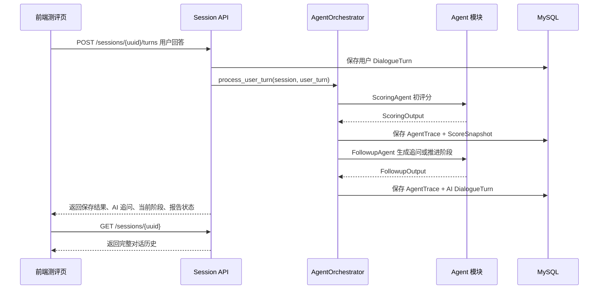

# Agent 输入输出契约 v1

本文档用于约定审辩式思维动态测评系统中各类 Agent 的输入、输出、失败兜底、数据库落库和前端调用方式。它是 Agent 模块、后端业务服务、前端测评页面之间的内部接口文档。

当前版本目标是先支撑基线 demo 跑通，优先保证结构稳定、可落库、可调试。真实模型效果优化、复杂 RAG、多模型一致性验证可以在基线闭环完成后继续迭代。

## 0. 读者速览

这份契约可以理解为“Agent 模块的内部接口文档”。它不是只写 prompt，而是把前端、后端、数据库和 Agent 的边界先定清楚。

| 读者 | 需要记住的边界 |
| --- | --- |
| 前端开发 | 前端不直接调用 Agent，只调用 Session API；用户提交回答后，后端返回下一条 AI 文本、当前阶段、报告状态等信息 |
| 后端开发 | 后端负责创建会话、保存用户回答、调用 AgentOrchestrator、保存 AgentTrace、DialogueTurn、评分快照和报告 |
| Agent 开发 | Agent 只接收后端组装好的上下文，返回结构化 JSON；不要直接操作数据库，也不要自造情境、rubric 或评分字段 |
| 心理组 | 心理模型、情境流程、追问策略和评分规则先进入 seed 或后台配置，再由 Agent 读取使用 |
| 商科/演示组 | 前端和报告页看到的内容都来自数据库，后续可以拿真实对话、评分证据和报告结构支撑计划书与演示 |

第一版推荐的总流程是：

```text
心理组材料 -> 测试版 YAML seed -> MySQL 配置表 -> 后端组装 Agent 输入 -> Agent 返回 JSON -> 后端落库 -> 前端展示
```

因此，Agent 成员开始写代码前，至少需要一份可导入的测试版配置。它不要求是最终专业版，但必须字段完整、编码稳定、能覆盖一条完整测评流程。

## 1. 契约定位

Agent 输出契约不是普通 prompt 文档，而是以下四类约定的组合：

| 类型 | 说明 |
| --- | --- |
| Agent 内部接口 | 后端调用 Agent 时传什么上下文，Agent 必须返回什么结构 |
| 后端解析说明 | 后端如何判断 Agent 输出是否有效，失败时如何兜底 |
| 数据库落库映射 | Agent 输入、输出、用户可见文本、评分、证据和报告分别保存到哪里 |
| 前端联调依据 | 前端提交用户回答后，应该从哪个接口读取 AI 追问、评分状态和报告 |

本契约的核心原则：

1. Agent 必须返回结构化 JSON，不返回 Markdown 包裹的 JSON；
2. 所有用户实际看到的 AI 文本必须保存到 `dialogue_turn`；
3. 每次 Agent 调用必须尽量保存 `agent_trace`；
4. 评分结果必须保存到 `score_snapshot`、`score_result`、`score_evidence`；
5. 报告必须保存到 `assessment_report`；
6. mock Agent 和真实 LLM Agent 使用同一套输出结构；
7. 真实模型失败不能阻塞基线流程，必须有 fallback。

## 2. 当前系统基础

### 2.1 已具备的后端基础

| 能力 | 当前落点 | 状态 |
| --- | --- | --- |
| 模型网关 | `backend/app/services/model_gateway_service.py` | 已有 mock/real 双模式 |
| Prompt 模板 | `backend/seeds/prompts.yaml`、`prompt_template` | 已有 host、followup、scoring、report 初稿 |
| Agent 调用日志 | `agent_trace` | 表已建好，代码待接入 |
| 对话轮次 | `dialogue_turn` | 已能保存用户回答和 AI 开场问题 |
| 情境配置 | `scenario`、`scenario_stage` | 已 seed，可后台编辑 |
| 动态信息 | `stage_dynamic_info` | 已 seed，可后台编辑 |
| 追问策略 | `stage_intervention_rule` | 已 seed，可后台编辑 |
| 能力模型 | `rubric_dimension` | 已 seed，可后台编辑 |
| 评分锚点 | `rubric_anchor` | 已 seed，可后台编辑 |
| 评分结果 | `score_snapshot`、`score_result`、`score_evidence` | 表已建好，代码待接入 |
| 最终报告 | `assessment_report` | 表已建好，代码待接入 |

### 2.2 当前主要缺口

| 缺口 | 影响 |
| --- | --- |
| 缺 `backend/app/agents/**` | Agent 代码还没有模块化落地 |
| 缺 `agent_orchestrator.py` | 用户回答后无法自动触发追问、评分和阶段推进 |
| 缺 Agent schema | 两位 Agent 开发成员容易返回不同 JSON 字段 |
| 缺 AgentTrace 落库服务 | 追问和评分过程不可审计 |
| 缺评分落库服务 | 报告页没有真实六维评分来源 |
| 缺报告生成服务 | `/report` 接口目前可能返回未生成 |

## 3. 推荐调用流程

第一版推荐采用同步流程，方便前端和后端联调。后续如果 Agent 调用耗时较长，可以再改成异步任务。



## 4. 后端目录建议

Agent 相关代码建议按以下目录落地：

```text
backend/app/agents/
  __init__.py
  schemas.py              # 本契约对应的 Pydantic 输入输出模型
  base.py                 # Agent 基类、公共工具
  mock_agents.py          # mock Agent，保证无 API Key 可跑通
  host_agent.py           # 情境呈现与阶段问题
  followup_agent.py       # 自适应追问与动态信息释放
  scoring_agent.py        # 六维评分与证据抽取
  report_agent.py         # 最终报告生成
  llm_client.py           # 调用统一模型网关的封装
  rag_context.py          # 专业上下文检索预留，第一版可固定返回

backend/app/services/
  agent_orchestrator.py   # 串联用户回答、评分、追问、报告
  scoring_service.py      # 保存 ScoreSnapshot/ScoreResult/ScoreEvidence
  report_service.py       # 保存 AssessmentReport
```

## 5. 通用字段约定

所有 Agent 输出必须包含以下字段：

| 字段 | 类型 | 说明 |
| --- | --- | --- |
| `status` | string | `ok` 或 `failed` |
| `agent_name` | string | `host`、`followup`、`scoring`、`report` |
| `reason` | string/null | 本次判断或生成原因 |
| `warnings` | string[] | 可为空，用于记录风险提示 |
| `fallback_used` | boolean | 是否使用兜底内容 |

失败输出统一格式：

```json
{
  "status": "failed",
  "agent_name": "followup",
  "error_code": "INVALID_JSON",
  "reason": "模型输出无法解析为 JSON",
  "fallback_used": true,
  "fallback_message": "你能进一步说明这个判断背后的主要依据吗？",
  "warnings": ["已使用阶段追问规则中的兜底问题"]
}
```

## 6. 共享输入上下文

后端调用任意 Agent 时，建议组装统一上下文对象。不同 Agent 可以只使用其中一部分字段。

```json
{
  "session": {
    "session_id": 1,
    "session_uuid": "uuid",
    "assessment_mode": "mock",
    "status": "in_progress"
  },
  "participant": {
    "participant_id": 1,
    "nickname": "小秦",
    "profile_summary": "大学生，关注实习与团队协作场景"
  },
  "scenario": {
    "scenario_id": 1,
    "scenario_code": "product_launch_48h",
    "title": "产品上线前 48 小时",
    "background": "..."
  },
  "stage": {
    "stage_id": 1,
    "stage_code": "s1",
    "stage_order": 1,
    "title": "初始问题界定",
    "stage_goal": "...",
    "context": "...",
    "main_question": "...",
    "context_generation_mode": "config_guided",
    "context_ai_weight": 30,
    "max_followups": 2
  },
  "dialogue_history": [
    {
      "turn_id": 1,
      "speaker": "ai",
      "content": "...",
      "content_type": "stage_question"
    },
    {
      "turn_id": 2,
      "speaker": "user",
      "content": "...",
      "content_type": "scenario_answer"
    }
  ],
  "rubric_dimensions": [],
  "rubric_anchors": [],
  "candidate_dynamic_infos": [],
  "candidate_intervention_rules": [],
  "latest_score_snapshot": null
}
```

## 7. HostAgent 契约

### 7.1 职责

HostAgent 负责情境呈现、阶段问题生成、阶段推进提示。第一版可以在创建 session 时生成开场问题，也可以在阶段切换时生成下一阶段问题。

### 7.2 输入

使用共享输入上下文中的 `participant`、`scenario`、`stage`、`dialogue_history`。

### 7.3 输出

```json
{
  "status": "ok",
  "agent_name": "host",
  "stage_code": "s1",
  "message": "小秦，接下来我们进入一个产品上线前 48 小时的决策情境...",
  "content_type": "stage_question",
  "generation_mode": "config_guided",
  "ai_generation_weight": 30,
  "reason": "根据用户昵称和阶段主问题生成开场提问",
  "next_action": "wait_user_answer",
  "fallback_used": false,
  "warnings": []
}
```

### 7.4 落库映射

| 输出字段 | 落库位置 |
| --- | --- |
| 完整输入 | `agent_trace.input_json` |
| 完整输出 | `agent_trace.output_json` |
| 原始模型输出 | `agent_trace.raw_output` |
| `agent_name` | `agent_trace.agent_name` |
| `generation_mode` | `agent_trace.generation_mode` |
| `ai_generation_weight` | `agent_trace.ai_generation_weight` |
| `message` | `dialogue_turn.content` |
| `content_type` | `dialogue_turn.content_type` |
| `stage_id` | `dialogue_turn.stage_id` |
| trace id | `dialogue_turn.source_agent_trace_id` |

## 8. FollowupAgent 契约

### 8.1 职责

FollowupAgent 负责根据用户最新回答、当前阶段目标、评分缺口、候选动态信息和追问策略，生成下一条 AI 追问、释放动态信息或推进阶段。

### 8.2 输入

除共享上下文外，必须包含：

```json
{
  "latest_user_turn": {
    "turn_id": 2,
    "content": "我觉得还是要上线，因为市场窗口很重要。"
  },
  "score_gap_summary": {
    "missing_dimensions": ["evidence_evaluation"],
    "argument_issues": ["缺少证据来源", "没有说明上线风险判断标准"]
  },
  "candidate_intervention_rules": [
    {
      "rule_id": 10,
      "rule_code": "clarify_evidence_source",
      "rule_type": "clarify",
      "trigger_condition": "用户给出判断但缺少证据来源",
      "strategy_direction": "引导用户说明优先核实哪些信息及来源",
      "sample_question": "你会优先核实哪些信息？这些信息分别来自哪里？",
      "question_generation_mode": "strategy_guided",
      "question_ai_weight": 40,
      "fallback_question": "你能说明一下这个判断需要哪些证据支持吗？"
    }
  ]
}
```

### 8.3 输出

```json
{
  "status": "ok",
  "agent_name": "followup",
  "question": "你提到市场窗口很重要，那你会优先核实哪些数据来判断上线风险是否可控？",
  "content_type": "followup_question",
  "question_type": "clarify",
  "selected_rule_code": "clarify_evidence_source",
  "selected_dynamic_info_code": null,
  "released_dynamic_info_text": null,
  "reason": "用户给出了上线倾向，但没有说明证据来源和风险判断依据",
  "next_action": "ask_followup",
  "confidence": 0.82,
  "fallback_used": false,
  "warnings": []
}
```

动态信息释放时：

```json
{
  "status": "ok",
  "agent_name": "followup",
  "question": "现在补充一条新信息：最新灰度测试显示核心功能报错率升高。基于这个变化，你会如何调整原判断？",
  "content_type": "dynamic_info_question",
  "question_type": "dynamic_update",
  "selected_rule_code": "dynamic_update_after_risk_signal",
  "selected_dynamic_info_code": "new_error_rate_increase",
  "released_dynamic_info_text": "最新灰度测试显示核心功能报错率升高。",
  "reason": "当前阶段需要观察用户面对新证据时的动态调整能力",
  "next_action": "ask_followup",
  "confidence": 0.78,
  "fallback_used": false,
  "warnings": []
}
```

### 8.4 落库映射

| 输出字段 | 落库位置 |
| --- | --- |
| 完整输入 | `agent_trace.input_json` |
| 完整输出 | `agent_trace.output_json` |
| `selected_rule_code` | 查询 `stage_intervention_rule.id`，写入 `agent_trace.selected_rule_id` 和 `dialogue_turn.intervention_rule_id` |
| `selected_dynamic_info_code` | 查询 `stage_dynamic_info.id`，写入 `agent_trace.selected_dynamic_info_id` 和 `dialogue_turn.dynamic_info_id` |
| `question` | `dialogue_turn.content` |
| `content_type` | `dialogue_turn.content_type` |
| trace id | `dialogue_turn.source_agent_trace_id` |

## 9. ScoringAgent 契约

### 9.1 职责

ScoringAgent 负责基于 rubric、用户原始回答、对话上下文和阶段目标生成六维评分、证据句、评分理由和置信度。第一版可以在每轮用户回答后做阶段性评分，也可以在测评结束时做最终评分。

### 9.2 输出

```json
{
  "status": "ok",
  "agent_name": "scoring",
  "snapshot_type": "stage",
  "summary": "用户能够提出初步判断，但证据来源和风险验证方式不足。",
  "scores": [
    {
      "dimension_key": "evidence_evaluation",
      "score": 3,
      "confidence": 0.72,
      "reason": "用户提到需要关注市场窗口，但没有说明具体证据来源、数据可靠性和交叉验证方式。",
      "evidence": [
        {
          "text": "我觉得还是要上线，因为市场窗口很重要。",
          "evidence_type": "user_quote",
          "explanation": "体现了决策倾向，但证据评估不充分。"
        }
      ]
    }
  ],
  "detected_score_gaps": ["证据评估缺少数据来源说明"],
  "detected_argument_issues": ["结论先行，理由链较短"],
  "fallback_used": false,
  "warnings": []
}
```

### 9.3 验证规则

| 字段 | 规则 |
| --- | --- |
| `score` | 必须为 1 到 5 的整数 |
| `confidence` | 必须在 0 到 1 之间 |
| `dimension_key` | 必须能匹配 `rubric_dimension.dimension_key` |
| `evidence.text` | 必须来自用户原话或对话原文，不允许编造 |
| `reason` | 必须解释为什么给这个分，不能只写泛泛评价 |

### 9.4 落库映射

| 输出字段 | 落库位置 |
| --- | --- |
| 完整输入/输出 | `agent_trace.input_json` / `agent_trace.output_json` |
| `snapshot_type` | `score_snapshot.snapshot_type` |
| `summary` | `score_snapshot.summary` |
| trace id | `score_snapshot.agent_trace_id` |
| `dimension_key` | 查询 `rubric_dimension.id` |
| `score` | `score_result.score` |
| `reason` | `score_result.reason` |
| `confidence` | `score_result.confidence` |
| `evidence.text` | `score_evidence.evidence_text` |
| `evidence.evidence_type` | `score_evidence.evidence_type` |
| `evidence.explanation` | `score_evidence.explanation` |

## 10. ReportAgent 契约

### 10.1 职责

ReportAgent 负责根据最终六维评分、关键证据、阶段表现和报告模板生成结构化报告。报告面向用户展示，但不能写成临床诊断或人格定性。

### 10.2 输出

```json
{
  "status": "ok",
  "agent_name": "report",
  "summary": "本次测评中，你在问题界定和整合决策方面表现较好，证据评估仍有提升空间。",
  "overall_level": "中等偏上",
  "dimension_reports": [
    {
      "dimension_key": "evidence_evaluation",
      "dimension_name": "证据评估",
      "score": 3,
      "level_label": "中等",
      "strength": "能够意识到需要参考信息作出判断。",
      "weakness": "对信息来源、可靠性和交叉验证说明不足。",
      "evidence_quotes": ["我会先看看用户反馈和测试数据。"],
      "suggestion": "后续决策时，可以明确列出数据来源、可信度和验证方法。"
    }
  ],
  "advantages": ["能较快识别决策压力和主要目标"],
  "improvement_suggestions": ["加强证据来源、风险边界和备选方案说明"],
  "development_plan": [
    "遇到复杂决策时，先区分事实、推测和观点。",
    "提出关键判断前，说明证据来源和可靠性。"
  ],
  "disclaimer": "本报告仅基于本次情境对话表现生成，不作为临床诊断或高风险选拔结论。",
  "fallback_used": false,
  "warnings": []
}
```

### 10.3 落库映射

| 输出字段 | 落库位置 |
| --- | --- |
| 完整输入/输出 | `agent_trace.input_json` / `agent_trace.output_json` |
| `summary` | `assessment_report.summary` |
| 完整报告 JSON | `assessment_report.report_json` |
| trace id | `assessment_report.agent_trace_id` |
| 报告模板 | `assessment_report.report_template_id` |
| 状态 | `assessment_report.status` |

## 11. 前端调用契约

第一版前端测评页不直接调用 Agent 接口，只调用后端 Session API。Agent 由后端编排器内部触发。

### 11.1 创建会话

```text
POST /api/v1/sessions
```

前端传昵称，后端创建 `participant`、`assessment_session`，并返回初始 AI 问题。后续如果 HostAgent 接入，第一条 AI 问题应由 HostAgent 生成，并关联 `agent_trace`。

### 11.2 提交用户回答

当前接口：

```text
POST /api/v1/sessions/{session_uuid}/turns
```

当前响应只返回回答已保存。Agent 接入后，建议扩展响应为：

```json
{
  "session_uuid": "uuid",
  "saved_turn_index": 2,
  "next_action": "ask_followup",
  "ai_turns": [
    {
      "turn_index": 3,
      "speaker": "ai",
      "content": "你会优先核实哪些信息来判断上线风险是否可控？",
      "content_type": "followup_question"
    }
  ],
  "current_stage": {
    "stage_code": "s2",
    "title": "证据核实"
  },
  "score_snapshot_id": 12,
  "report_ready": false
}
```

前端使用规则：

1. 提交回答后，如果返回 `ai_turns`，直接追加到对话列表；
2. 如果 `next_action=advance_stage`，前端展示下一阶段问题；
3. 如果 `next_action=finish_ready`，前端允许用户结束测评并进入报告页；
4. 如果 `report_ready=true`，前端跳转报告页或展示查看报告按钮；
5. 如果 Agent 失败但有 fallback，前端仍展示 fallback 问题，不暴露技术错误。

### 11.3 读取会话

```text
GET /api/v1/sessions/{session_uuid}
```

用于刷新页面后恢复对话。所有用户实际看到的 AI 文本都必须能从该接口读取到。

### 11.4 读取报告

```text
GET /api/v1/sessions/{session_uuid}/report
```

报告未生成时返回 `404`，前端显示专业空状态。报告生成后读取 `assessment_report.report_json` 展示六维评分、证据句、优势、改进建议和发展计划。

## 12. AgentTrace 保存要求

每次 Agent 调用都建议保存以下内容：

| 字段 | 内容 |
| --- | --- |
| `session_id` | 当前测评会话 |
| `stage_id` | 当前阶段，可为空 |
| `trigger_turn_id` | 触发本次调用的用户回答 |
| `prompt_template_id` | 使用的 prompt 模板，可为空 |
| `agent_name` | host/followup/scoring/report |
| `generation_mode` | fixed/context_guided/strategy_guided/ai_open 等 |
| `ai_generation_weight` | 当前配置中 AI 自由度 |
| `config_snapshot_json` | 本次调用读取到的阶段、规则、rubric、动态信息快照 |
| `input_json` | Agent 输入 |
| `output_json` | Agent 结构化输出 |
| `raw_output` | 模型原始返回文本 |
| `status` | success/failed/fallback |
| `error_code` | 失败原因 |
| `model_name` | deepseek-v4-pro 或 mock |
| `duration_ms` | 调用耗时 |
| `selected_dynamic_info_id` | 本次释放的动态信息 |
| `selected_rule_id` | 本次使用的追问策略 |

## 13. 是否需要先做测试版 seed

结论：需要。建议先做一份“Agent 测试版配置 seed”，再让 Agent 成员全面开工。

原因不是追求心理组材料一次到位，而是让 Agent 开发有稳定输入。如果没有稳定的测试配置，Agent 同学只能凭空造上下文，后续和真实数据库集成时会反复返工。

### 13.1 测试版 seed 的定位

测试版 seed 不是最终专业版本，而是 Agent 联调用的最小可用测评配置。它需要保证字段完整、编码稳定、覆盖核心流程。

建议版本命名：

```text
rubric.yaml: version: agent_test_v1
scenario_product_48h.yaml: version: agent_test_v1
prompts.yaml: version: agent_test_v1
```

### 13.2 最小内容要求

| 配置 | 最小要求 |
| --- | --- |
| 六维能力模型 | 6 个 `rubric_dimension`，每个有定义、可观察行为、无效证据 |
| 评分锚点 | 每维至少 1/3/5 分锚点，后续可补 2/4 |
| 情境 | 1 个完整情境：产品上线前 48 小时 |
| 阶段 | 6 个阶段，阶段顺序稳定 |
| 阶段维度 | 每阶段配置 1-2 个主测维度、1 个辅助维度 |
| 动态信息 | 至少 4 条，覆盖风险信号、反向证据、利益相关方反馈、数据更新 |
| 追问策略 | 至少 8 条，覆盖开放、澄清、索证、挑战、陷阱、动态更新、阶段推进 |
| 兜底问题 | 每条追问规则至少有 `fallback_question` |
| Prompt | host、followup、scoring、report 四类模板都 active |
| 报告模板 | 至少包含 summary、dimension_reports、development_plan |

### 13.3 推荐流程

1. 心理组材料先整理成 `docs/psych/*` 正式说明；
2. 全栈 A 将其中一版转写为 `backend/seeds/*.yaml`；
3. 执行 `python scripts/seed_db.py` 导入；
4. Agent 成员基于数据库读取真实配置开发；
5. Agent mock 流程跑通后，再替换或升级 seed 内容；
6. 每次心理组修改配置时，不改 Agent 代码，只改 seed 或后台配置。

### 13.4 不建议等待最终版心理材料

不建议等心理组把所有 rubric、情境和评分样例都打磨完再开发 Agent。正确节奏是：

```text
测试版配置先导入 -> Agent 基于真实结构开发 -> 心理组继续迭代内容 -> 后台/seed 更新配置 -> Agent 流程不变
```

这样能把“内容专业化”和“Agent 工程化”并行推进。

## 14. 两位 Agent 成员建议分工

| 成员 | 建议负责 | 主要交付 |
| --- | --- | --- |
| 全栈 B | HostAgent、FollowupAgent、AgentOrchestrator 第一版 | 阶段问题、追问策略选择、动态信息释放、阶段推进 |
| 新增 Agent 全栈 | ScoringAgent、ReportAgent、Agent schema 测试 | 六维评分、证据抽取、报告生成、评分输出校验 |
| 全栈 A | 后端落库与接口收口 | AgentTrace、DialogueTurn、ScoreSnapshot、AssessmentReport 落库和 Session API 集成 |

冲突控制：

1. `backend/app/agents/schemas.py` 由新增 Agent 全栈先起草，全栈 B 和全栈 A 审核；
2. `backend/app/services/agent_orchestrator.py` 由全栈 B 主改，全栈 A 审核；
3. `backend/app/services/scoring_service.py`、`report_service.py` 由全栈 A 或新增 Agent 全栈和全栈 A 协作，但数据库落库最终由全栈 A 审；
4. 不允许两个 Agent 成员同时自由修改 `session_service.py`，该文件由全栈 A 收口。

## 15. 第一版验收标准

Agent 第一版完成需要满足：

1. 无 DeepSeek API Key 时，mock Agent 能跑通一次完整流程；
2. 用户提交回答后，系统能自动返回一条 AI 追问或下一阶段问题；
3. AI 追问保存到 `dialogue_turn`，并关联 `agent_trace`；
4. 每轮或每阶段至少产生一次 `score_snapshot`；
5. 每个评分维度能保存 `score_result`；
6. 每个评分结果至少有一条 `score_evidence`；
7. 完成测评后能生成一份 `assessment_report`；
8. 前端通过 Session API 能读回完整对话和报告；
9. Agent 输出 JSON 解析失败时，系统使用 fallback，不中断流程；
10. 数据库能追溯某条 AI 追问来自哪个阶段、哪个规则、哪个 Agent 调用。
